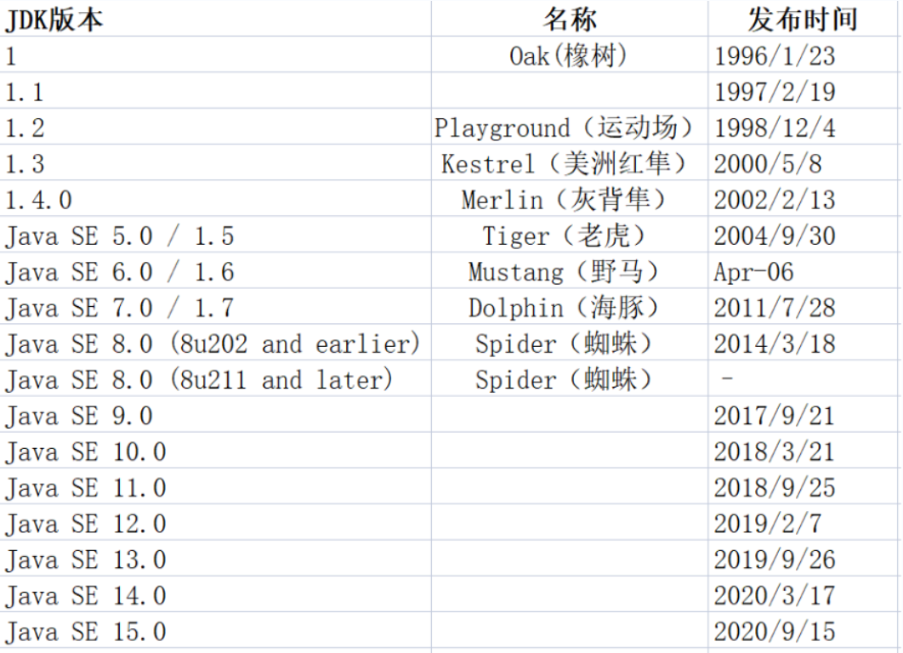
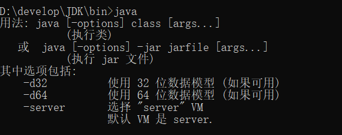
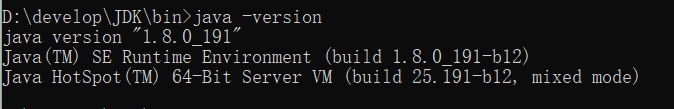

# Day01

## 学习要求

1.  上课认真听，不要走神，不要做其他事情，不要打断老师讲课。

2.  课余时间可以自由放松，晚自习以及学习时间做好每堂课，每天内容的复习，不懂就问

3.  从早上上课，到晚自习下课，不要玩游戏，看其他无关视频。

## 上课方式

1.  每天写笔记，录视频，放学后发送

2.  控屏幕学习

## IT

IT：information techonology 信息技术

IT分类：

UI: user interface 主要是完成图片、logo、海报等页面的一个设计

前端：将UI设计师设计出来的各种图片通过网页的形式去实现

后端：接收前端传递的数据，后端对数据做一些处理，处理之后，会将处理的结果给前
端进行反馈。

数据库：主要是用来存储数据的

图示说明：

## 

## Java语言的简介

1.  Java语言的起源：

OAK(橡树) ----\> Java(咖啡) 开始属于Sun---\>Oracle公司收购

詹姆斯.高斯林（Java语言之父）

1.  Java语言的版本：

说明：

Jdk1.2版本：是一个里程碑式的版本

分了三大平台：

JavaME：微型版本：主要适用于移动端开发

JavaSE：标准版本：主要适用于pc端开发

JavaEE：企业级版本：主要是适用于做一些大型的互联网项目开发

Jdk1.5版本：从1.4----1.5jdk增加了很多非常实用的技术点：

泛型 可变参数 自动装箱拆箱........

Jdk8版本：教学开发使用的版本 （稳定，市场使用率最高）

1.  Java语言的特点：

开源：开放源代码 免费

编译性：java代码写完之后，需要先编译再运行

动态性：当定义完代码之后，代码运行的结果不一定式固定的

跨平台性

面向对象【下周讲】

### 跨平台性

1.  跨：跨越

2.  平台：操作系统

3.  跨平台概念：在某一个操作系统上开发编译的java程序，可以在其他系统上运行

4.  原因：因为在不同的操作系统上，安装了不同的JVM,不同版本的JVM营造了相同的运行
    环境，因为在不同的系统上的环境相同，所以代码在任何系统上都可以运行。

5.  举例：

种子 需要在温度为10度

南极北极：因为温度低所以种子不能生存

赤道：因为温度高，所以不能生存

问题：南极北极温度不适宜，所以中种子不能生存

解决：

在南极或者北极建造一个耐寒的大棚，温度维持在10度

在赤道建造一个耐热的大棚，温度维持在10度

### Java相关的三个概念

1.  JVM：Java虚拟机 Java程序运行所需要的容器

2.  JRE：Java运行时环境 ，程序想要运行不仅需要一个容器，也需要各种条件（资源）

JRE = JVM+程序运行所需要的各种类库

1.  JDK：开发工具包

JDK = JRE + 需要使用的各种开发工具

## Java环境的搭建

1.  下载JDK：oracle官网 [www.oracle.com](http://www.oracle.com)

2.  下载步骤：

访问官网--\>产品--\>Java---\>下载Java--\>选择版本---\>登录即可下载

1.  Jdk安装：

安装特点：一路选择下一步（选择一个特定位置存放）

注意事项：

（1）尽量不要安装在c盘

（2）安装路径中尽量不要有空格中文及特殊符号

（3）JDK安装之后，不需要再次安装JRE

4、验证JDK是否安装成功：

（1）找到jdk的bin目录

（2）打开bin目录对应的dos窗口（命令行窗口）

（3）在命令行中输入 java / javac /java -version

（4）如果出现对应的版本号（只要不是出现error错误，都表示安装成功）

5、JDK卸载：

控制面板找到jdk的安装程序，右键卸载即可

## Java开发四个步骤

1.  编辑：编写源代码（编写的源代码要在.java文件中存储）

2.  编译：将代码编辑完之后，需要对源代码进行编译，编译为虚拟机可以识别的文件

编译之后的文件后缀名.class

1.  运行：使用特定的工具运行编译后的class文件

2.  调试：找到问题，解决问题

## HelloWorld案例

### HelloWorld案例的编辑

1.  找到安装的jdk的bin目录

2.  在bin目录中创建一个文件，将文件名称改为HelloWorld，后缀名以java结尾

3.  打开文件创建一个类型：

class HelloWorld {

}

1.  在类中定义一个主方法：

public static void main(String[] args){

}

1.  在方法中定义一个小功能：输出语句

System.out.println(“Hello 0210Java”);

### HelloWorld案例的编译

1.  使用一个编译工具：bin目录下的javac.exe

2.  先打开dos窗口：

在窗口中使用特定的命令：javac.exe HelloWorld.java

1.  如果在dos窗口中没有出现问题，且在当前目录下出现一个class文件表示编译成功

### HelloWorld案例的运行

1.  使用一个运行工具：bin目录下的java.exe

2.  在dos窗口中：

使用特定的运行命令：java.exe HelloWolrd

1.  如果在窗口中打印了代码中写好的内容，表示运行成功！

### 注意事项（强调）

1.  源文件的后缀名.java

2.  编译后的文件后缀名.class

3.  编译后的文件名class文件名和类名一致，不和源文件名一致

4.  编译的是源文件的全名称

5.  运行的是类名

6.  代码中的单词大小写严格区分

7.  代码中的标点符号，全部都是英文状态下的标点符号

8.  格式遵守规范，层次分明（类、方法、内容之间使用缩进分隔）
