# Day02

## 今日内容

1.  path环境变量的配置

2.  编辑软件

3.  注释、关键字、标识符

4.  常量

5.  变量

## path环境变量的配置

1.  如果不配置环境变量：

如果不配置，以后就需要将代码定义在jdk的bin目录下，随着代码越来越多，不能对
代码进行一个分类管理，以后再操作这些代码时，比较麻烦。

1.  配置环境变量之后：

如果将环境变量进行了配置，那么可以再计算机的任何位置使用各种工具，也可以在计
算机的任何位置编辑代码，编译代码，运行代码。可以更好的对代码分类管理。

1.  配置环境变量的方式：

第一种配置方式：

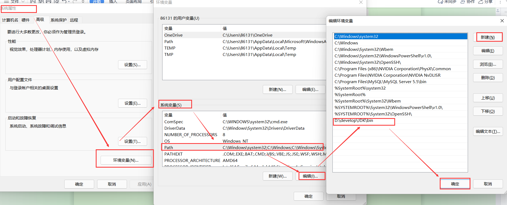

第二种配置方式：（推荐使用）

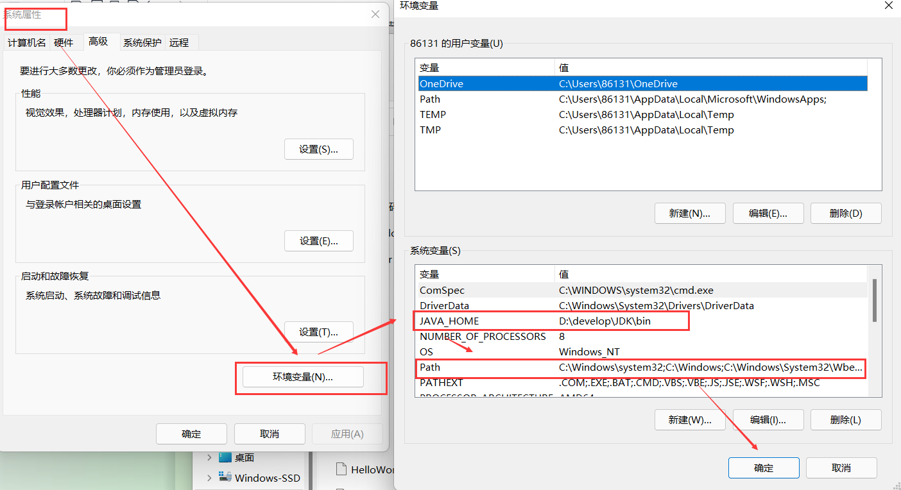

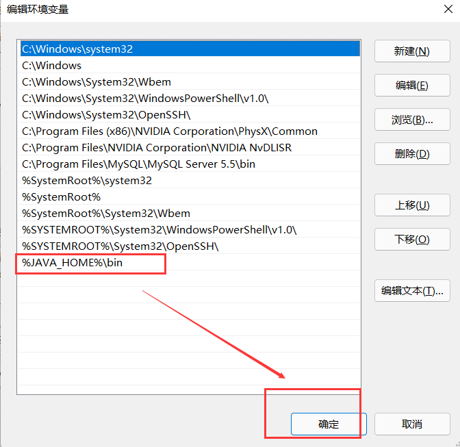

## 编辑软件

1.  分类：

记事本：优点：计算机自带

缺点：没有任何的提示和快捷键

增强型记事本：editplus 有一些快捷键的使用，也有一些高亮的显示

集成开发环境：

Eclipse

Myeclipse

Idea

## Idea的下载安装和使用

1.  访问官网：<https://www.jetbrains.com/>

2.  步骤：

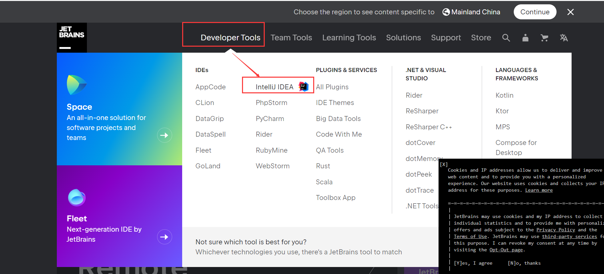

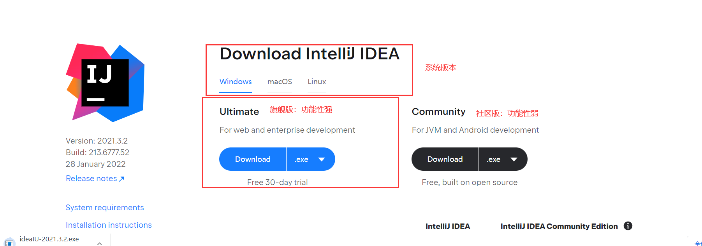

1.  安装：

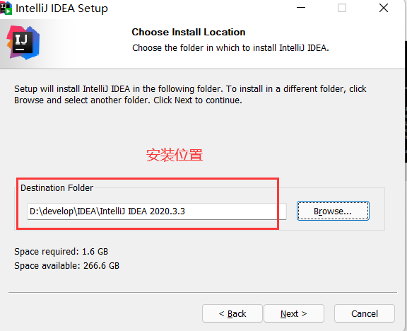

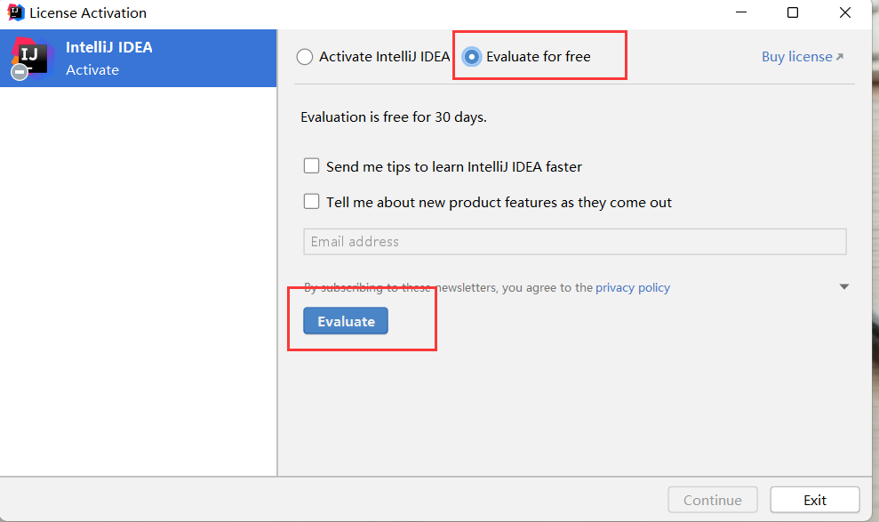

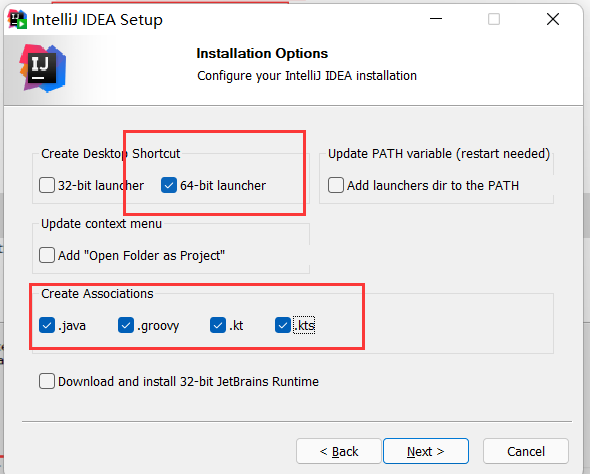

1.  使用：

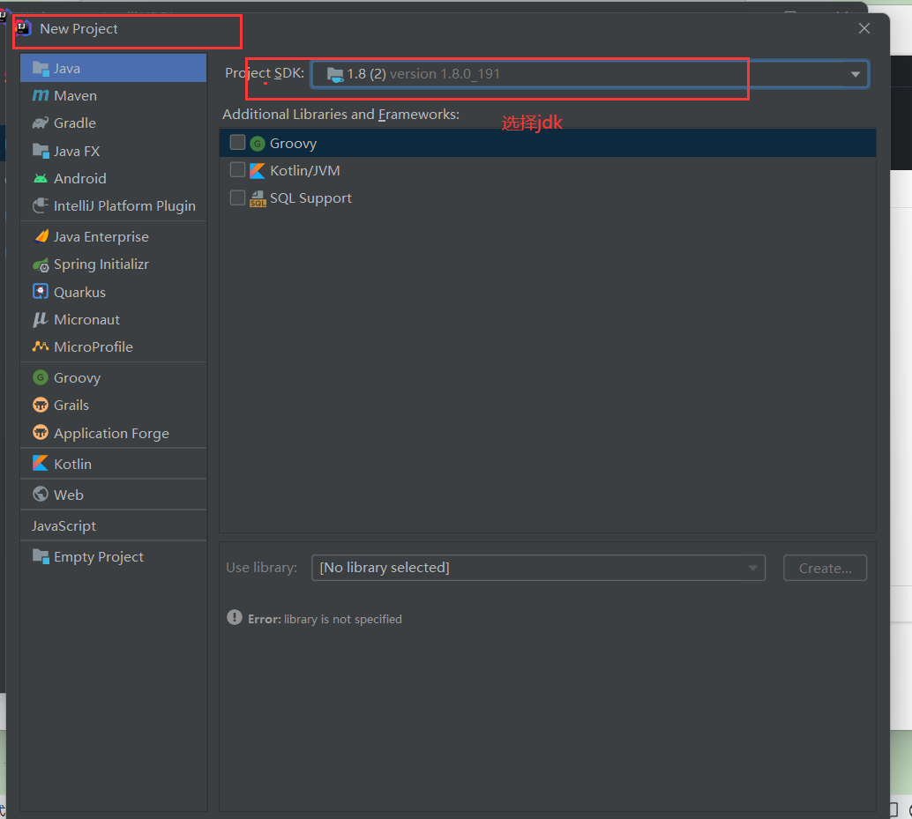

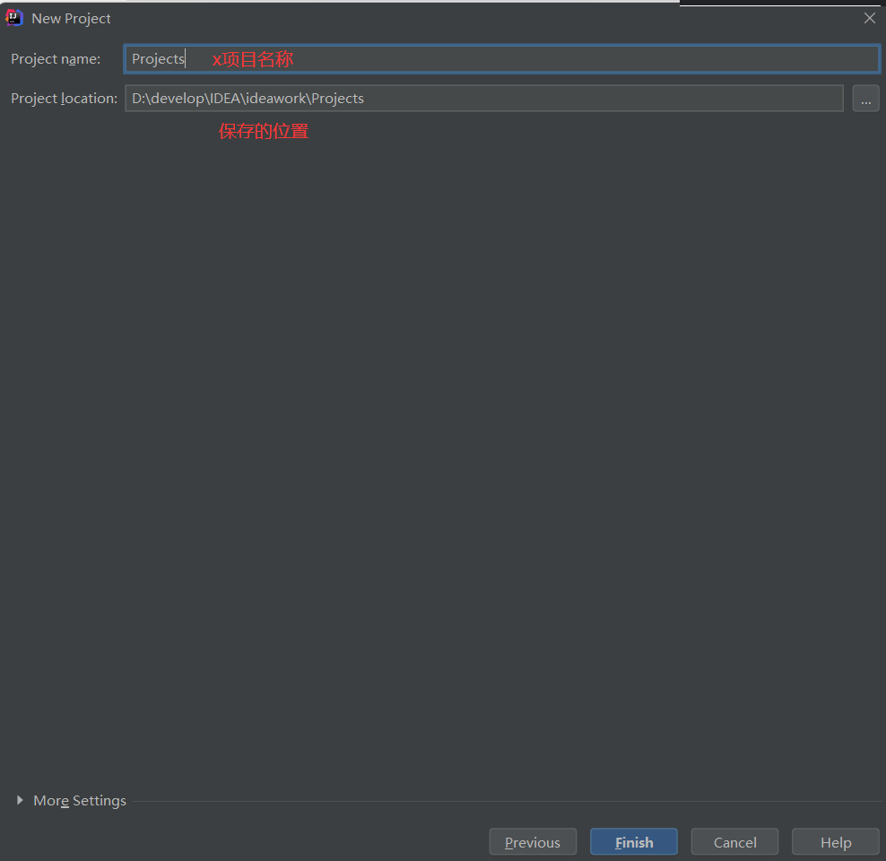

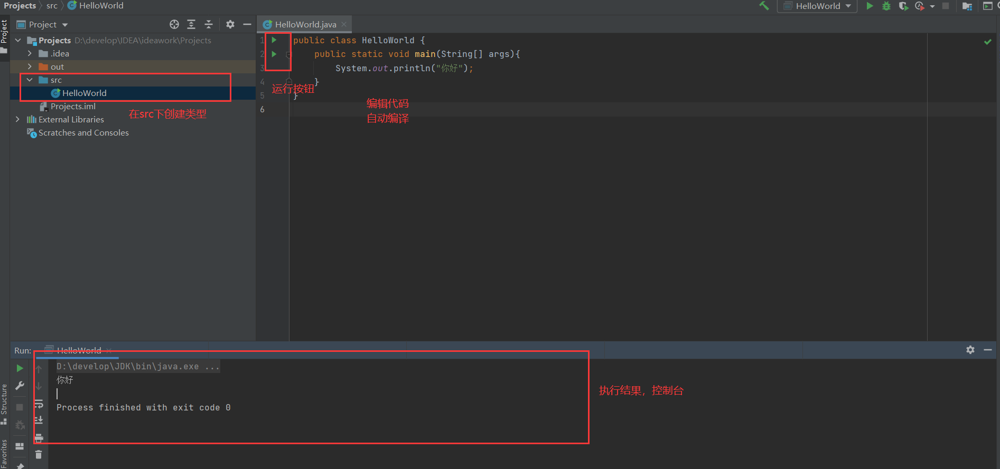

1.  基本设置：

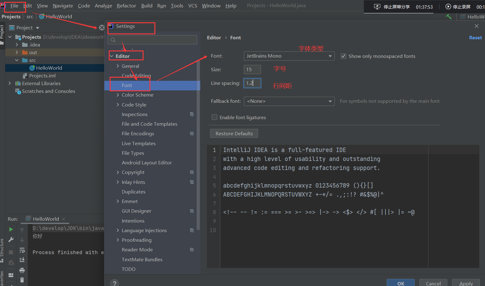

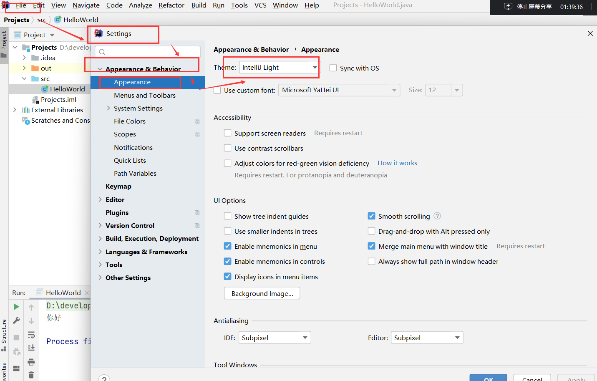

## 注释

1.  概述：对代码进行解释的部分

2.  分类：

单行注释：【//】

特点：一次只能注释一行内容

可以嵌套使用

多行注释：【/\*注释的内容\*/】

特点：可以选择注释多行内容

不可以嵌套使用

1.  要求：

2.  写代码百分之三十必须是注释

代码实例

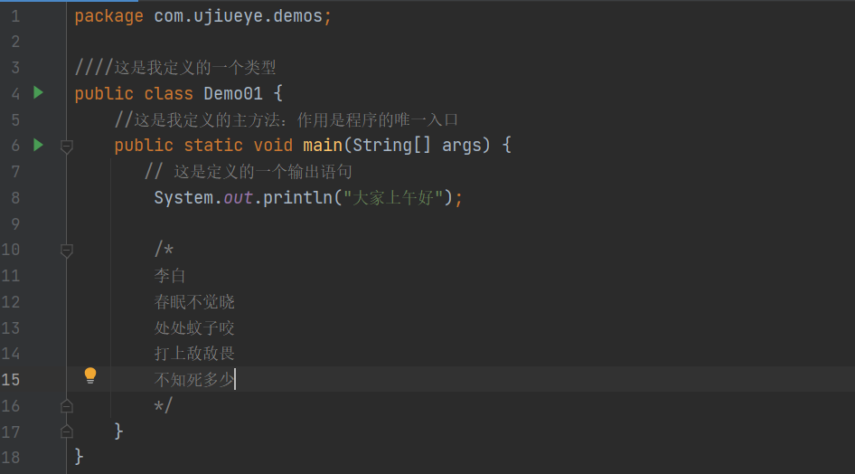

## 关键字

1.  概述：官方定义的具有特殊含义的英文单词

2.  罗列：

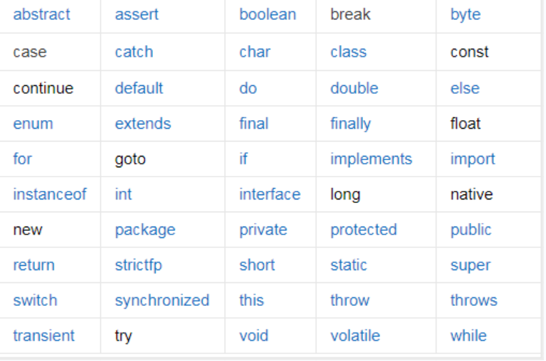

1.  注意事项：

2.  关键字全部都是小写，以后再写关键字的时候不要写为大写

3.  有两个保留的关键字：goto const

4.  以后起名的时候，不要和这些关键字重名

## 标识符

1.  概述：自己起的名字都叫做标识符 标志符

2.  标识符的组成：

数字0-9

英文大小写

特殊符号：\$ \_

1.  注意事项：

起名字不能和关键字重名

数字不能开头

## 常量

1.  概述：用来表示那些不会发生改变的数据

2.  分类：

直接写出来的数据也可以称为：字面值常量

基本数据类型的常量：

整数常量：表示的所有整数 10 100 1000 1 2 -10 -1 -100

小数常量：表示所有的小数 1.1 1.2 -1.1 -1.2

字符常量：使用单引号引起来的单个符号 ’a’ ‘你’

布尔常量：表示真和假 true false

引用数据类型的常量

字符串常量：使用双引号引起来的任意内容

空常量：null 不指向任何数，不能表示任何数据

不能直接打印

代码

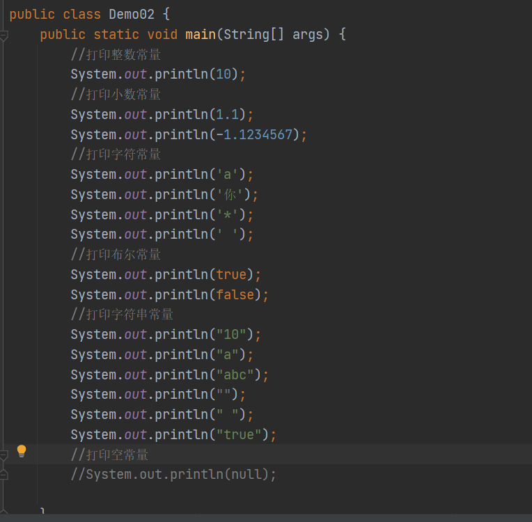

## 变量

1.  概述：在程序的运行过程中，可以发生变化的数据

2.  定义格式：

数据类型 变量名 = 变量值;

1.  说明：

数据类型：表示在运行内存中给变量分配空间的方式

变量名：给定义的可以变化的数据起一个名字

（1）尽量是名词

（2）小驼峰命名法：第一个单词的首字母小写，其余单词的首字母大写，其 他字母都小写
age maxValue maxValueOrMinValue

补充：起类名：大驼峰命名法：每个单词首字母都大写，其余字母小写

HelloWorld

=：赋值符号

变量值：用来表示的数据

1.  定义变量的原因：

如果在程序中想要表示一些具有特殊含义的数据，比如：年龄、身高、体重。这些具有
特殊含义的数据是不可以不断改变的，那么就只能通过变量来定义这些数据。

1.  变量在内存中的存储方式：

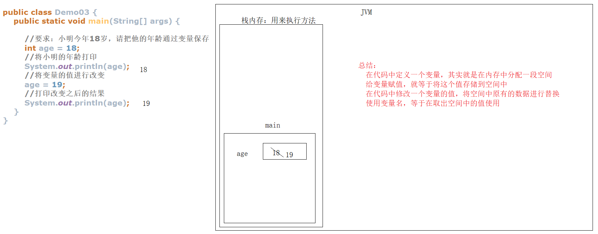

代码

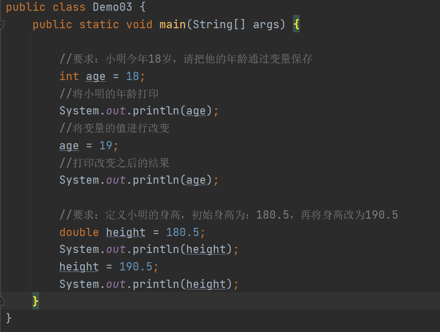

### 变量的注意事项

1.  变量是有作用域的，在哪一个作用域中定义了该变量，就只能在哪一个作用域中使用他

作用域：起作用的范围。大括号来表示作用域

1.  在同一个作用域中，不能定义重名的变量

如果重名，就编译报错，矛盾

1.  在方法中定义的变量，必须先赋值后使用

如果变量定义之后，没有赋值，在使用时编译报错

可以在定义之后，在其他行赋值（只要保证使用前有值即可）

1.  如果需要定义多个相同类型的变量，可以一行完成

数据类型 变量名1 = 值,变量名2 = 值;

## 计算的内存存储单元

1.  概述：在计算机中存储数据的最小单位：比特（bit）。8个比特可以组成一个字节（byte）

一般使用二进制来表示数据的存储大小

1.  分类：

8bit = 1B

1024B = 1KB

1024KB = 1MB

1024M = 1GB

1024GB = 1T

## 

## 数据类型

1.  概述：Java语言是强类型语言，在定义变量的时候，要强制给变量分配一定的内存空间。

2.  数据类型的分类：

基本数据类型：

整数类型：

byte 1字节 0000 0000 -2\^7----2\^-1 -128----127

short 2字节 -2\^15----2\^15-1 -32768---32767

int 4字节 -2\^31---2\^31-1 -2147483648---2147483647

long 8字节 -2\^63---2\^63-1

小数类型：IEEE754

float 4字节 单精度小数

double 8字节 双精度小数

字符类型：

char 2字节

布尔类型：true false

boolean 未知

1.  注意：

整数和小数是有默认类型：

如果定义了一个整数，整数的默认类型：int

如果想要表示一个超过int范围的整数，可以在数据后面加一个L表示long

如果定义了一个小数，小数的默认类型：double

如果想要定义一个单精度小数，在该数据后面加一个大写F

代码

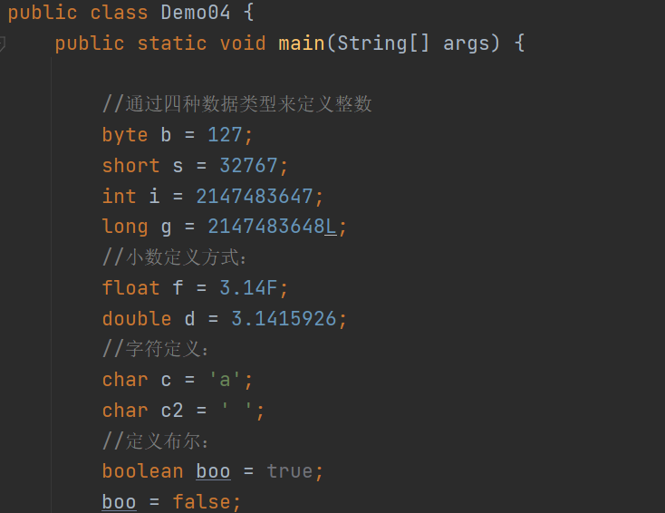

## 数据类型之间的转换

### 数据类型转换之隐式转换

1.  小数据类型和大数据类型的数据在进行运算时，会先将小数据类型的数据转为大数据类
    型再运算，最终的结果是大数据类型

2.  数据类型排序：

byte \< char \< short \< int \< long \< float \< double

1.  如果是byte、char、short、int类型在运算时，结果不是转换为大范围类型，而是统统转
    为int类型。

2.  代码：

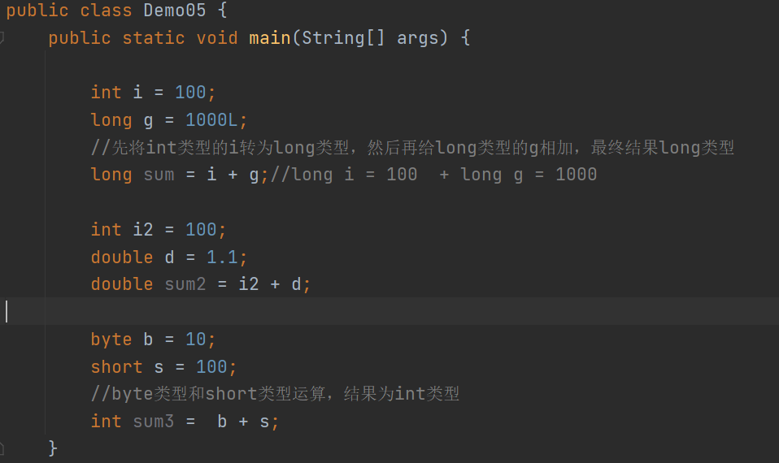

### 数据类型转换之强制转换

1.  概述：可以将某一个类型的数据强行转为其他的类型

2.  转换的格式：

(要转为的数据类型)数据;

1.  代码：

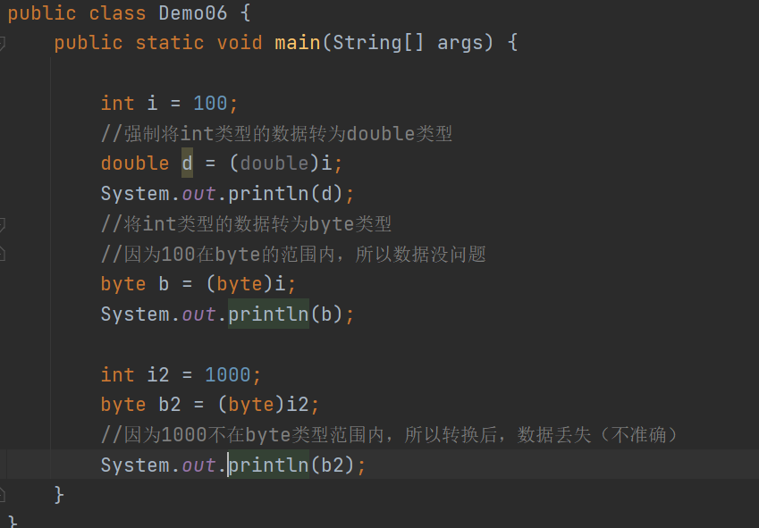

## 

## 字符类型

1.  字符：单引号引起来的单个符号

2.  字符数据类型：char

3.  计算机存储数据的特点：

计算机底层存储数据，只能存储二进制的数据。

1.  特点：

（1）定义的整数和小数会默认转为二进制，然后被计算机存储或者处理。

（2）定义的字符先转为一个它对应的十进制整数，然后将这个十进制的整数转为二进
制来存储或者处理。

5、结论：

在程序中定义出来的每一个字符，都有一个十进制的整数来对应

每一个字符和整数之间的对应关系，就在编码表中来进行了表示

6、编码表如下：ASCII编码表（最基础的编码表）

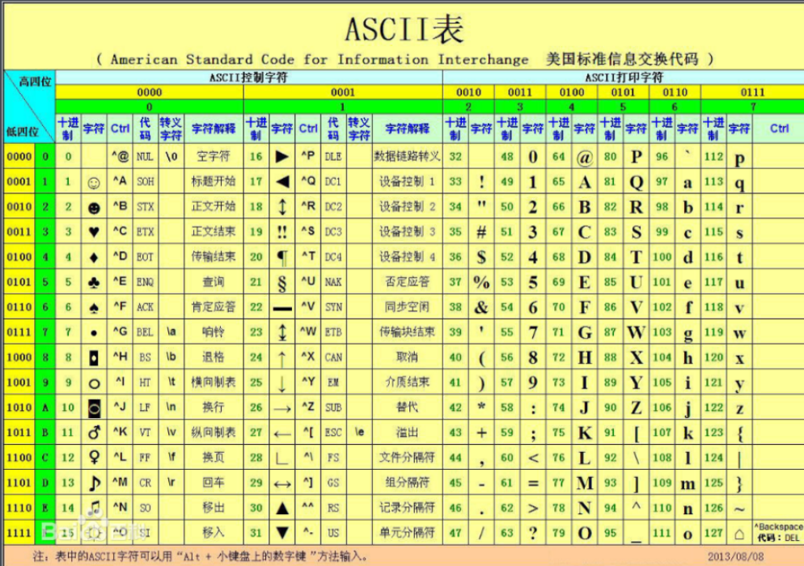

1.  以上ASCII编码表中只定义了普通字符和整数的关系，中文字符也有自己的编码表来表
    示，GBK. 一个英文字符占用一个字节 一个中文字符占用2字节

2.  因为每个国家都有自己国家的字符，所以就延申了一个万国码表。

UTF-8 一个英文占用一个字节 一个中文占用3个字节

1.  将 整数===\>字符 解码

将 字符===\>整数 编码

## 

## 字符串类型

1.  字符串：使用双引号引起来的任意个符号

2.  如果想要定义一个字符串变量：String

3.  特点：

4.  基本数据类型变量中存储的是数据本身

5.  引用数据类型变量中存储的是数据所在的地址值

6.  图示：

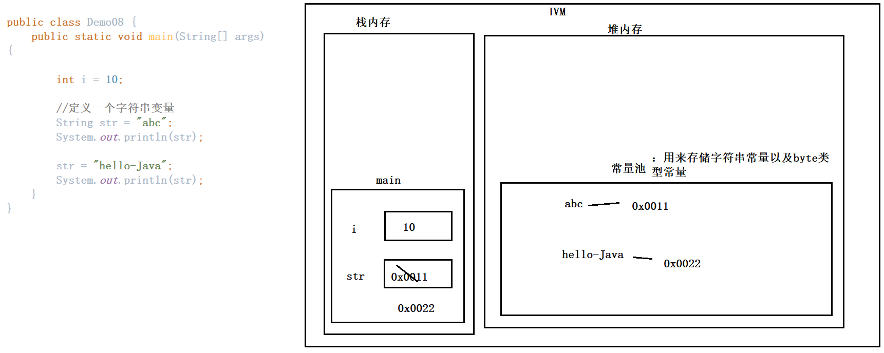

1.  字符串可以和其他数据类型的数据进行 + 运算：

字符串之间可以直接相加：相加表示的是字符串之间的拼接

字符串和其他类型数据+：会先将其他数据转为字符串再拼接

代码

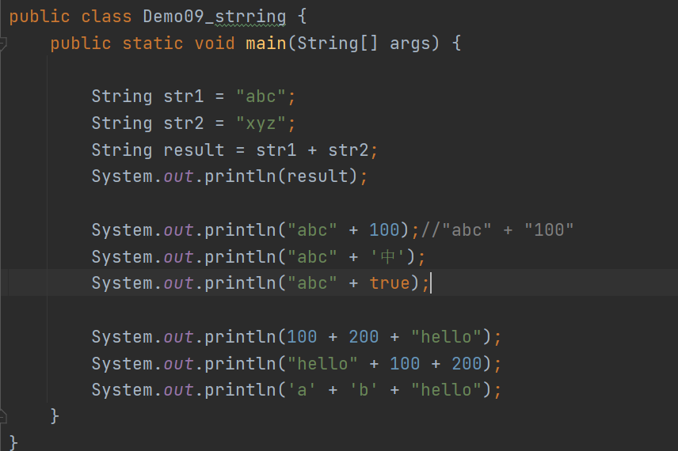
