# Day03

## 今日内容

1.  运算符

2.  数据的进制

3.  键盘录入

4.  获取随机数

## 运算符

1.  概述：对数据进行各种运算的符号

2.  分类：

算术运算符

自增自减运算符

赋值运算符

比较运算符

逻辑运算符

三元运算符

### 算术运算符

1.  分类：+ - \* / %

2.  \+：加运算符

作用：可以进行数据的加法运算

表示字符串的拼接运算

表示数据的正负 + 10

1.  \-：减运算符

作用：可以进行数据的减法运算

表示数据的正负 -10

1.  \*：乘运算符

作用：表示数据的乘法运算

1.  /：除运算符 取商运算符

2.  如果两个整数相除，结果还是整数（只要两个数相除的商）

3.  如果数据中有小数，结果就是小数（小数是大范围类型，结果是大范围类型）

4.  %：取余运算符 取模运算符

5.  获取两个数相除的余数（不要商，主要余数）

6.  结果的正负，只跟前面数据的正负有关，前面数据为正，结果就为正

代码

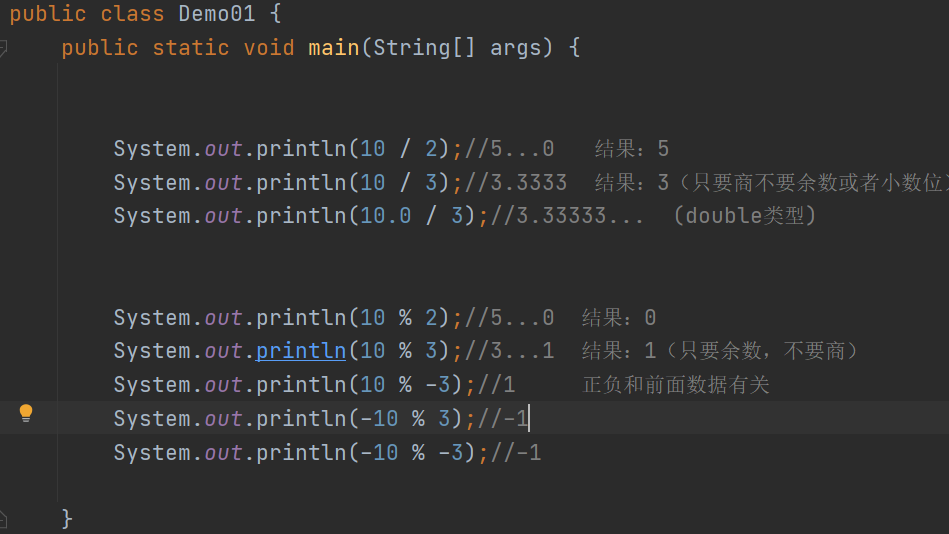

### 自增自减运算符

1.  分类：

\++ --

1.  \++：自增运算符：

2.  可以对一个变量进行自增运算，结果是该变量原有的值+1

3.  \--：自减运算符：

4.  可以对变量进行自减运算，结果原有的值-1

5.  特点：

6.  如果以后对变量的自增或者自减，是单独定义的，该符号可以放在变量的前面也
    可以放在变量的后面，结果都是+1或者-1

7.  如果变量的自增或者自减不是单独定义，如果将符号放在了变量的前面，运算方
    式：先运运算，再取值。如果将符号放在了变量的后面，运算方式：先取值后运 算。

代码

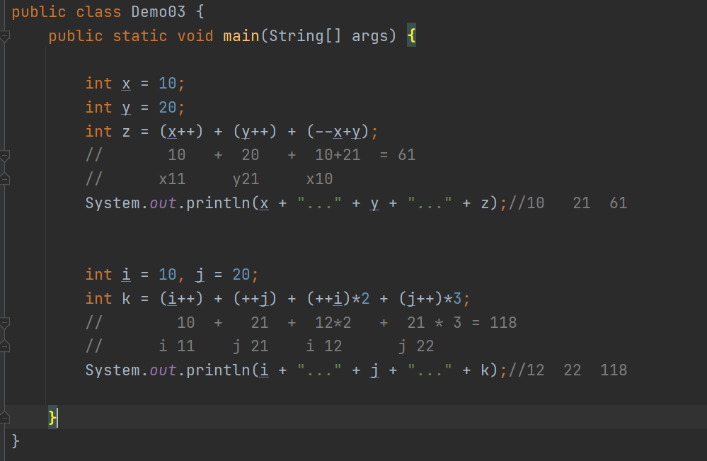

### 赋值运算符

1.  分类：

基础的赋值运算符：=

将符号右边的数据赋值给左边的变量

扩展的赋值运算符： += -= \*= /= %=

先将符号左右两边的数据，进行对应的运算，再赋值给左边的变量

1.  注意：

关于数值运算的符号，只适用于：整数 小数 字符

代码

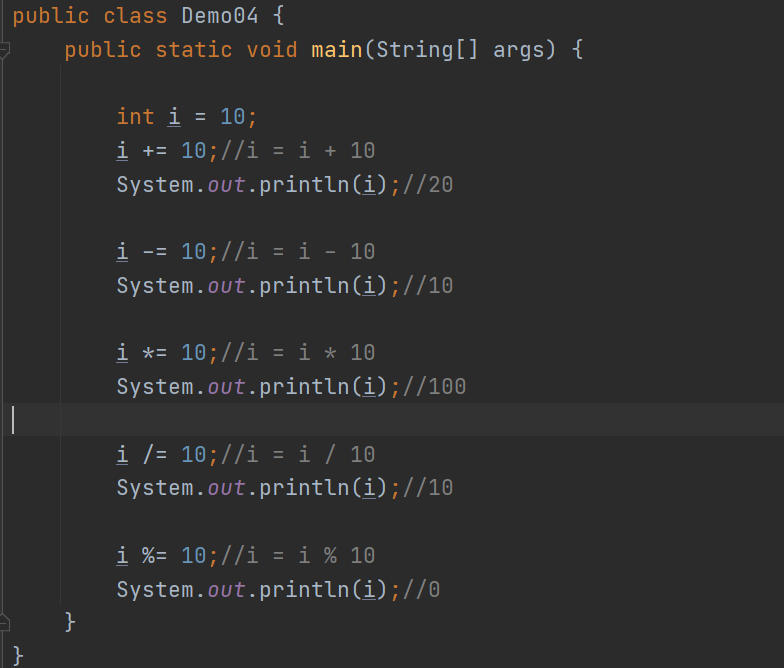

### 比较运算符

1.  分类：

基础的比较运算符： \> \>= \< \<=

比较方式：比较符号左右两边数据的大小关系，，满足为真，不满足为假

注意：只参与整数 小数 字符（数值类型）之间的比较。

字符串、布尔、null不能使用以上符号互相比较

扩展的比较运算符：== !=

比较方式：比较两个数据是否相等或者不等。

==：如果两个数据相等，为真，如果不等为假

!=：如果两个数据不相等，为真，如果相等为假

注意：

不仅可以参与数值之间的比较

字符串和布尔之间也可以比较，但是如果不是同一类不能互相比较

代码1

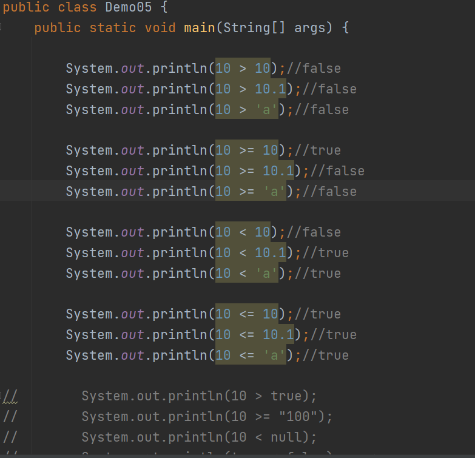

代码2

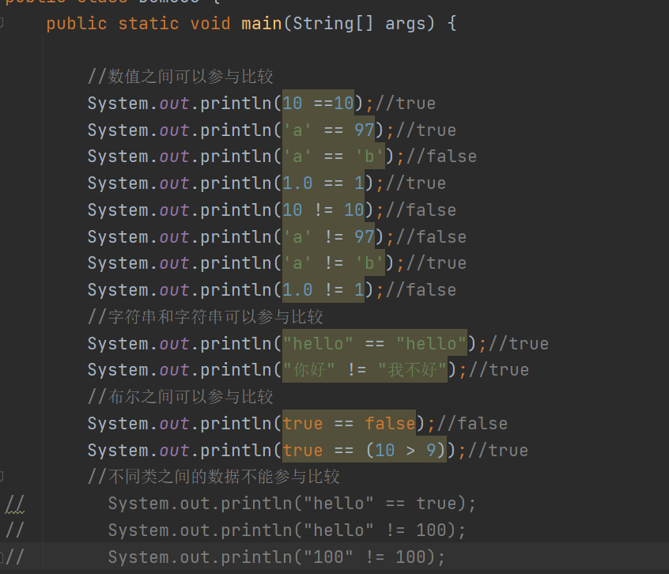

### 逻辑运算符

1.  分类：

& \| && \|\| !

1.  &：逻辑与运算符

比较方式：左右两边的表达式结果如果都为真，最终结果为真

左右两边的表达式结果如果有一个为假，最终结果为假

特点：不管左边的表达式是真还是假，右边的表达式都会执行

总结：全真为真，否则为假

1.  \|：逻辑或运算符

比较方式：全假为假，否则为真

特点：不管前面的是真还是假，右边的都会执行

1.  &&：逻辑短路与【常用】

比较方式：和&一模一样 。都是全真为真，否则为假

特点：如果符号左边的表达式结果为假，右边的表达式就不会执行，整个结果取假

1.  \|\|：逻辑短路或【常用】

比较方式：和\|比较方式以某一样 全假为假，否则为真

特点：如果符号左边的表达式为真，右边的表达式不会执行，整个结果取真

1.  ！：逻辑非

比较方式：取反（真为假，假为真）

代码1

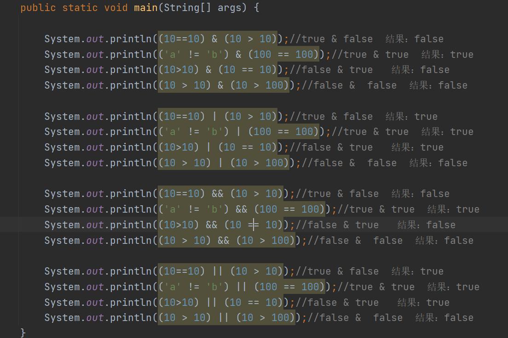

代码2

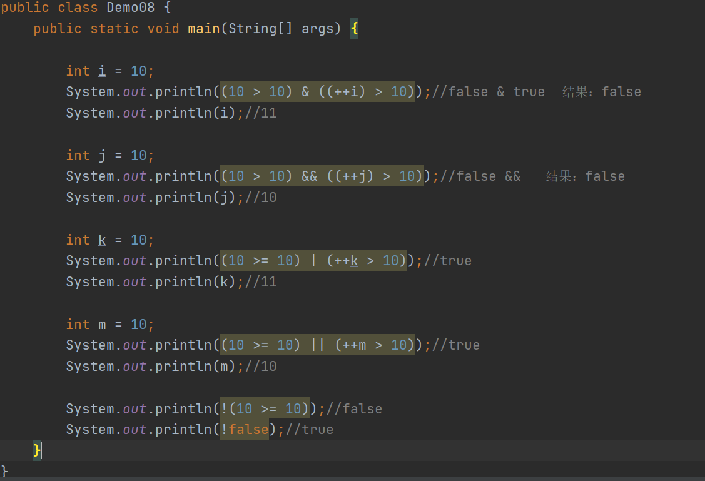

### 三元运算符

1.  元：用来表示数据或者表达式

2.  三元：可以表示三个数据或者三个表达式

3.  格式：

表达式1 ？ 表达式2 ：表达式3；

1.  说明：

2.  表达式1必须是一个布尔表达式（结果要么为真要么为假的表达式）

3.  表达式2和表达式3可以是任意操作

4.  三元运算符的执行流程：

5.  先执行表达式1，结果要么为真要么为假

6.  如果表达式1的结果为真，执行表达式2，结束

7.  如果表达式1的结果为假，执行表达式3，结束

代码

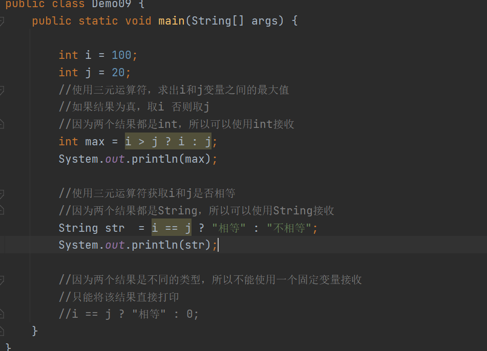

### 位运算符【拓展了解】

1.  概述：再进行数据的运算符，是根据该数据的二进制移动位置来改变的一种方式

2.  分类：

\<\< \>\> \>\>\>

1.  \<\<：左移运算符

数据向左移动一位，扩大2倍。向左移动两位，扩大4倍

1.  \>\>：右移运算符

数据向右移动一位，缩小2倍。向右移动两位，缩小4倍

1.  \>\>\>：无符号右移运算符

该符号的运算方式和\>\>相同，只不过该符号只能用来移动正数，不能用来移动负数

代码

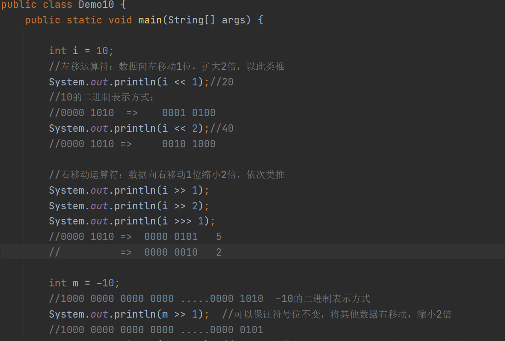

## 数据的进制

1.  进制：数据进位的一种规则

2.  常见的进制：二进制 八进制 十进制 十六进制

3.  二进制：

二进制的每一个数据，都是由：0和1组成

二进制的进位规则：逢二进一

举例：0、1、10、11、100、101、110、111、1000

1.  八进制：

八进制的每一个数据，都是由：0 - 7组成

八进制的进位规则：逢八进一

举例：0、1、2、3、4、5、6、7、10、11、12、13、14、15、16、17、20....77、100

1.  十进制：

每一个数据，都是由0-9组成

进位规则：逢十进一

0、1、2、3、4、5、6、7、8、9、10......99、100

1.  十六进制：

十六进制的每一个数据，由0-9abcdef

十六进制的进位规则：逢十六进一

举例：0...9、a、b、c、d、e、f、10、11、12....1f、20.....af、b0....ff、100

1.  通过各种进制来表示数据：

二进制的数据：0b数据

八进制的数据：0数据

十进制的数据：数据

十六的进制数据：0x数据

代码

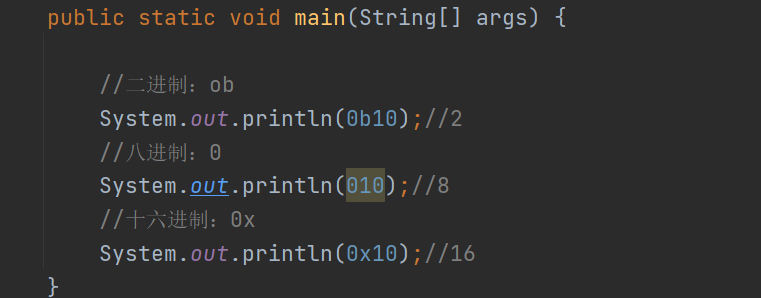

### 其他进制转为十进制

1.  概述：将二进制、八进制、十六进制的数据转换为十进制数据表示

2.  方式：系数\*基数的权次幂 求和

3.  解释：

系数：每一位的值是多少，系数就是多少 100

基数：当前数据是几进制，基数就是几 100二进制：2 八进制：8

权：从右往左依次递增 0开始

1.  验证：

十进制的数据13579：9\* 10\^0 + 7\*10\^1 + 5\*10\^2 + 3\*10\^3 + 1\*10\^ 4

= 9 +70 + 500 + 3000 + 10000

=13579

1.  二进制转为十进制：

101011：1\*2\^0 + 1\*2\^1 + 0\*2\^2 + 1\*2\^3 + 0\*2\^4 + 1\*2\^5

= 1 + 2+ 0 + 8 + 0 + 32

= 43

1.  八进制转为十进制：

732：2\*8\^0 + 3\*8\^1 + 7\*8\^2

= 2 + 24 + 448

=474

1.  十六进制转为十进制：

1af：15\*16\^0 + 10\*16\^1 + 1 \*16\^2

= 15 + 160 + 256

=431

### 自主练习

1.  二进制的110011 转为十进制：51

2.  八进制的1172转为十进制：634

3.  十六进制bf3转为十进制：3059

### 十进制转为其他进制

1.  方式：除基倒取余

2.  解释：

除：除法运算

基：当前十进制的数据要转为几进制，基就是几

倒取余：反过来获取每次相除的余数

1.  十进制转为其他进制：

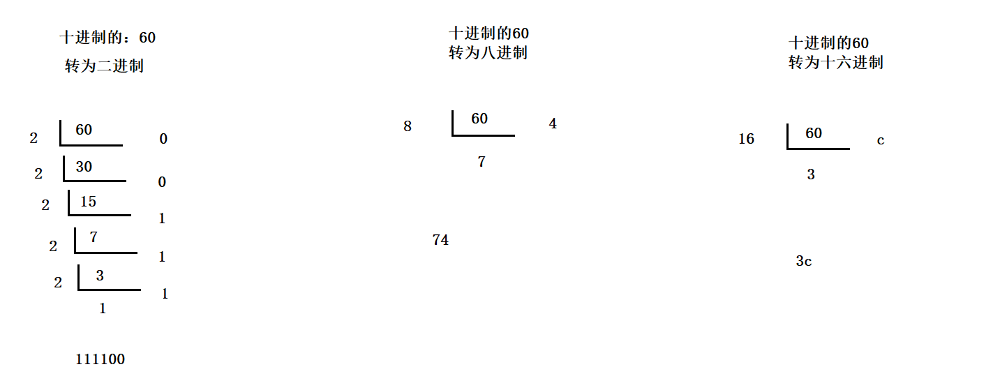

## 键盘录入

1.  概述：在程序启动之后，可以让用户给变量录入一些数据，将来用户录入的是多少，代
    码中就使用多少。

2.  步骤：

3.  导包：import java.util.Scanner;

4.  创建对象：Scanner sc = new Scanner(System.in);

5.  使用方法来录入数据：int x = sc.nextInt();

6.  可以使用这个变量x

7.  注意事项：

8.  导包操作是在类的上面进行完成

9.  nextInt方法，只可以录入整数

10. 如果想要录入小数：nextDouble()

11. 如果想要录入字符串：next();

12. 一般要录入一个字符串：nextLine()

13. 如果想要同时录入多个数据，只需要导包一次，创建一次对象即可

代码

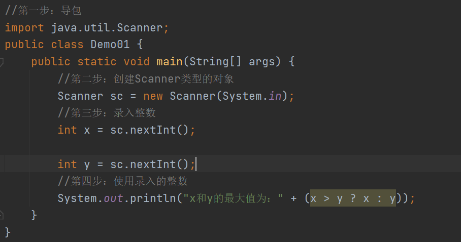

练习

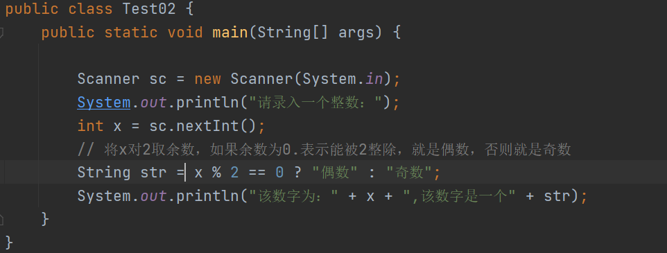

## 获取随机数

1.  概述：可以让程序给变量随机赋值。

2.  步骤：

3.  导包：import java.util.Random;

4.  创建对象：Random r = new Random();

5.  使用方法随机获取一个整数：int x = r.nextInt();

6.  使用获取的随机数x

代码

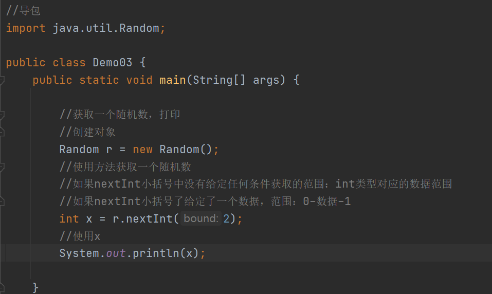

练习

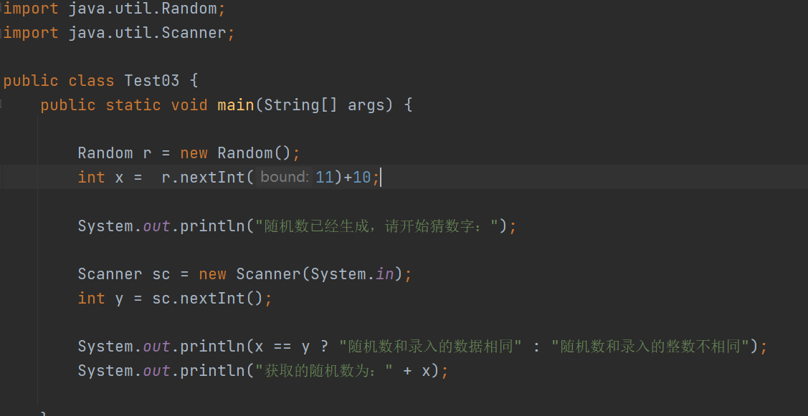
