# Day04

## 今日内容

1.  分支结构

2.  循环结构

## 流程控制

1.  流程：代码执行的顺序

2.  流程控制：可以通过某些格式控制代码执行的顺序

3.  分类：

顺序结构：代码从上往下，从左往右依次执行【默认执行方式】

分支结构：在代码的执行过程中，可能会碰到不同的选择，选择不同的内容，执行的结
果也不同。

特点：代码写的多，执行的少

循环结构：如果有一些相同的或者相似的代码需要反复执行，可以利用循环结构来简化
代码

## 分支结构

1、概念：在代码的执行过程中，可能会碰到不同的选择，选择不同的内容，执行的结
果也不同。

2、分类：

if语句

if

if...else

if...else if...else if...else

switch语句

### If语句的第一种格式

1.  格式：

if(条件表达式){

语句体;

}

1.  注意事项：

2.  条件表达式的执行结果必须是真或者假（布尔表达式）

3.  语句体没有固定的要求

4.  小括号的后面不要加分号，否则无法控制语句体

5.  如果大括号中的语句体只有一句，可以省略大括号

6.  如果大括号中的语句体有多句，不能省略大括号，如果省略，只能控制第一句

7.  执行流程：

8.  先执行条件表达式，结果真或者假

9.  如果结果为真，就执行语句体

10. 如果结果为假，不执行语句体

代码

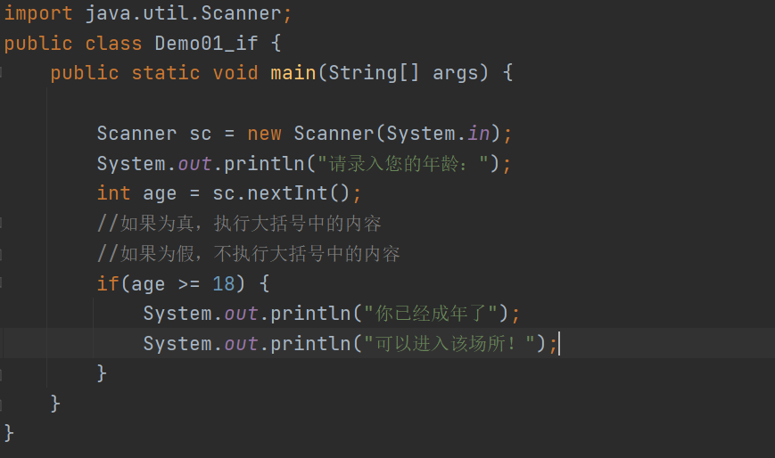

### If语句的第二种格式

1.  格式：

if(条件表达式){

语句体1；

}else{

语句体2;

}

1.  执行流程：

2.  执行条件表达式，结果为真或者为假

3.  如果结果为真，执行语句体1

4.  如果结果为假，执行语句体2

代码

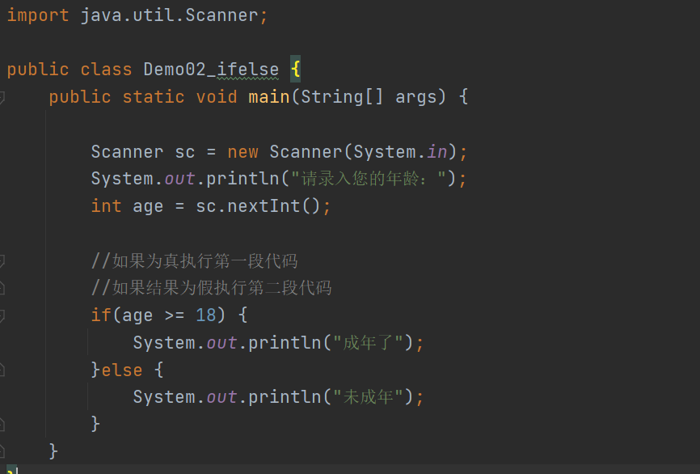

### If语句的第三种格式

1.  格式：

if(条件表达式1){

语句体1;

}else if(条件表达式2){

语句体2;

}else if(条件表达式3){

语句体3;

}

.......

else{

语句体N;

}

1.  执行流程：

2.  执行条件表达式1，结果真或者假

3.  如果表达式1的结果为真，执行语句体1，直接结束if语句

4.  如果表达式1的结果为假，不执行语句体1，执行表达式2

5.  如果表达式2的结果为真，执行语句体2，直接结束if语句

6.  如果表达式2的结果为假，依次执行后续的条件表达式（同上）

7.  如果定义的多个表达式全部为假，就执行最后的else中的语句体n

8.  问题：

（1）有没有一种可能， 执行的语句体为两段或者两段以上？

没有可能，因为如果执行一段之后，直接结束

1.  有没有可能，一段代码也执行不到？

else代码段可以加可以不加，如果加的话，至少保证会执行代码

如果不加else代码段，有可能一段也执行不到。

代码

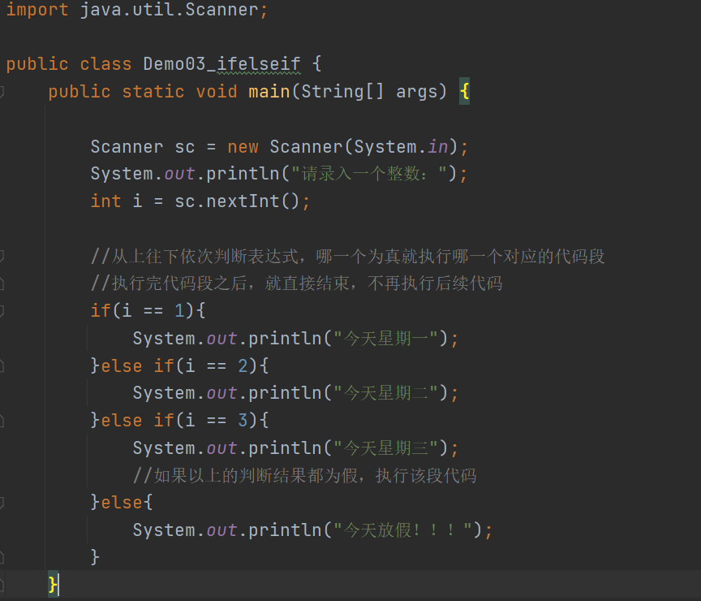

练习1

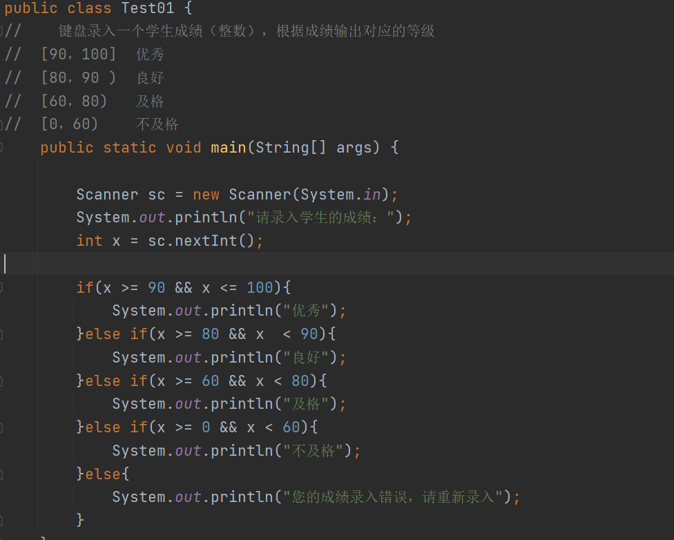

练习2

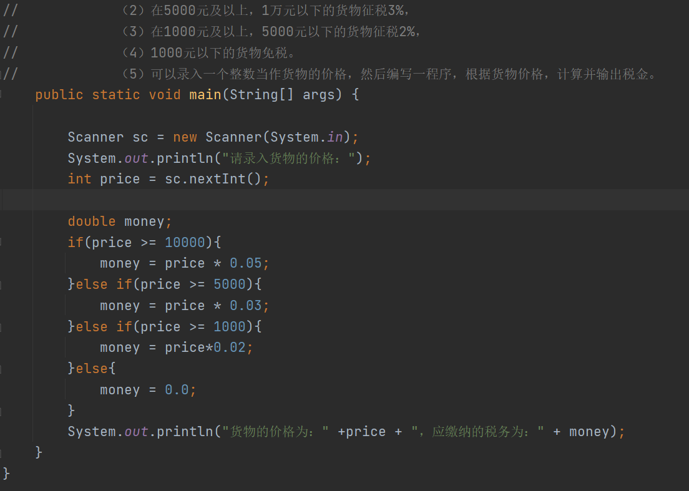

### 

### 

### switch语句

1.  格式：

switch(表达式){

case 常量1：

语句体1；

break;

case 常量2：

语句体2；

break;

case 常量3：

语句体3；

break;

....

default:

语句体n;

}

1.  执行流程：

2.  先获取小括号中表达式的值x

3.  将x和常量1匹配。如果相等，就执行语句体1，执行break，直接结束

4.  如果x和常量1不相等，就不执行语句体1，直接和常量2匹配

5.  如果x和常量2相等，就执行语句体2，执行break，直接结束

6.  如果x和常量2不相等，继续和常量3匹配（同上）

7.  如果x和定义的每一个常量都不相等，就执行最后的语句体n

代码

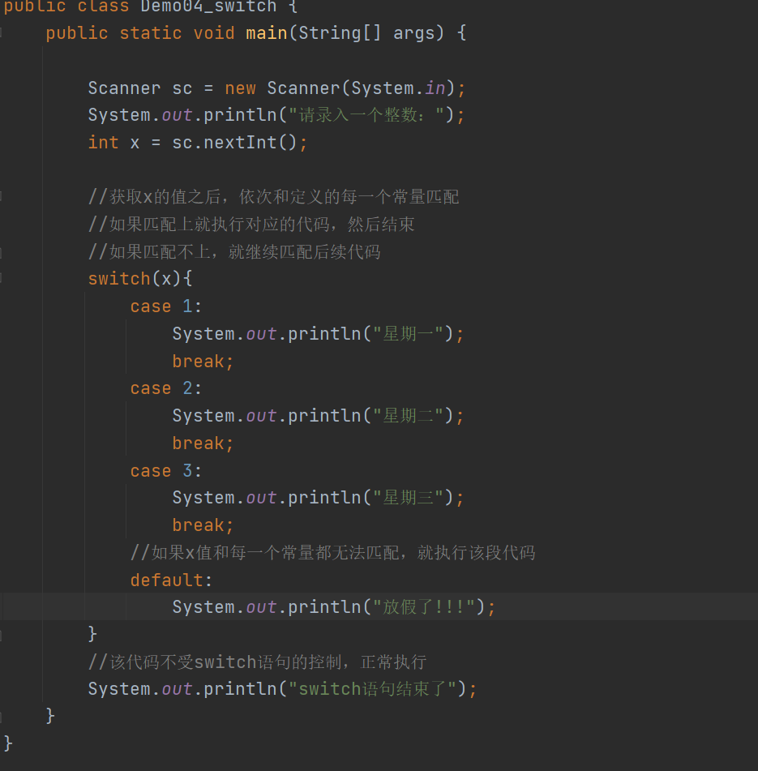

### switch语句的注意事项

1.  小括号中表达式的值的数据类型：byte short int char String 枚举

2.  case后面跟的数据必须是常量，不能是变量

3.  break关键字一般情况要加上，如果不加，会发生case穿透

4.  default代码段可以写也可以不写

如果加上能保证有代码执行，如果不加，可能一段代码也执行不了

1.  default语句可以放在switch中的任意位置，如果放在前面或者中间，需要加上break防
    止发生穿透。

## 循环结构

1.  概念：如果程序中有一些相同的或者相似的代码需要反复执行时，可以利用循环结构来
    简化操作。

2.  分类：

for循环

while循环

do...while循环

### 

### for循环

1.  格式：

for(初始化语句;条件表达式;初始化语句的变化){

循环体语句;

}

1.  解释说明：

2.  初始化语句：用来记录循环的次数，一般通过一个变量来实现

3.  条件表达式：（结果为真或者假）用来控制循环是应该继续还是应该结束

4.  初始化语句的变化：随着循环的继续，应该让记录的次数不断改变

5.  循环体语句：需要反复执行的代码

6.  执行流程：

7.  初始化语句，表示先定义一个变量来记录循环次数

8.  执行条件表达式，结果为真或者为假

9.  如果条件表达式的结果为假，直接结束for循环，不再继续

10. 如果结果为真，执行循环体语句

11. 执行初始化语句的变化

12. 重新回到第二步，重新判断结果

代码

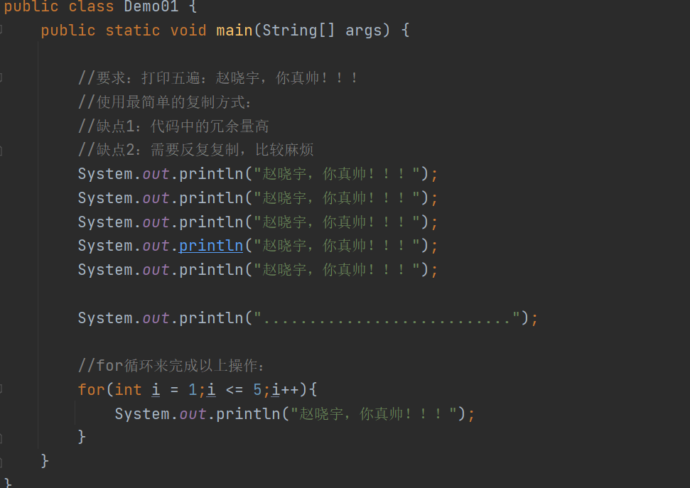

### for循环的注意事项

1.  for循环小括号中的三部分内容要通过分号分隔

2.  for循环后面的小括号不要加分号

3.  for循环中的循环体如果只有一句，可以省略大括号，如果有多句，不能省略

4.  for循环中的条件表达式必须结果为真或者为假

5.  for循环中的初始化语句的变化，可以是增加可以是减少的

只要让循环满足的次数能够解决问题即可

练习1

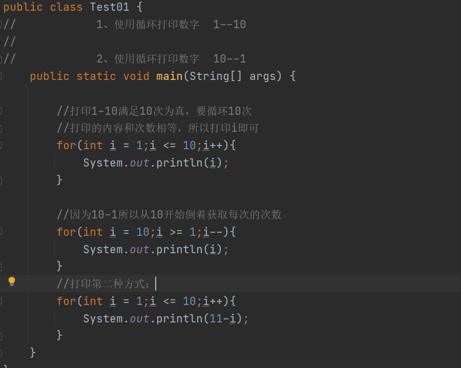

练习2

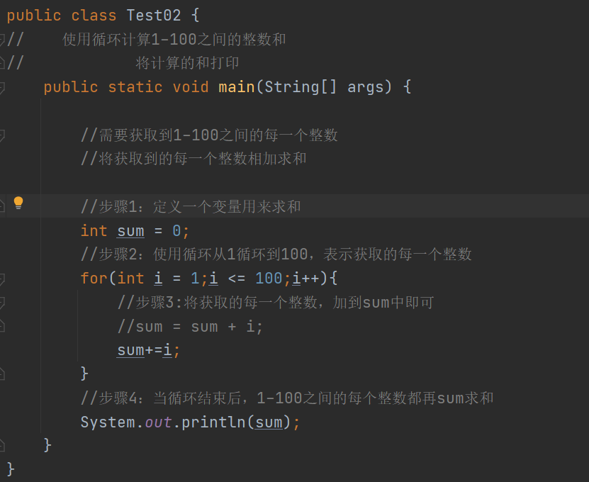

练习3

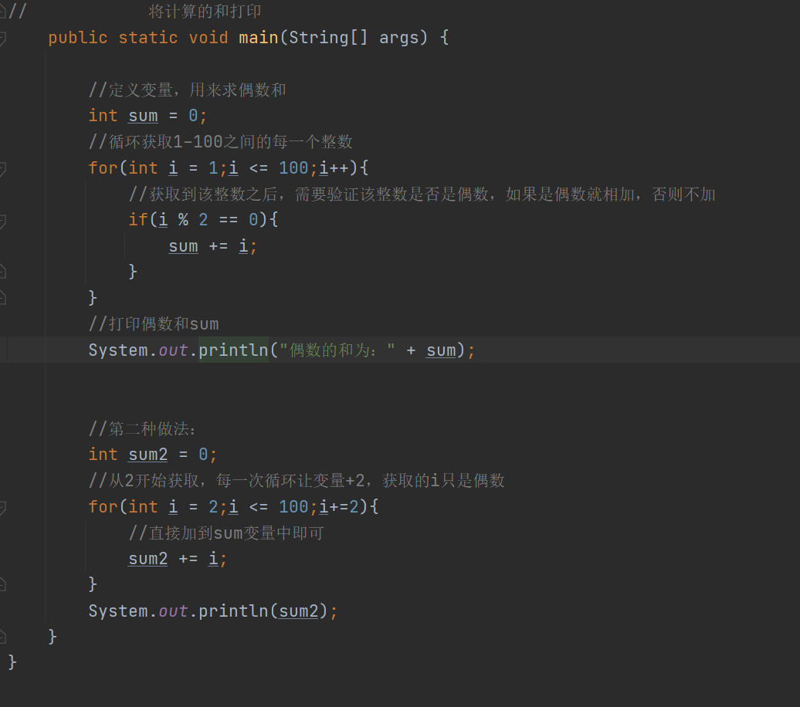

练习4

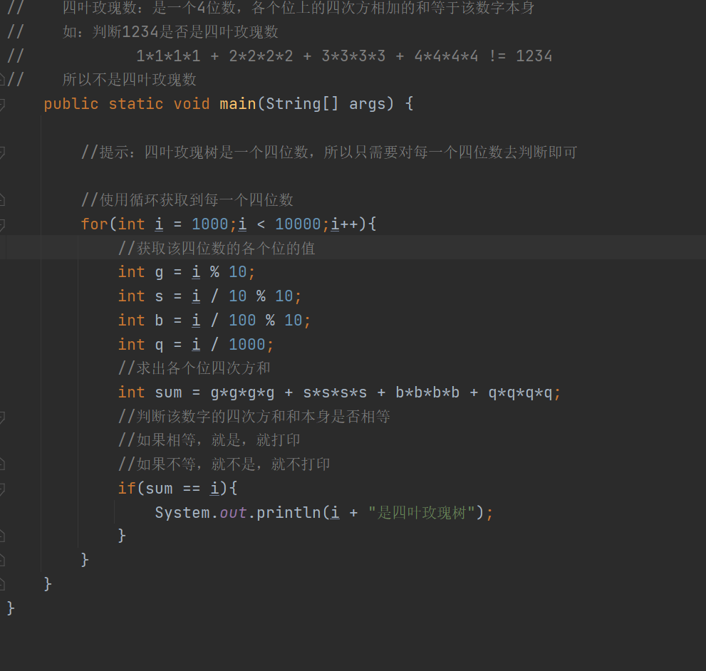

### while循环

1.  格式：

初始化语句;

while(条件表达式){

循环体语句;

初始化语句的变化;

}

1.  执行流程：

2.  初始化语句

3.  条件表达式，结果为真或为假

4.  如果结果为假，直接结束while循环

5.  如果结果为真，执行循环体语句

6.  执行初始化语句的变化

7.  回到第二步重新判断

代码

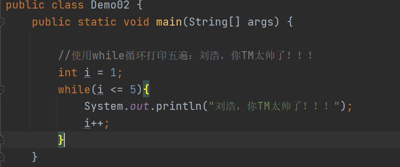

练习

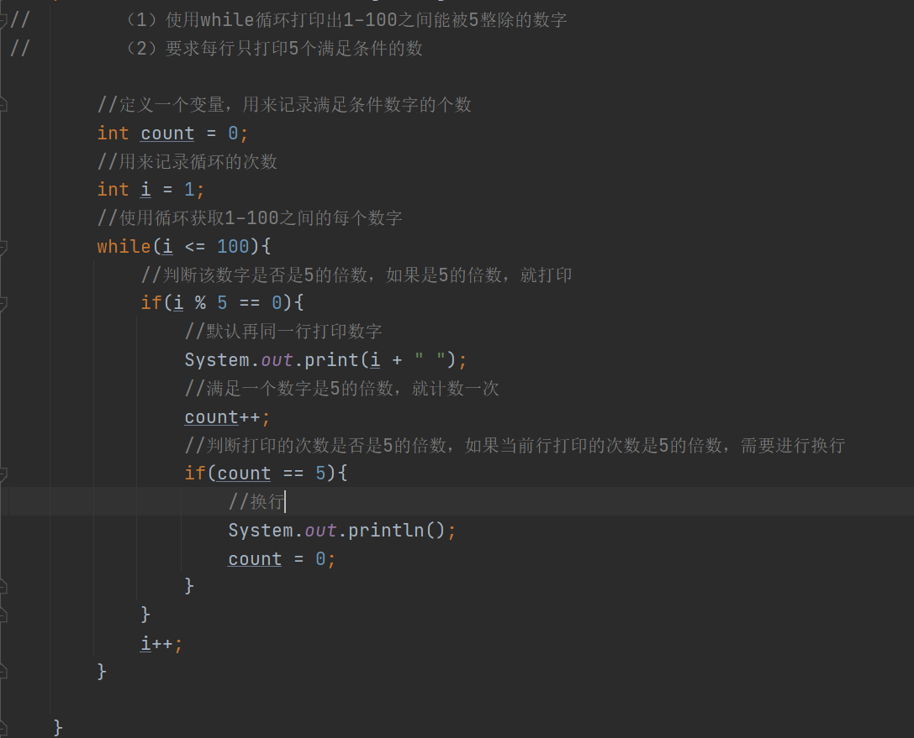

### do...while循环

1.  格式：

初始化语句;

do{

循环体语句;

初始化语句的变化;

}while(条件表达式);

1.  执行流程：

2.  执行初始化语句

3.  执行循环体语句

4.  执行初始化语句的变化

5.  执行条件表达式，结果为真或者为假

6.  如果结果为假，结束循环，不再继续

7.  如果结果为真，重新回到第二步，执行循环体语句依次往下执行

代码

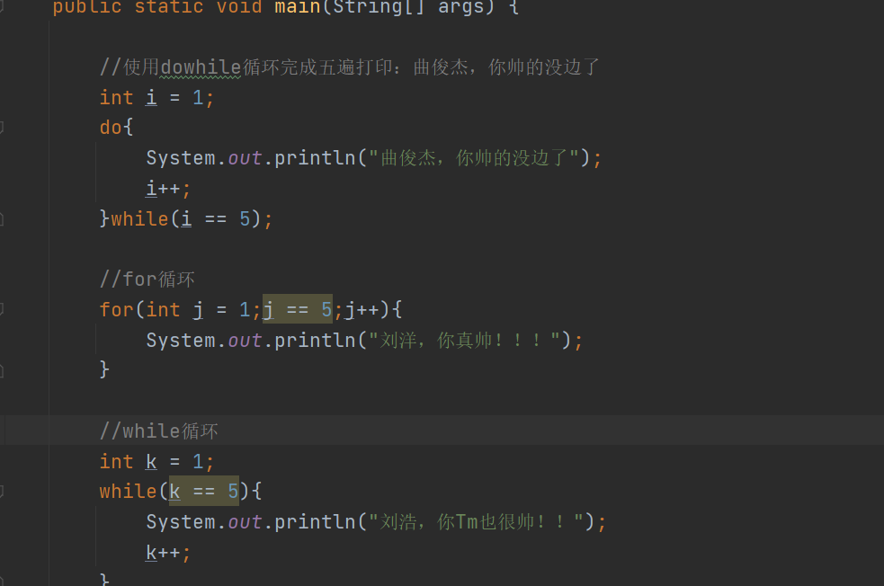

### 三种循环的区别

1.  do..while循环和for、while的区别：

do...while循环至少能保证执行一遍循环体

for和while有可能一遍循环体也无法执行

1.  while循环和for循环的区别：

for循环中定义的初始化语句的变量，在循环结束之后，不能使用

while循环中定义的初始化语句的变量，在循环结束后，可以继续使用
