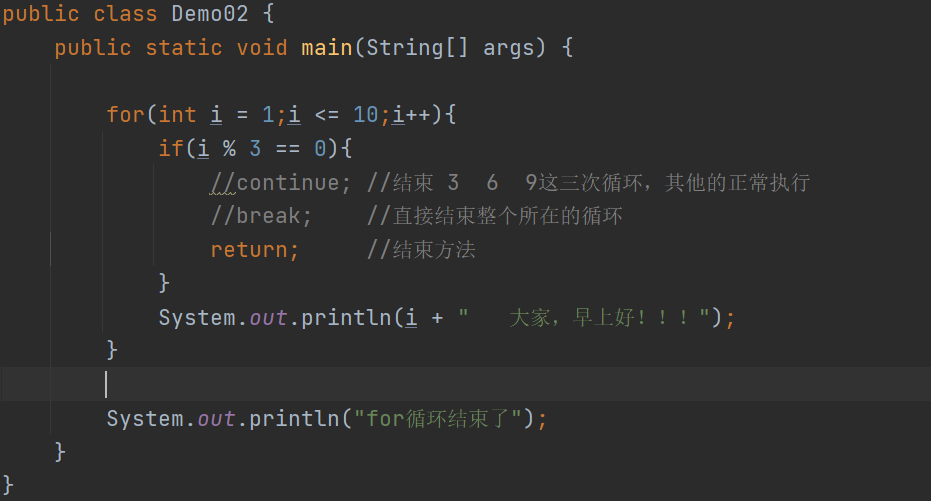

# Day05

## 今日内容

1.  死循环

2.  跳转语句

3.  嵌套循环

4.  方法

## 死循环

1.  概述：循环一直继续，无法结束

2.  格式：

for(;;){

循环体语句

}

while(true){

循环体语句

}

1.  注意事项：

死循环代码的后面，不能在继续定义其他代码。如果定义执行不到，编译报错

代码

## 跳转语句

1.  概述：可以将循环强制结束的一些关键字。

2.  分类：

continue; 结束本次循环，继续下次循环

break; 结束整个循环

return; 结束整个所在的方法

System.exit(0); 退出虚拟机

代码

## 嵌套循环

1.  概述：在一个循环中，循环体语句又是一个循环。（循环里面写循环）

2.  格式：

for(初始化语句1；条件表达式1；初始化语句1的变化){

for(初始化语句2；条件表达式2；初始化语句2的变化){

循环体语句;

}

}

1.  执行流程：

2.  初始化语句1

3.  执行条件表达式1

4.  如果条件表达式1的结果为假，直接结束整个循环

5.  如果表达式1的结果为真，进入内层循环，执行初始化语句2

6.  执行条件表达式2

7.  如果条件表达式2结果为假，执行外层循环初始化语句1的变化

1.  回到第二步判断

（8==6）如果条件表达式2结果为真，执行循环体语句

1.  执行初始化语句2的变化

2.  回到第五步，重新判断内层循环的条件表达式

代码

案例1

案例2

练习1

练习2

## 方法

1.  概述：用来表示某一个功能的代码段。

2.  原因：

如果在后续的编程中，有一段代码经常调用，可以将这段经常调用的代码使用一个大括
号括起来，然后再给这段代码起一个名字，后续再次使用这段代码时，直接调用这个名
字即可，不需要将这段代码重复定义。

1.  好处：

2.  减少代码冗余

3.  后续再使用这个代码时，使用名字即可（使用方便）

### 方法的定义

1.  格式：

修饰符 返回值类型 方法名称（参数列表）{

方法体;

返回值语句;

}

1.  方法格式解释：

（1）修饰符：统一写为public static

（2）返回值类型：方法可以表示某一个功能，那么该功能有有可能有新数据的产出，
该方法产出的数据是什么类型，返回值类型就定义为什么类型。

（3）方法名称：给这段代码起一个名字。小驼峰命名法

（4）参数列表：方法想要实现某一个特定的功能，就可能要传递一些数据，传递给方
法的数据就是参数列表。一般通过定义变量的方式来定义参数列表

（5）方法体：实现该功能所需要的具体代码

（6）返回值语句：当方法将新数据产出之后，需要将数据返回给使用者

3、说明：

方法定义之后，不会默认启动。什么时候使用，什么才能被运行

### 方法的使用

1.  使用格式：

方法名(参数);

1.  调用格式分类：

直接调用：直接使用方法名  
输出调用：将调用方法的格式放在输出语句中

赋值调用：使用一个变量接收方法的返回值

代码

### 

### 

### 方法的注意事项

1.  方法的定义：

2.  方法之间是平级关系，不能嵌套定义

3.  方法虽然不能嵌套定义，但是可以嵌套使用

4.  方法定义的先后没有区别，先调用哪一个方法就先启动哪一个方法

5.  方法的参数：

形式参数：在定义方法时，定义的那些变量

实际参数：在使用方法时，传递的一些具体数据

强调：在使用方法时，传递的实际参数和形式参数是按照顺序赋值

1.  返回值类型和返回值语句：

2.  返回值语句使用return实现。return：一：结束方法 二：返回数据的

3.  返回值类型要和return返回数据的类型保持一致

4.  如果方法不需要返回值，返回类型就定义为void

5.  如果方法不需要返回值，可以不写返回值语句，或者写为return;

6.  如果方法需要返回数据，return语句必须放在方法的最后一行

### 方法在内存中的执行流程

### 

### 方法的重载

1.  重载：Overload

2.  概念：在同一个类中，多个方法的方法名相同，参数列表不同，返回值类型无关

3.  说明：

4.  方法的重载发生的前提：多个方法在同一个类中

5.  多个方法的方法名相同：大小写都一样

6.  参数列表不同：参数的个数不同、参数的类型不同、参数类型的顺序不同

7.  好处：

如果以后需要定义一些相同功能的方法时，可以将这些方法的名字起为一样，不用每一
个名字都不同，在使用这些方法时，只需要记住一个名字即可，默认会根据参数来区分
调用。

代码

