# Day06

## 今日内容

1.  数组的概述

2.  数组的初始化

3.  数组的内存图

4.  数组的异常

5.  数组的常用操作

6.  二维数组

## 数组的概述

1.  概述：用来存储或者操作多个数据的容器。

2.  使用数组的原因：

比如：有一家公司，公司有50个员工

问题：统计50个员工的个人薪资，以及总薪资？

需要计算出50个员工中的最高薪资和最低薪资？

使用数组存储或者操作多个数据的时候，使用数组比使用变量更加方便。

1.  比较：

如果后续需要操作多个数据时，可以使用数组

如果后续需要操作一个数据或者两个数据时，可以使用变量

## 数组的定义

1.  格式：

数据类型[] 数组名称 = new 数据类型[元素的个数];

1.  解释说明：

2.  数据类型：将来数组中存储的数据是什么类型，就定义为什么类型

3.  []：表示当前数组是一个，一维数组

4.  数组名称：给数组起一个名字 和变量起名规则相同

5.  =：赋值符号

6.  new：表示在内存中给数组中开辟空间的关键字

7.  数据类型：和前面的类型保持一致

8.  元素的个数：元素（表示的是数据） 存储数据的个数

9.  定义数组后打印数组名称结果：[I@1b6d3586

10. [：表示访问的数组是一个一维数组

11. I：表示访问的数组存储的数据类型是int类型

12. @：是一个普通的字符串，表示分隔

13. 1b6d3586：数组以后会有自己的内存空间，Java会通过哈希算法将这个内存空间
    按的地址计算为一个十进制的整数，再将这个十进制的整数转为十六进制。

14. 为了方便统计这个结果就将打印的内容称为数组的地址值，所以数组是引用数据
    类型。

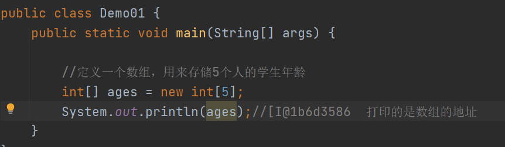

### 数组的初始化

1.  初始化：给数组分配空间并赋值

2.  分类：

动态初始化

静态初始化

1.  动态初始化：

动态初始化定义数组：数据类型[] 数组名称 = new 数据类型[元素的个数];

数据类型 数组名称[] = new 数据类型[元素的个数];

数组的赋值方式：

数组名称[元素的索引] = 值;

解释：

元素：表示存储的数据

索引：数组会默认给每一个元素分配一个有序的序号，这个序号就称为
索引。索引的范围：0----元素的个数-1

数组取值方式：数组名称[索引];

注意事项：

（1）存储数据的类型，要和定义的类型保持一致

（2）如果数组定义之后，没有给数组赋值，数组有一个默认值

默认值：整数：0 小数：0.0 字符：’’ 字符串：null 布尔：false

代码

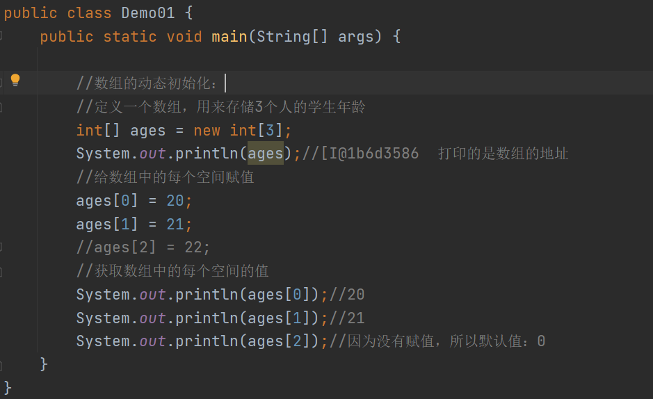

### 静态初始化

1.  格式：

数组类型[] 数组名称 = new 数据类型[]{元素的罗列};

1.  注意事项：

2.  静态初始化后面的中括号中不要写元素的个数，罗列的数据有几个，就存储几个

3.  元素值的罗列：每个数据之间使用逗号分隔

4.  静态初始化有一种简写格式：

数据类型[] 数组名称 = {元素的罗列};

1.  如果使用简写格式不能将数组的定义和赋值分为两行编辑

代码

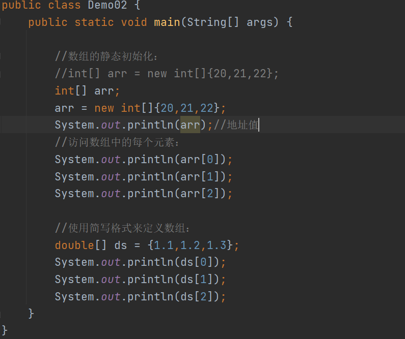

### 数组的内存图示

### JVM内存的划分

1.  JVM：java虚拟机，运行程序的容器。

2.  在JVM中有很多预区域的划分，不同的区域功能也不同。

3.  分类：

栈内存：用来执行方法的区域。 先进后出，后进先出

堆内存：用来存储数组、对象等等数据的区域。堆内存的空间大，存储数据量比较大的
数据

方法区：用来加载类的字节码对象 静态数据

程序计数器区：控制程序执行

本地方法区：用来执行本地方法，或者加载本地数据

一个数组在内存中的存储方式

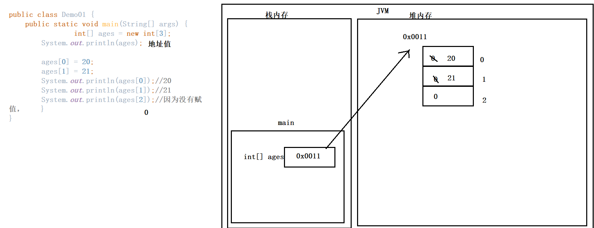

总结：

1.  定义的数组本身也是一个变量，也需要在栈内存中分配一段空间来存储地址

2.  数组中的地址在堆内存中开辟

3.  数组名称中保存的是数组在堆内存中的地址

4.  访问数组名称，就是在访问地址

5.  通过数组名称和索引访问数据，就是在访问堆内存中数组中的数据

多个数组的存储方式

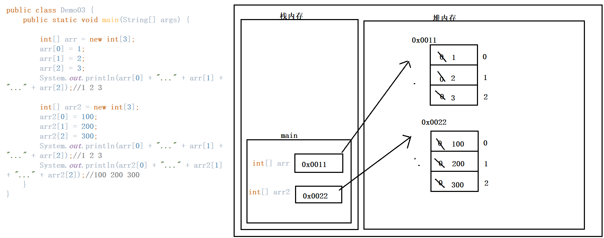

总结：

1.  在方法中定义了多个数组，在内存中开辟多个空间来存储地址

2.  使用new关键字之后，表示新建空间，而不是指向原来的空间

两个引用指向同一个数组

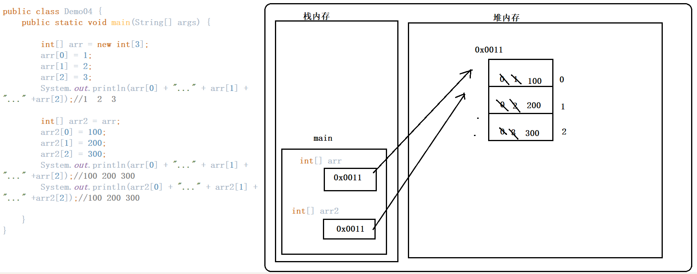

总结：

1.  当将其中一个数组的地址赋值给另外一个变量时，两个变量访问的是同一个数组

2.  如果其中一个变量通过地址改变了数组中的内容，另外一个变量在访问数组的内
    容时，是修改之后的结果。

补充：

引用：表示地址 Java语言的术语

指针：表示地址 C语言中的术语

引用数据类型：该类型的变量中保存的是地址

### 

### 数组的异常

1.  异常：在生活中，异常表示不正常的情况。

在代码中，导致程序出现问题的错误。

1.  异常类型1；

Exception in thread "main" java.lang.ArrayIndexOutOfBoundsException

异常 在 线程 主 数组 索引 超过 边界 异常

异常名称：数组索引越界异常

异常出现的原因：因为数组的索引是有一定范围的：0----元素的个数-1

如果访问的索引不指定范围内，程序就出现该异常

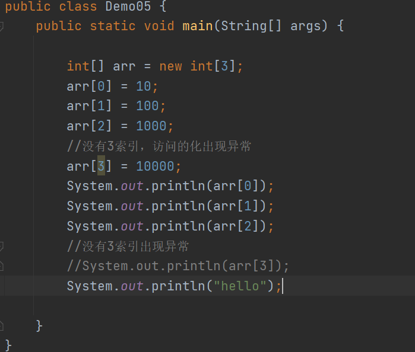

1.  异常类型2：

Exception in thread "main" java.lang.NullPointerException

空 指针 异常

名称：空指针异常

原因：因为该数组中的地址为空，通过空地址不能访问到数组中的数据，如果偏要访问，
就出现该异常。

避免：在访问该数组的数据之前，可以判断该数组的地址是否是空，如果不为空再访问

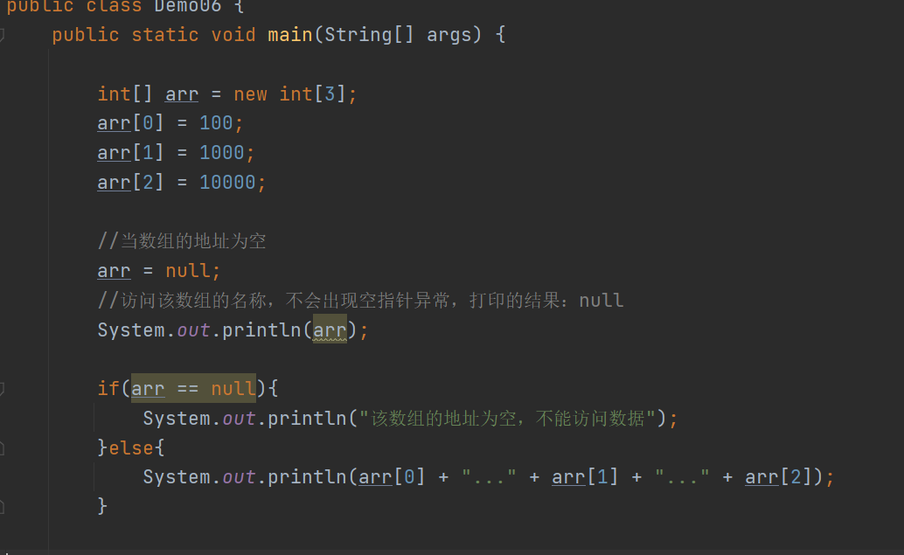

### 数组的常用操作

1.  概述：数组中可以存储很多数据，后续再操作这些数据的时候，有一些简单的操作方式

2.  分类：

数组的遍历

数组的最值

数组中元素的交换

数组的反转

数组元素的查找

数组的排序

### 数组的遍历

1.  遍历：逐个获取数组中的每个元素

2.  思路：数组中的每个元素不是有序的，无法直接快速获取每个元素，但是每个元素的索
    引是有序的，可以通过循环来获取索引，再通过获取的索引依次取出每个数据。

3.  补充：数组名称.length 可以自动获取数组中元素的个数

代码

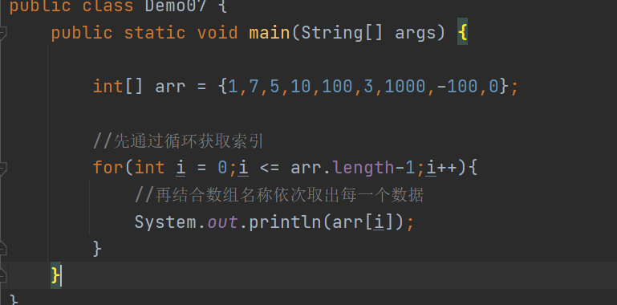

### 数组最值的获取

1.  概述：获取数组的最大值和最小值。

2.  思路：

可以先定义一个变量，用来存储最大值。再依次获取数组中的没一个元素，分别定义
的变量比较，如果数组中的元素大于变量中存储的数据，就将变量的值替换，如果数组
中的元素比变量中的值小，就不需要替换。当每个元素都比较之后，变量中存储的就是
最大值。

1.  注意：

定义的最大值变量，默认值不能是无关元素，需要赋值为参与比较的元素

代码

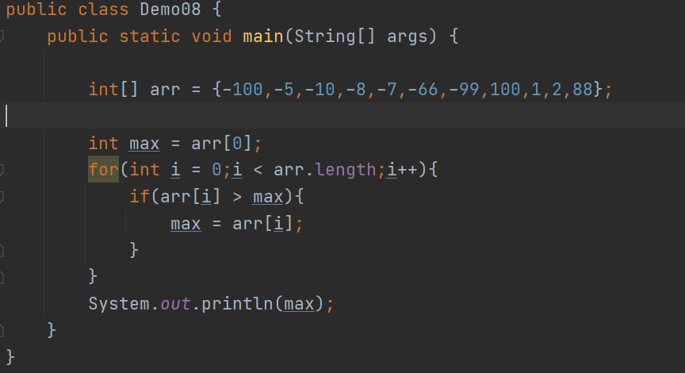

### 数组元素的交换

1.  概述：给定一个数组，交换两个索引元素的位置s

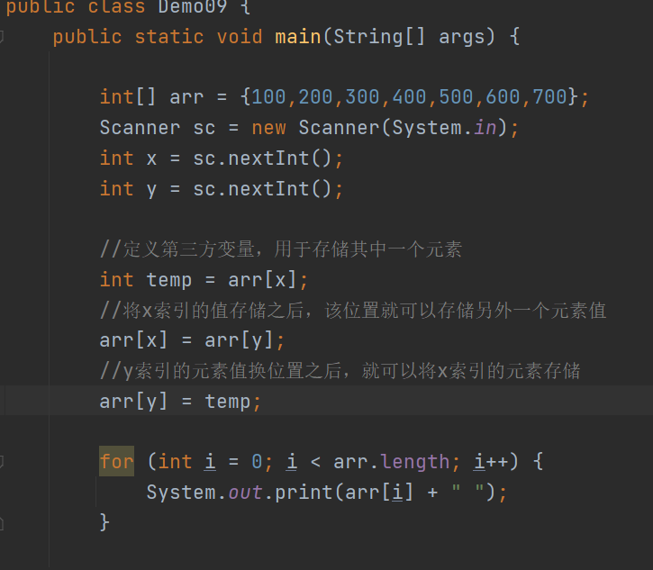

### 数组的反转

1.  概述：将数组中的元素逆序排列。

2.  图示：

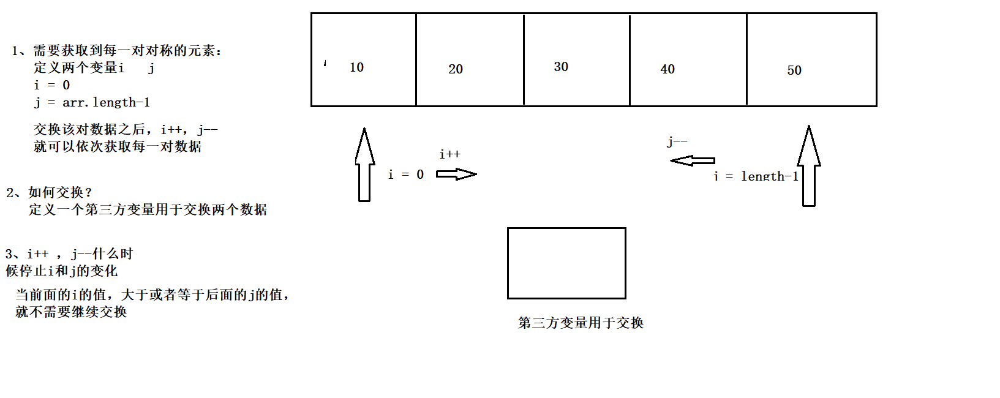

代码

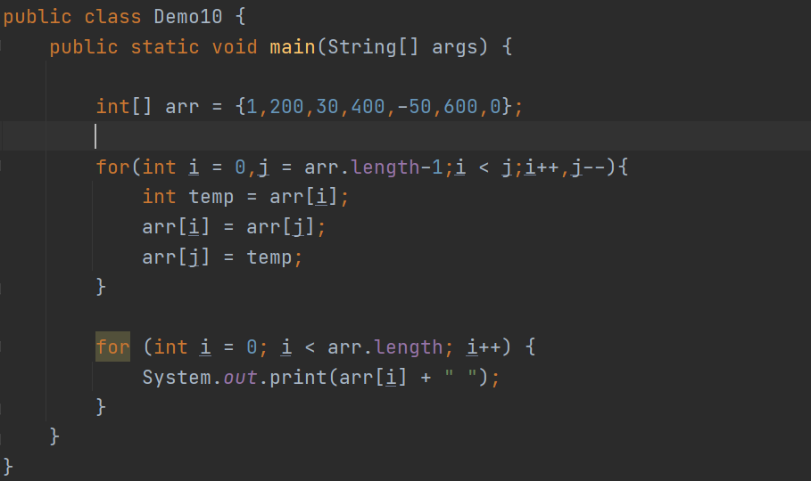

### 数组元素的查找

1.  概述：给定一个数组，以及一个数据，获取该数据在数组中的位置

代码

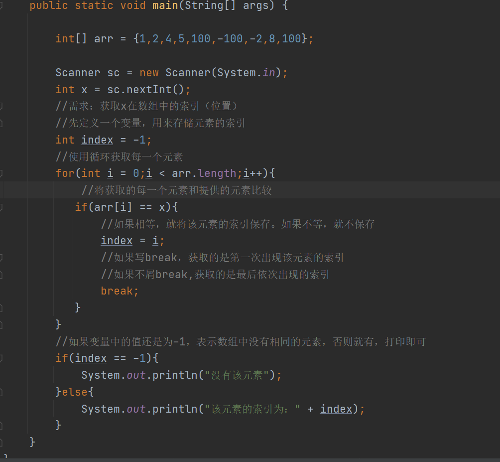

### 数组的排序

1.  概述：将数组中的元素按照从小到大或者从大到小的方式依次排列

2.  方式：冒泡排序

3.  图示理解：

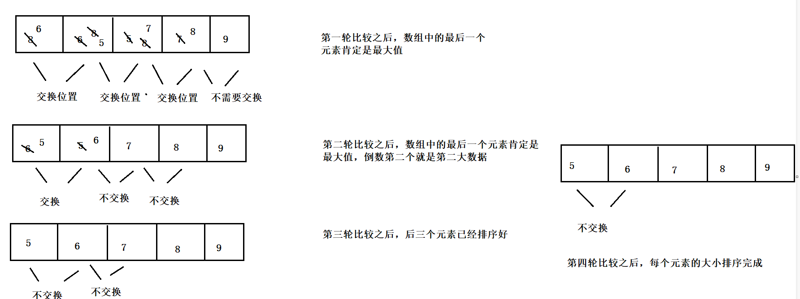

代码

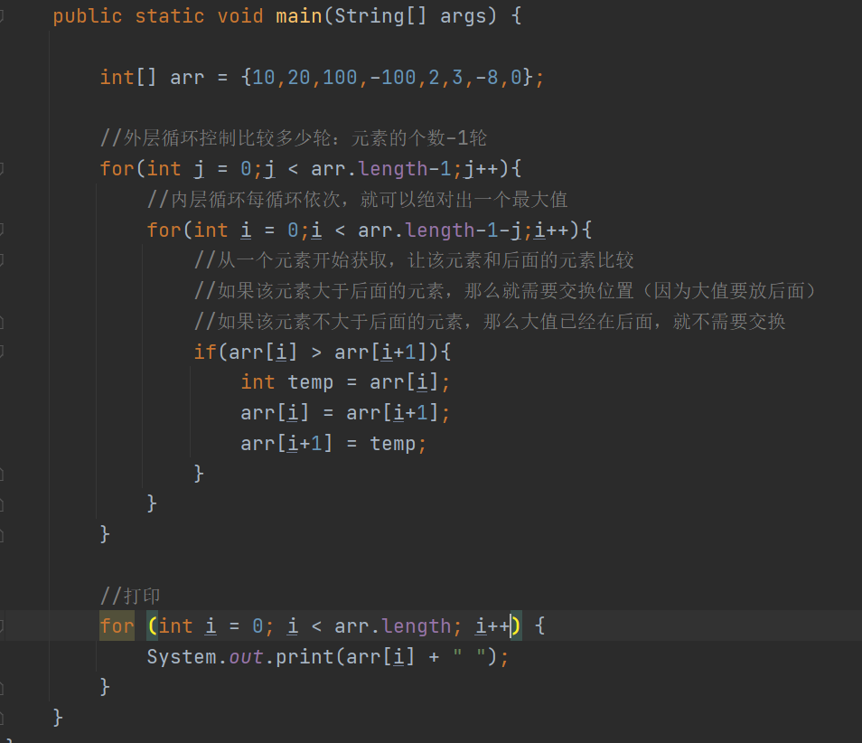

## 二维数组

1.  概述：数组中存储的数据是另外一些一维数组的地址，那么该数组就是一个二维数组

2.  二维数组的初始化：

动态初始化：

举例说明：int[][] arr = new int[num1][num2];

解释：

1.  int：二维数组中的每一个一维数组中存储的元素是int类型

2.  [][]：表示当前数组是二维数组

3.  num1：表示当前二维数组中可以存储一维数组的个数

4.  num2：表示每一个一维数组中可以存储的数据的个数

二维数组的图示：

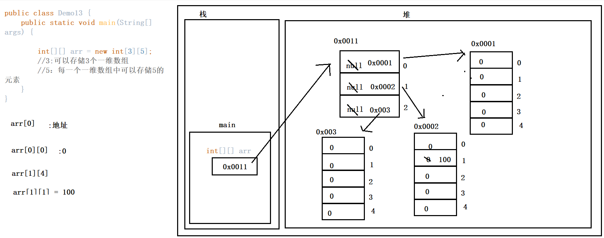

二维数组的静态初始化

1.  格式：

举例：int[][] arr = new int[][]{ {1,2,3},{100,200},{3000} };

简写格式：int[][] arr = {{1},{200,300},null}

二维数组的遍历

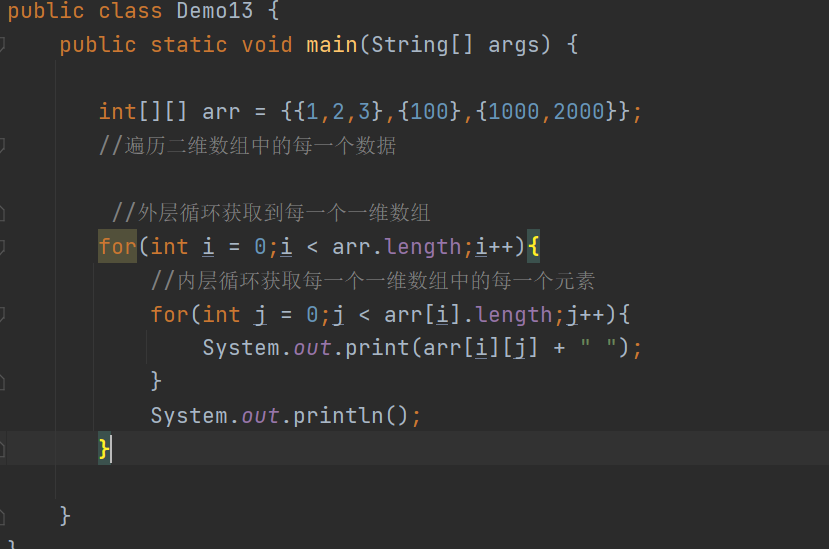
