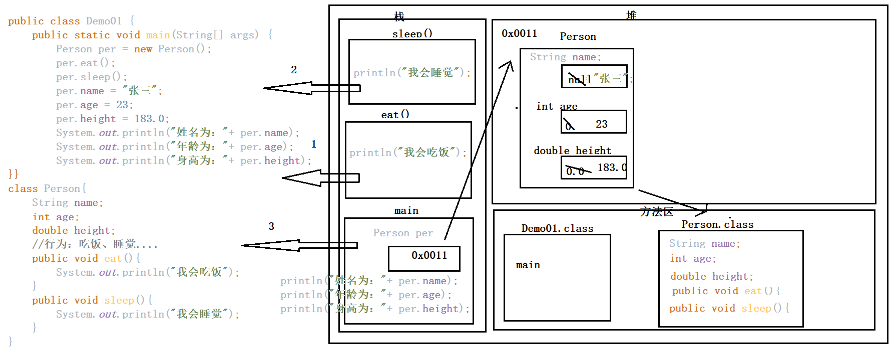

# Day07

## 今日内容

1.  面向对象

2.  封装

## 面向对象

1.  概述：面向对象是Java语言编程使用的一种编程思路，编程思想。

2.  面向过程和面向对象：

面向过程：比较注重解决问题的步骤；比如：碰到一个问题，需要考虑解决这个问题的
每一步应该怎么做。

面向对象：比较注重解决问题的主题；比如：碰到一个问题，需要考虑找一个主题来完
成来解决问题。

1.  洗衣服：

面向过程：找个盆、放衣服、放水、放洗衣液、泡一泡、洗一洗、晾一晾

面向对象：找一个全自动洗衣机

1.  面向对象和面向过程的关系：

面向对象基于面向过程的；面向过程是面向对象的基础

1.  面向对象的特征：

封装、继承、多态

## 类和对象

1.  类：类型。对一些相同的或者相似的事物的一个统称。概念

2.  对象：一些具体的事物，或者一些实实在在的事物 实例

## 类的具体的定义

1.  类：类型：对一些事物统称。一般想要定义一个类型，从两点来进行定义。

属性：对该类型的信息的描述。

在Java语言中，一般通过变量来定义类型的属性。在类中方法外来定义该变量

行为：对该类型的功能的定义。

在Java语言中，一般通过方法来定义类型的功能。方法的修饰符：public

1.  举例：

人类{

属性：姓名、身高、体重、年龄....

功能：会吃饭、会睡觉、会打豆豆

}

1.  说明：

带着main方法的类型称为：测试类（程序的入口）

自己定义的类型：自定义类（用来定义属性和方法）

不管是自定义类还是测试类，要使用都需要先编译为class文件

### 对象的创建和使用

1.  创建对象的格式：

类型 对象名 = new 类名();

1.  说明：

类型：要创建哪一个类的对象，就写哪一个类的类名即可

对象名：给该对象起一个名字 和普通变量起名规则相同

=：赋值符号

new：表示关键字，用于开辟空间

类名：和前面的名字一致

()：构造方法

访问属性：

对象名.属性名

1.  给属性赋值：

对象名.属性名 = 属性值;

1.  访问方法：

对象名.方法名;

代码

## 类和对象在内存中的执行流程

### 一个对象在内存中的存储方式

总结：

1.  使用一个类型之前，需要先加载该类型，类型在方法区中加载

2.  创建一个对象名，就是在方法中，定义一个变量，分配一段空间，用来存储地址

3.  创建对象是在堆内存中创建的，对象中存储的是属性值

4.  使用对象访问的方法，是栈内存中运行的

5.  使用对象名访问属性，通过变量中存储的地址找到堆内存中的对象，以此来访问
    对象中的属性值。

### 两个对象在内存中的存储方式

总结：

1.  类型加载过一次，下次使用时不需要重复加载

2.  不同的对象中都有相同的属性，但是属性值可能不同（不同的对象保存自己不同
    的属性值）

### 两个引用指向同一个对象

总结：

（1）当两个变量中保存的是同一个对象的地址时，其中一个变量修改了对象的属性值，
另外一个在访问时，访问的是修改后的结果。

### 成员变量和局部变量

1.  局部变量：在方法中定义的变量

2.  成员变量：在类中方法外定义的变量

3.  区别：

4.  局部变量和成员变量定义的位置不同

5.  变量存储区域不同：

成员变量： 在堆内存中存储

局部变量： 在栈内存中存储

1.  生命周期不同：

成员变量：随着对象的创建而存在，随着对象的消失而消失（当方法中没有引用
访问该对象时，那么该对象就会被默认回收）

局部变量：随着方法的调用而存在，随着方法的调用结束而消失

1.  默认值不同：

成员变量：有默认值

局部变量：没有默认值

### 匿名对象

1.  概述：在创建一个对象之后，没有给该对象起名（没有使用一个变量接收该对象地址）

2.  格式：

new 类名();

1.  使用场景：

2.  使用某个方法，该方法需要一个对象，那么可以使用匿名对象当作实际参数来传
    递该数据。

3.  当需要调用类型中的某个方法时，可以使用匿名对象来调用该方法

4.  使用匿名对象的好处：

节约内存空间。

图示对比：

代码

## 封装

1.  概念：在生活中，每个人应该都有自己的信息，这些信息都应该只有自己有权力去访问
    或者修改。如果每个人的信息没有一种安全性，就造成一些错误的情况。在类中定义的
    属性和方法，如果没有一些保护的手段，那么该方法或者属性就可以被其他类随意访问，
    就不能保证安全性，所以需要封装来保证安全性。

2.  实现封装的关键字：private

3.  如果需要让类中的属性和方法不能被其他类访问，就可以使用private修饰

4.  私有之后的问题：一旦属性和方法被私有之后，那么该属性和方法就不能在其它类中被
    访问，那定义的该属性和方法也就没有意义

5.  解决问题：给私有之后的属性和方法提供一个公共的访问方式：

定义的属性一般需要两种操作：一种是赋值，一种是取值

所以就给私有的属性提供一个公共的赋值和取值操作

公共的赋值操作：set属性名

公共的取值操作：get属性名

可以在公共的方法种，提供各种条件来限制对该属性的使用

1.  封装的原则：

2.  将属性和方法通过private修饰（私有化）

3.  给私有化的内容，提供公共的访问方式

代码

### 封装的优化

1.  优化的方式：在定义类的方法或者方法的参数时，要做到原则：见名知意

2.  实现方式：

在定义公共的访问方法时，方法的名字：get属性或者set属性名

在定义方法的参数时，给哪一个属性赋值，参数名就定义为对应的属性名、

1.  Java语言中变量的访问原则：就近原则

在Java语言中要访问某一个变量，先看当前方法中有没有该变量的定义，如果该方法
中有定义该变量，就直接使用；如果该方法中没有定义过该变量，去类中方法外看有没
有定义该变量，如果类中定义了该变量，就直接使用，如果类中也没有定义该变量，就
直接报错。

1.  问题：当实现见名知意之后，发现在给属性赋值的时候，无法赋值成功（就近原则）

2.  解决：

为了区分属性和参数，使用this关键字来区分。

使用this关键字修饰的变量，直接指向当前对象中的属性，没有使用this修饰的变量默
认根据就近原则来访问。

1.  this：哪一个对象访问this所在的方法， this就指向哪一个对象（表示哪一个对象）

2.  图示：

代码

