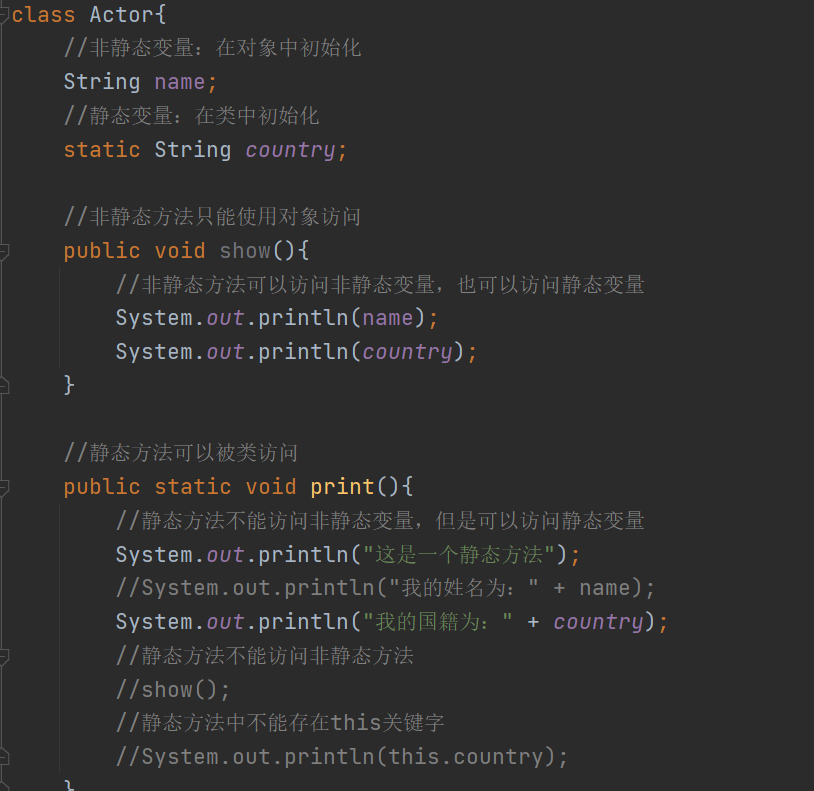

# Day08

## 今日内容

1.  构造方法

2.  静态

3.  继承

## 构造方法

1.  构造方法的作用：用来创建对象给对象中的属性初始化。

2.  别名：构造函数 构造器

3.  构造方法定义的格式：

修饰符 方法名(){

方法体;

}

1.  说明：

修饰符：public

方法名：和当前所在的类名一模一样

()：构造方法后续如果需要传递一些数据，就在括号中定义对应的形参即可

方法体：可以有也可以没有，根据情况而定

1.  特点：

2.  构造方法是在创建对象时被调用

3.  如果在类中没有定义过构造方法，类型中会默认提供一个空参构造用于创建对象

4.  如果在创建对象时，不需要给属性赋值，可以在类中定义一个空参构造

5.  如果在创建对象时，需要给属性赋值，可以提供有参构造

6.  构造方法不能使用对象名调用。

7.  构造方法和set方法不冲突，构造是创建对象是可以给属性赋值；set方法在创建
    对象之后，给属性改值。

代码

## 静态

1、没有使用静态

（1）如果某个类中所有的对象中都有属性的值相同的，那么就需要在各自对象中为这
个相同属性值分配空间。

缺点1：浪费内存空间

缺点2：数据维护麻烦

1.  使用静态：

2.  如果某个类中所有对象中有一个相同的属性，值都相同，可以将该属性定义为静
    态修饰。

优点：（1）节约内存（因为不需要在每个对象中都为这个静态属性分配空间，只需要
在类中初始化一次即可。）

（2）数据维护简单

### 静态变量的特点

1、静态变量使用关键字：static

2、静态变量属于类，随着类的加载就初始化（随着类的加载就存在）

3、静态变量在对象之前就存在，在类中存储，在方法区中存储

4、在类中定义的静态变量，可以给该类所有对象所共用

5、静态变量可以使用类名直接调用，也可以使用对象名调用

### 静态方法的特点

1.  静态方法关键字：static

2.  静态方法可以类名调用，也可以使用对象名调用

3.  静态方法是随着类的加载就可以使用，所以静态方法的使用时机在对象之前

4.  注意事项：

5.  静态方法中不能访问非静态变量，可以访问静态变量

静态方法可以使用的时候，对象可能还没创建，对象没创建非静态属性就没有初
始化，那么就不能使用

1.  静态方法不能访问非静态方法

因为非静态方法可以访问非静态属性的，如果静态方法可以访问非静态方法，表
示静态方法可以间接访问非静态属性，和第一点冲突。

1.  静态方法中不能存在this关键字

2.  总结：静态不能访问非静态

代码

### 静态变量和非静态变量的区别

1、相同点：都在类中方法外定义。

2、不同点：

（1）调用方式不同：

静态变量可以使用类名调用，也可以使用对象名调用

非静态变量只能使用对象调用

1.  存储空间不同：

静态变量属于类，在方法区中存储

非静态变量属于对象，在堆内存中存储

1.  生命周期不同：

非静态变量随着对象的创建而存在，随着对象的回收而消失

静态变量随着类的加载就存在，随着类字节码对象的消失而消

## 继承

1.  概述：两个类之间实现了子父类的关系

2.  继承的关键字：extends

3.  子类：用于继承的类型 派生类

4.  父类：被继承的类型 基类 超类

5.  使用继承好处：

6.  降低程序的冗余

7.  提高代码的复用性

代码

### 继承的注意事项

1.  父类中定义的私有方法，子类不能继承的

2.  父类中定义的私有属性，子类可以继承，但是不能直接访问

如果需要访问继承而来的私有属性，可以使用父类中继承的公共访问方式来间接访问

1.  父类中的构造方法，子类不能继承：

2.  如果子类能继承父类的构造方法，那么子类的构造方法名就无法和本类的类名保
    持一致，这一点和构造的定义格式矛盾。

3.  如果子类中有一些特殊的属性，那么从父类中继承而来的构造方法就无法给这个
    特殊的属性进行初始化，所以这一点和构造方法的作用矛盾。

4.  父类中的构造方法子类不能继承，所以子类要自己定义构造方法

如果在父类中有一些私有属性子类是不能直接访问的，所以在子类的构造方法中，可以
调用父类的有参构造来间接给该属性赋值。

super(参数)

1.  类和类之间不能随意继承，要遵循两个原则：

原则一：子类必须是父类的一种

原则二：父类中定义的内容，必须是每个子类的共同内容

### 子父类中属性的继承关系

1.  父类中定义的属性，子类可以继承，子类对象也可以访问

2.  子类中定义的属性，父类对象不可以访问

3.  在子类中访问某一个变量，根据就近原则：

在子类中访问某一个变量，先看方法中有没有定义，方法中有定义就直接使用；如果方
法中没有定义，就看本类中有没有定义该变量，如果本类中定义过，也可以使用；如果
本类中也没定义过，可以去父类中寻找有没有该变量的定义，如果父类中定义过，可以
使用；如果父类中没有定义过，如果父类中没有定义过，表示不能使用。

1.  如果访问变量，没有使用任何关键字修饰，那么根据就近原则

如果访问变量，使用this修饰，直接访问本类对象中的属性

如果访问变量，使用super修饰，直接访问子类父类中的属性

1.  图示：

补充：

1.  在加载子类之前，需要先加载父类

2.  在子类的对象中先初始化父类的属性，再初始化本类的属性

### 子父类继承中构造方法的关系

1.  如果在子类的构造方法中，没有调用任何构造方法，那么在子类构造方法的第一行，系
    统会默认提供一个super()表示默认调用父类的空参构造。

2.  如果在子类的构造方法中，调用过父类的构造方法，那么系统就不再默认提供任何构造

3.  如果在子类的构造方法中，调用了本类的构造方法，那么系统就不再提供任何构造

4.  总结：

通过以上三点发现，不管怎么创建子类的对象，都是先指定父类的构造方法

目的：为了在初始化子类的数据前，先初始化父类的数据

1.  注意事项：

2.  构造方法之间，不能自己调用自己

3.  调用父类的构造方法和调用本类的构造方法都需要在第一行定义。

### 子父类中成员方法的关系

1.  子类对象可以访问父类中定义的方法（私有除外）

2.  父类对象不能使用子类中的方法

3.  方法重写的原因：

当子类从父类中继承一个方法之后，子类不想要使用父类对该方法的实现方式时，子类
就可以将该方法的实现方式进行修改。

1.  方法的重写：

在子父类的关系中，两个方法的方法名相同，参数列表相同，返回值类型相同，方法的
实现内容可以不同。

为了验证以及表示该方法是重写的方法，一般使用一个注解来修饰

@Override

使用该注解修饰的方法如果没有编译报错，表示是重写的方法，如果编译报错，表示该
方法不是重写的方法。

1.  注意事项：

2.  私有方法不能被子类重写（根本不能继承）

3.  方法在重写的时候，权限不能越来越小

4.  静态方法是可以被子类继承的，但是不能被子类重写

如果在子类中定义了（声明）一个和父类一模一样的静态方法，那么从父类中继承而来
的静态方法就会被默认被子类隐藏，只能使用自己定义的静态方法。
