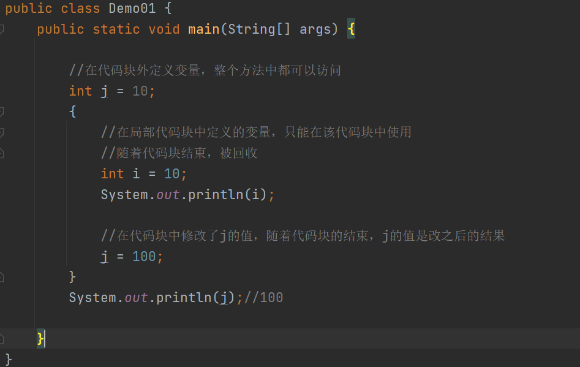
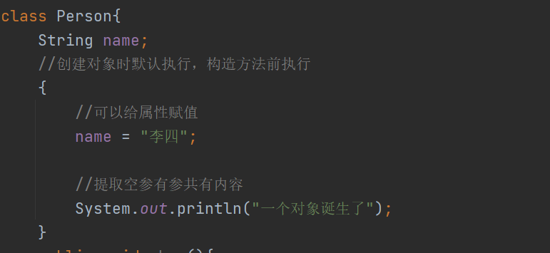
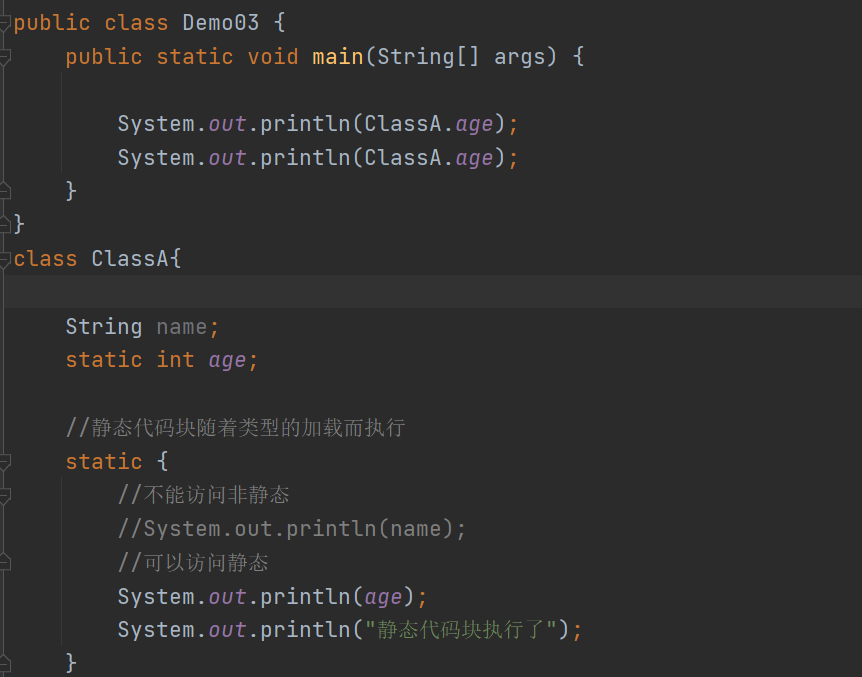
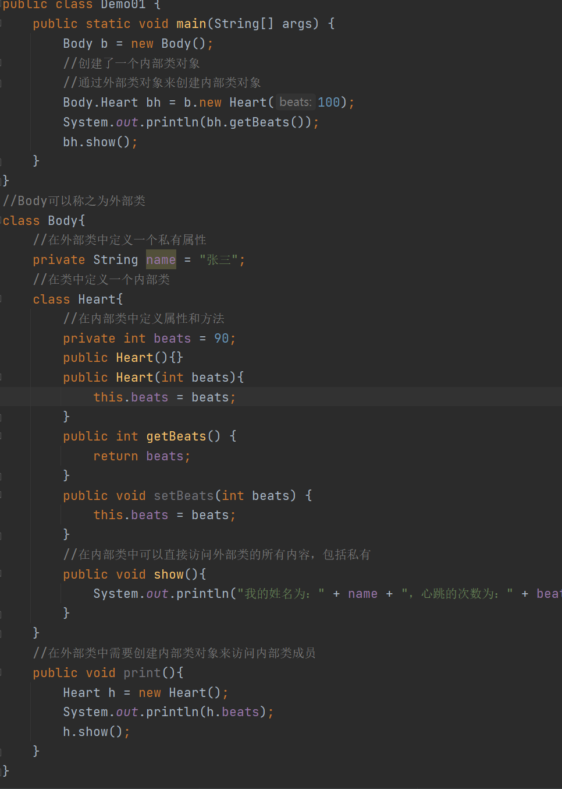
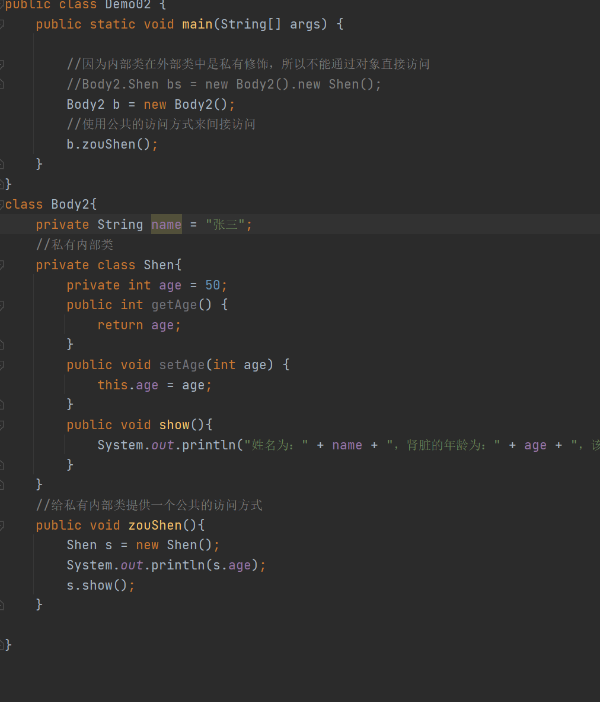
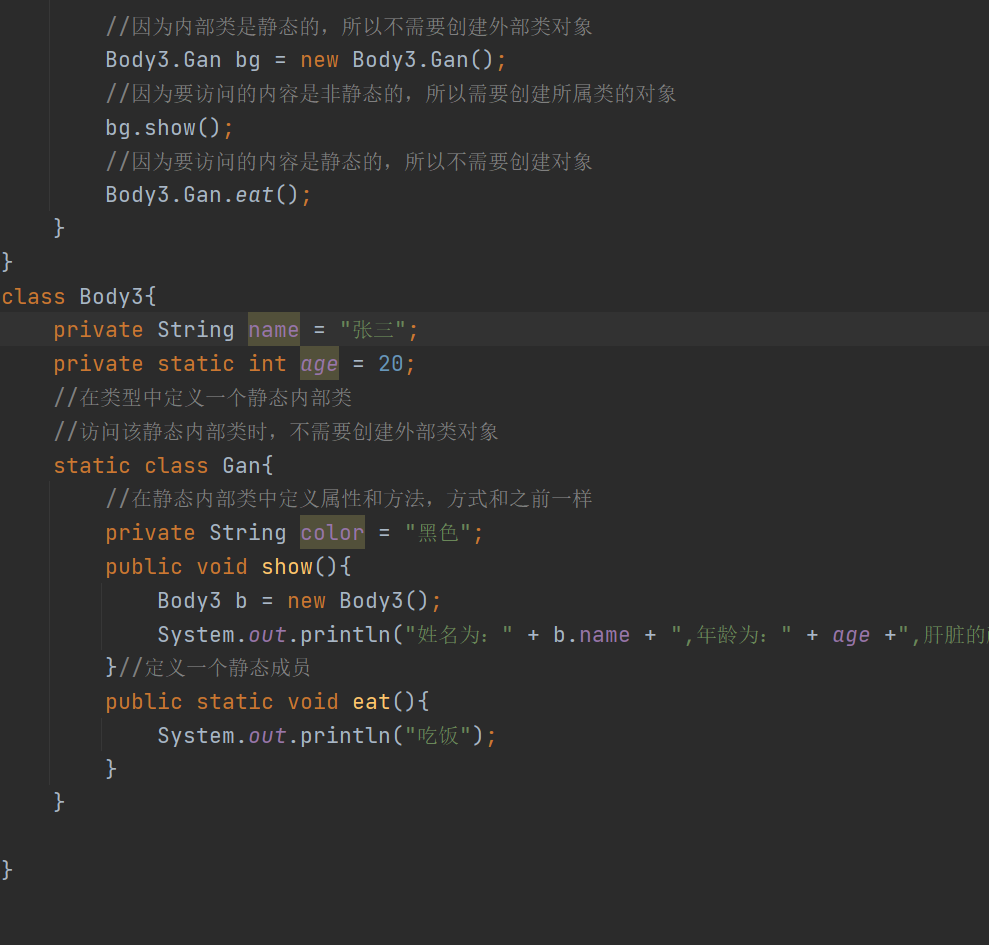
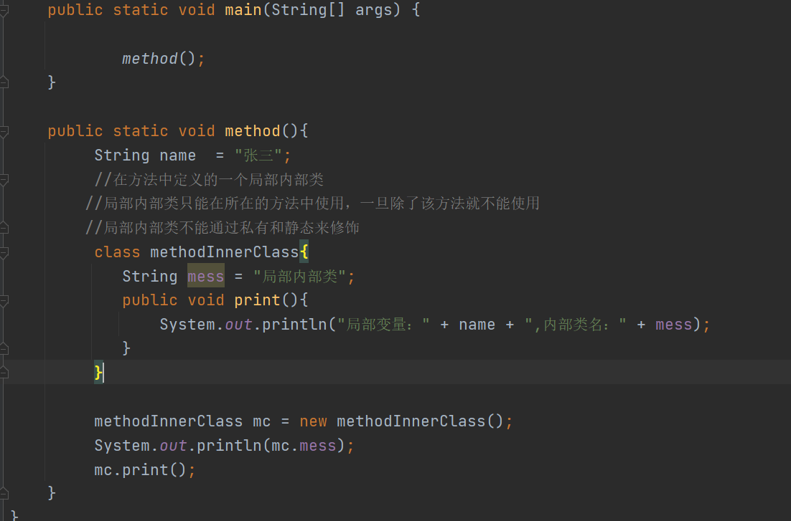

# Day09

## 今日内容

1.  继承的特点

2.  代码块

3.  final关键字

4.  内部类

5.  包

6.  权限修饰符

## 继承的特点

1.  特点：Java语言中，类之间的继承：支持单继承、支持多层继承、不支持多继承

2.  单继承：一个类继承一个父类

3.  多层继承：类型C 继承 类型 B ，类型 B继承类型 A

4.  多继承：一个类型同时继承多个父类（不支持）

如果一个类型同时继承了多个父类，多个父类中有一些相同的方法时，子类如
果都继承，属于方法的重复定义；如果子类能继承，那么以后再调用该方法时，
不知道执行哪一个父类中的该方法。

## 代码块

1.  概述：使用大括号括起来的一段代码，就可以称为代码块

将代码块放在不同的位置，那么该代码块的名称和作用都不同

1.  分类：

局部代码块

构造代码块

静态代码块

### 局部代码块

1.  概述：将代码块定义在方法中

2.  作用：

及时回收内存空间

1.  说明：

2.  当定义的变量使用之后，不再继续使用时，可以将该变量的定义，定义在局部代
    码块中，随着代码块的执行结束，该变量就会立即回收。

3.  在代码块中定义的变量，随着代码块的结束就回收，所以在代码块外不能继续使
    用该变量。

4.  在代码块外定义的变量，在代码块中对该变量进行了操作，随着代码块的结束，
    该变量是操作后的结果。

代码

### 构造代码块

1.  概述：在类中方法外定义的一段代码。

2.  特点：

3.  在创建对象的时候，构造代码块会默认被执行

4.  创建一次对象，执行一次构造代码块

5.  构造代码块是在构造方法之前执行

6.  作用：

7.  构造代码块可以用来给属性赋值

8.  当空参构造和有参构造中有一些共同内容时，可以将这些共同内容提取到构代码 块中

代码

### 静态代码块

1.  概述：在类中方法外定义的代码块，但是使用static修饰

2.  特点：

3.  静态代码块随着类的加载被默认执行

4.  在一次程序执行过程中，类型只需要加载一次，所以静态代码块只执行一次

5.  在静态代码块中可以访问静态变量和静态方法，不能访问非静态

6.  作用：

7.  可以给静态属性赋值

8.  当程序中有一些资源只需要加载一次时，可以将这些资源的加载定义在静态代码
    块中。【加载数据库驱动】

代码

## final关键字

1.  解释：最终的，最后的

2.  作用：

3.  修饰变量

4.  修饰方法

5.  修饰类型

6.  final修饰变量：

使用final修饰的变量，变量变为一个常量。值不能被修改

常量：

字面值常量：直接定义出来的数据 10 100 1.1

符号常量：通过final修饰的变量，就称为符号常量 final int a = 10;

定义final修饰的常量时，名字都大写

1.  final修饰方法:

使用final修饰的方法，该方法不能被子类重写

能被正常继承

1.  final修饰类型：

使用final修饰的类型，该类型不能有子类，不能被其他类继承

## 

## 

## 内部类

1.  概述：将类型的定义写在类中或者方法中。

将类型A定义在方法B中，类型A就是一个局部内部类

将类型A定义在类型B中，类型A就是一个成员内部类

1.  分类：

局部内部类

成员内部类

普通的成员内部类

私有的成员内部类

静态的成员内部类

匿名内部类【明天讲】

### 普通的成员内部类

1.  概述：在类中定义的类型，该类型没有任何修饰符修饰

2.  特点：

3.  在内部类中，可以直接访问外部类的属性

4.  在其他类中想要访问外部类的属性和方法，需要创建外部类的对象

5.  在其他类中想要访问内部类的属性和方法，需要先创建外部类对象，再创建内部
    类对象来访问。

格式：外部类名.内部类名 对象名 = new 外部类名().new 内部类名();

1.  在外部类中，想要访问内部类中的内容，只需要创建内部类对象即可访问

代码

### 私有的成员内部类

1.  概述：在类中定义了一个类型，但是该类型使用private修饰

2.  特点：

3.  在私有内部类中一样可以直接访问外部类的所有成员

4.  在外部类中，想要访问私有内部类的成员，只需要创建内部类对象即可

5.  如果定义了一个私有的内部类，需要同时给该私有内部类提供公共访问方式

代码

### 静态的成员内部类

1.  概述：在类中定义了一个类型，该类型使用static来进行修饰

2.  特点：

3.  在静态内部类中，可以直接访问外部类的静态成员

4.  在静态内部类中，不可以访问外部类的非静态成员

5.  在外部类中，想要访问静态内部类中的成员时，需要考虑访问的内容是否是静态，
    如果访问的内容时非静态，就需要创建对象，如果访问的内容是静态，就不需要
    创建对象

6.  在其他类中，想要访问静态内部类的成员时，如果该成员是静态的，外部类及内
    部类对象都不需要创建，直接使用类名即可；如果访问的该成员是非静态的，只
    需要创建内部类的对象，不需要创建外部类对象。

7.  一个类型是否需要创建对象，跟当前类是否是静态有关还是跟要访问的内容是否
    是静态有关？

跟类型是否是静态无关，跟要访问的内容是否是静态有关。

代码

### 局部内部类

1.  概述：在方法中定义的类型

代码

## 包

1.  概述：在磁盘中创建的一个个文件夹

2.  作用：

3.  分类保存代码，可以更好的对代码进行管理

4.  可以将相同的类，定义在不同的包中

5.  类型定义在包之后，该类的名字发生了改变：

定义在包下的类名：包名.类名 = 全类名

1.  如何使用定义在包中的类：

2.  如果当前类和要使用的类是在同一个包中，可以直接使用该类的名字，不需要使
    用全类名。

3.  如果当前类和要使用的类不在同一个包中，要使用该类型要使用他的全类名

但是每次使用全类名，全类名名字比较长，所以需要优化这种调用方式；

优化方式：使用关键字：import 来进行导包

1.  package：打包

将定义好的类型自动生成到指定的包下。

如果使用idea可以自动帮助我们生成对应的目录

如果需要自己打包则使用命令：javac -d . 源文件名

1.  包名如何起名：

如果需要定义很多层包，一般采用域名倒着写的方式来定义（目的：为了避免重复）

## 权限修饰符

1.  分类：

private 私有权限修饰符 只能在本类中被使用

(空着即可) 默认的权限修饰符 可以在本类中被使用

可以在本包的其他类中使用

proteced 本类中可以访问

本包的其他类可以访问

其他包的子类中可以访问

public 公共的权限修饰符 本类中可以访问

本包的其他类可以访问

其他包的子类以及无关类可以访问
