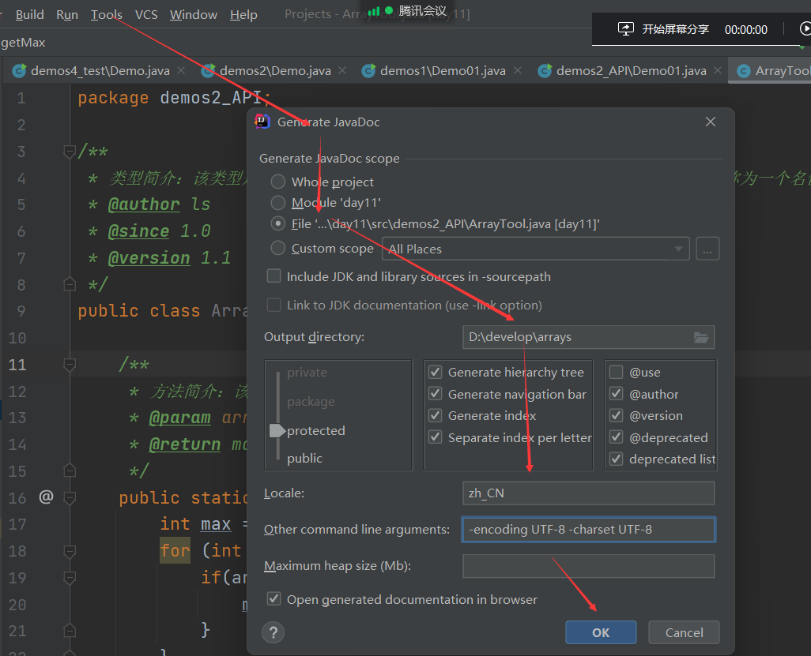
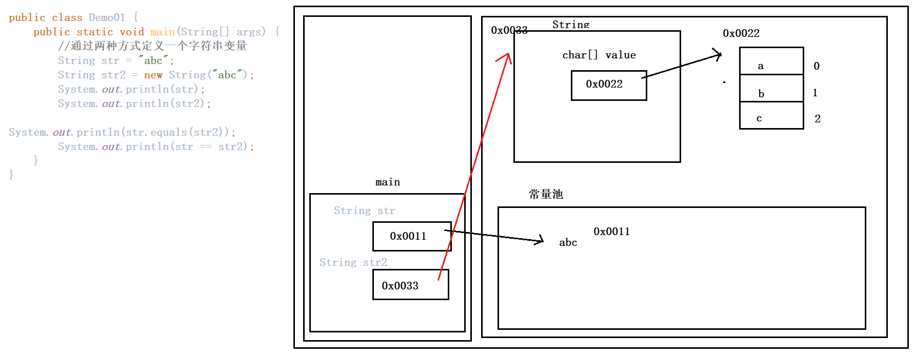
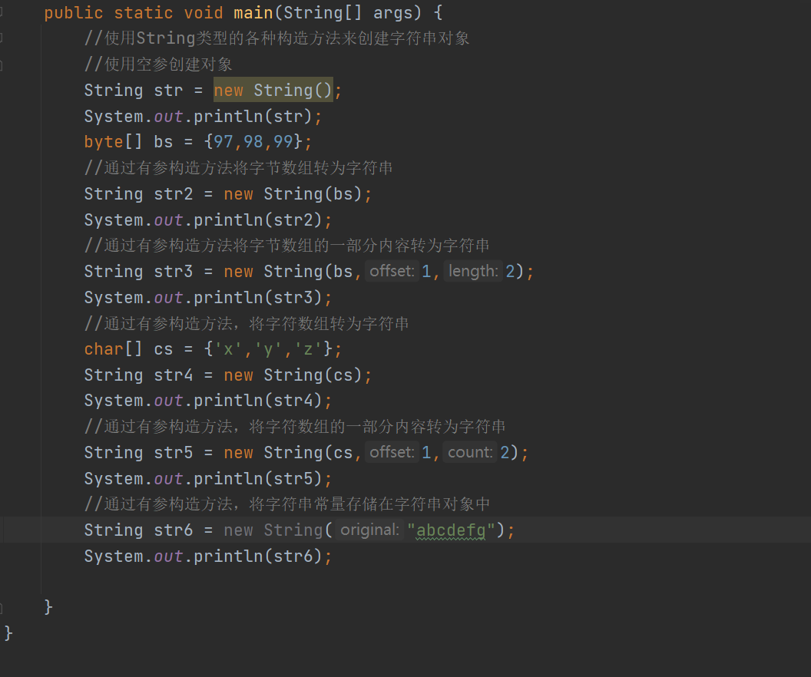
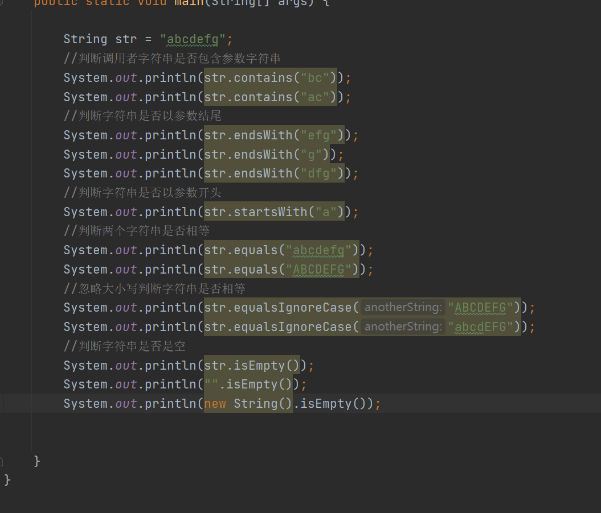
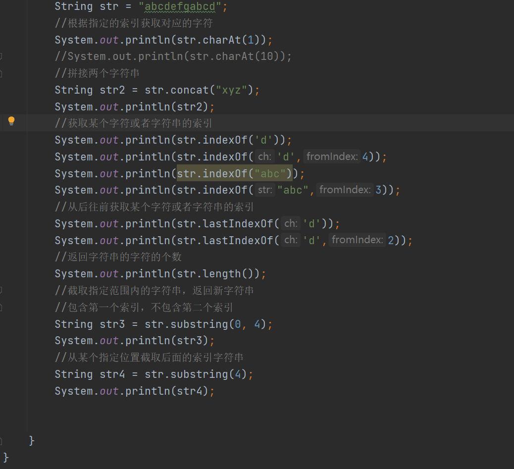
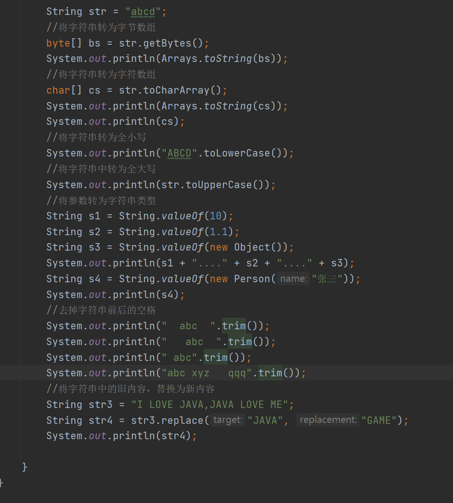
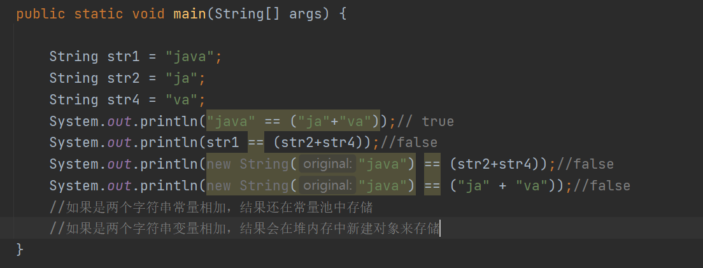
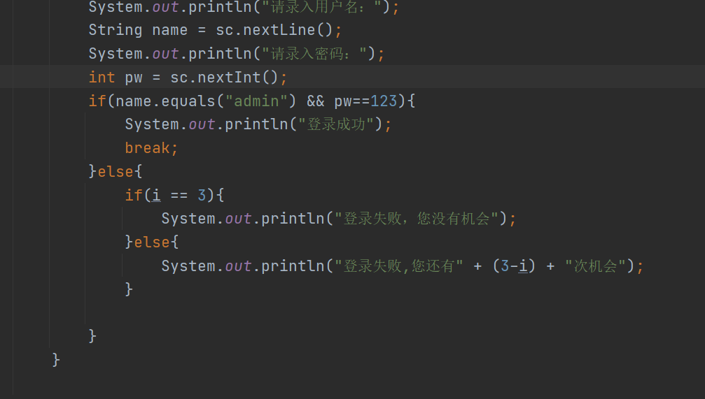

# Day11笔记

## 今日内容

1.  Jar包

2.  API的概述、使用及制作

3.  Object类型

4.  String类型

## Jar包

1.  什么是Jar包：

（1）是Java语言专用的压缩包

（2）用来存放编译好的字节码文件

2、为什么定义Jar包：

（1）Java源代码在编译之后，会生成对应的.class文件，.class文件中包含了该类定义
的各种属性和方法，所以可以脱离源代码使用

（2）脱离源代码使用需要一定条件：

需要将.class文件打成jar包

3、如何生成Jar包：

（1）File-\>Project Structure

或者: 快捷键:ctrl + alt + shift + s

（2）选择 Artifacts -\> JAR -\> From modules ..

点一下图中的加号+, 才会出现JAR系列选项

1.  选择要导出的的模块，点击OK，可以选择导出目录，也可以修改名称

2.  Apply后点击OK

3.  点击软件上方build进行加载

4、如何使用Jar包：

（1）在当前工程下，创建一个文件夹 lib

（2）将需要导入的jar包，直接复制到lib文件夹中

（3）右键jar包，add as libraries

## API

### API的概述

1.  API：application programming interface 应用程序编程接口

2.  API：官方提供的JDK类库（Java官方写好的各种类型）

3.  API帮助文档：

JDK类库中有很多定好的类型，而且每个类型都有一个对应的帮助文档。

如果要使用这些类型，就需要借助帮助文档来学习

### API帮助文档的使用

1.  在线API文档：需要网络访问的应用程序编程接口

2.  离线API文档：下载后的应用程序编程接口

步骤：

（1）索引

（2）输入框中输入需要查看的类型

（3）类型中，会有一个介绍和方法的展示等等

## 通过帮助文档学习：Arrays工具类

1.  概述：操作数据中数据的工具类

2、特点：

（1）提供了操作数组的各种静态方法，直接通过类名调用。

（2）工具类不能通过构造创建对象，因为构造方法私有化

（3）当前工具类在 java.util，使用时需要导包

1.  主要方法介绍：

binarySearch(byte[] a, byte key)

查找某个元素在数组中的索引，按照二分查找法查找，数组需要升序排列

equals(char[] a, char[] a2)

比较两个数组是否一样（比较两个数组中的元素是否一样，顺序也需要相同）

sort(byte[] a)

将数组进行升序排列

toString(int[] a)

遍历参数数组，通过字符串方式进行遍历，返回值是一个字符串

fill(int[] a, int val)

将val参数填充到数组a中，原数组中的内容都被参数val替换

### API文档的制作

1、文档注释：用于给代码生成帮助文档的注释

格式：

/\*\*

文档注释

\*/

特点：

不能嵌套

2、帮助文档注解：将来可以被文档生成工具解析出来的格式，可以解析出来其中的数据

作者：@author 名称

当前版本：@version v1.0

上一个版本：@since

参数：@param

返回值：@return

3、生成帮助文档：

1.  点击Tools菜单,选择Generate JavaDoc..

2.  设置扫描生成API的范围，api的存放路径，以及设置编码

zh_CN

\-encoding UTF-8 -charset UTF-8

## Object类型

1.  概念：Object是类层次结构的根类，每个类都使用Object作为超类。

所有对象(包括数组)都实现 这个类的方法.随意定义一个类型，不手动显式定义其
父类，那么这个类的父类就是Object 类。

1.  特点：这个类型在java.lang包中定义的

凡是在改包中定义的类型，都不需要再次导包，可以直接使用

### toString方法

1.  方法概述：

    返回当前对象的字符串表示，返回的当前对象的地址。

    补充：该方法可以不用自己调用，直接打印对象名会默认调用该方法返回地址

    2、注意：对象返回这样一个地址值的字符串,没有什么意义,因此对于子类而言,需要重写父类的这个方法。

    3、重写的原则：返回该对象中的所有成员变量的值(对象的属性)

    4、使用快捷键重写该方法：alt + insert 选中toString 回车

### equals方法

1.  概述：public boolean equals(Object obj) 指示其他某个对象是否与此对象"相等"

判断调用者对象和参数对象是否是同一个，如果是为true,否则为false

2、注意：实际开发中，比较两个对象的内存地址，没有什么意义，因此在自定义的子类中，
都要重写这个方法。

3、重写原则：一般比较两个对象中的所有属性，是否全部相同.

4、快捷键：alt +insert 选中equals 一路next即可

### ==和equals方法

1.  相同点：

都是可以比较数据是否相同，结果都是布尔值

1.  不同点：

2.  比较的规则不同：

==如果比较的是基本数据类型，比较的数数据值是否相等

==如果比较的是引用类型数据，比较的是两个对象的地址的是否相等

equals方法在子类重写之前，比较的是两个对象的地址值，子类重写之后比较的是
属性值。

1.  比较的内容：

==可以比较基本数据类型，也可以比较引用数据类型

equals方法只能用来比较引用数据类型

## String类型

1.  概述：

（1）用来定义字符串的类型。

（2）引用数据类型。

（3）在java.lang包定义，使用该类不需要导包

1.  特点：

（1）定义String字符串，可以直接接收一个字符串常量

如果接收的是字符串常量，该常量在常量池种存储

如果接收的是new对象，那么该对象在堆内存种单独存储

（2）定义String字符串，可以使用new创建一个字符串对象

（3）定义的String字符串，字符串本身不能被直接修改

因为String类型种维护的是一个字符数组，该字符数组是私有修饰，在类中只提
供了获取的方式，没有提供修改的方法。所以只能获取或者赋值，不能改值

3、图示：

### String类构造方法

1.  String() 空参构造

2.  String(byte[] bytes) ：将一个字节数组转成一个字符串，解码

3.  String(byte[] bytes, int offset, int length) ：将字节数组的一部分转成字符串

4.  String(char[] value) ：将一个字符数组转成一个字符串

5.  String(char[] value, int offset, int count) ：将字符数组的一部分转成字符串

6.  String(String original) ：将字符串存储到字符数组中

代码

### String类的判断功能

1.  contains(String s) ：判断是否包含参数

2.  endsWith(String suffix) ：判断调用者字符串是否以参数字符串结尾

3.  startsWith(String prefix) ：判断调用者字符串是否以参数字符串开头

4.  equals(Object anObject) ：判断两个字符串是否一样

5.  equalsIgnoreCase(String anotherString) ：忽略大小写判断两个字符串是否一样

6.  isEmpty() ：判断调用者是否为空

代码

### 

### String类的获取功能

1.  charAt(int index) 获取index索引对应的字符

2.  concat(String str) ：拼接字符串

3.  indexOf(int ch) ：获取ch字符在字符串中的索引

4.  indexOf(int ch, int fromIndex) ：从制定位置找ch字符出现的索引

5.  indexOf(String str) ：找str字符串在调用者中出现的索引

6.  indexOf(String str, int fromIndex) ：从制定位置寻找str出现的索引

7.  lastIndexof():从后往前找制定元素出现的索引

8.  length() ：返回字符串的长度

9.  substring(int beginIndex) ：从参数索引开始往后截取字符串，形成一个新串

10. substring(int beginIndex, int endIndex) ：截取字符串一部分，形成一个新串

包含头部索引，不包含尾部索引

代码

### String类的转换功能

1.  getBytes() ：将字符串转成字节数组

2.  toCharArray() ：将字符串转为字符数组

3.  toLowerCase() ：将字符串转为全小写形式

4.  toUpperCase() ：将字符串转成全大写形式

5.  valueOf(参数)
    ：将基本类型数据的参数或者引用类型转为字符串类型，当前方法是一个
    静态方法，可以通过类名直接调用。

6.  trim() ：去掉前后两边的空格

7.  replace(char oldChar, char newChar) :将old元素改为new元素

代码

### String案例拓展

案例1

1、分析以下程序,判断控制台上的输出结果是什么:

String s1 = "abc";

String s2 = "abc";

String s3 = new String("abc");

String s4 = new String("abc");

System.out.println(s1 == s2); //true

System.out.println(s3 == s4); //false

System.out.println(s1 == s3); //false

System.out.println(s1.equals(s2));

System.out.println(s3.equals(s4));

System.out.println(s1.equals(s4));

案例2

模拟用户登录：

（1）正确用户名是admin，密码是123（全部使用字符串来录入）

（2）键盘录入用户名和密码，一共有三次机会

（3）如果录入错误，前两次提示还有几次机会，最后一次提示“登录机会已经用完”

（4）如果录入正确，提示“登录成功”，登录成功后结束继续登录

代码

