# Day12笔记

## 今日内容

1.  StringBuilder类型

2.  基本类型的包装类

3.  正则表达式

## StringBuilder类型

1.  概述：用来表示字符串的类型

2.  特点：

（1）是一个可变的字符序列

该类型底层也是维护了一个字符数组，该字符数组虽然没有私有修饰，但是默认
修饰在其他包中也不能直接访问。因为该类中提供了一些修改属性的方法，所以
该类型定义的字符串是可变的字符串。

（2）在lang包不需要导包

### StringBuilder构造方法

1.  StringBuilder() ：

创建一个初始值为空的字符串对象

1.  StringBuilder(int c) ：

创建一个初始值为空的字符串对象

1.  StringBuilder(String str) ：

创建一个初始值为str的字符串对象

代码

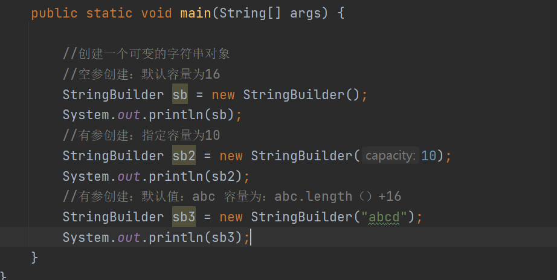

### StringBuilder获取长度的方法

概述：StringBuilder对象中维护的是一个字符数组，所以可以获取字符数组的长度和元素的
个数。

（1）capacity() ：返回对象的容量

（2）length()：返回字符串的长度

### StringBuilder类型中常用的方法

1.  增加方法：

append(参数) ：在字符串基础上追加数据，可以加任何类型的数据

如果该对象中的容量不够存储追加的数据，那么该类型会自动扩容，扩
容的方式为：原数组空间\*2 + 2

insert(int offset, 参数) ：在指定索引添加数据

添加的索引范围：0----length

1.  删除方法：

delete(int start, int end) ：删除从start开始到end-1结束的字符

deleteCharAt(int index) ：删除指定索引位置上的字符

1.  替换方法：

replace(int start, int end, String str) ：将指定索引范围的字符换成新的字符串

1.  反转方法：

reverse() ：将字符串在本身的基础进行反转

代码

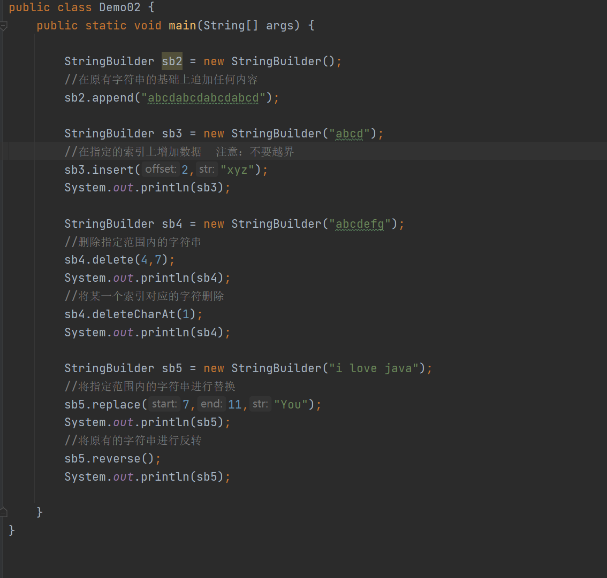

### String类型和StringBuilder类型拼接字符串的效率问题

1.  结论：

使用String类型拼接字符串效率低

使用StringBuilder类型拼接字符串效率高

1.  原因：

2.  因为String类型是不可变的字符串类型，所以不能在之前的数据基础上改变，只
    能在底层新建一个StringBuilder对象来帮助拼接，拼接后再转为String对象。效 率低

3.  因为StringBuilder类型是可变的字符串类型，所以可以在之前数据基础上直接改
    变，所以效率高。

### String和StringBuilder类型的区别

1.  相同点：

2.  都可以定义字符串

3.  不同点：

4.  定义方式不同：

String类型可以通过字符串常量来定义，也可以通过new创建一个对象

StringBuilder类型只能通过new来创建对象

1.  底层数组的定义不同：

String类型底层是通过私有final的数组来定义。不可变（没有公共该值方式）

StringBuilder类型底层是默认数组来存储。可变（有修改的方法）

1.  拼接使用效率不同：

Srting类型拼接效率低

StringBuilder拼接效率高

### StringBuilder类型和StringBuffer类型的区别【面试题】

1.  相同点：

两个类型都可以表示字符串

而且两个类型都可以表示可变的字符串

两个类型中的方法都一模一样

1.  不同点：

2.  出现的版本不同：

StringBuilder JDK1.5版本

StringBuffer JDK1.0版本

1.  线程安全性不同：

前者是线程不安全

后者是线程安全

1.  效率问题：

使用StringBulider效率高，使用StringBuffer效率低

### 字符串传参问题

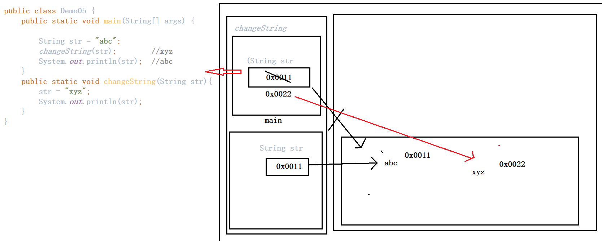

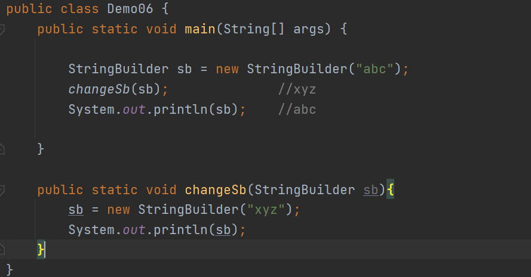

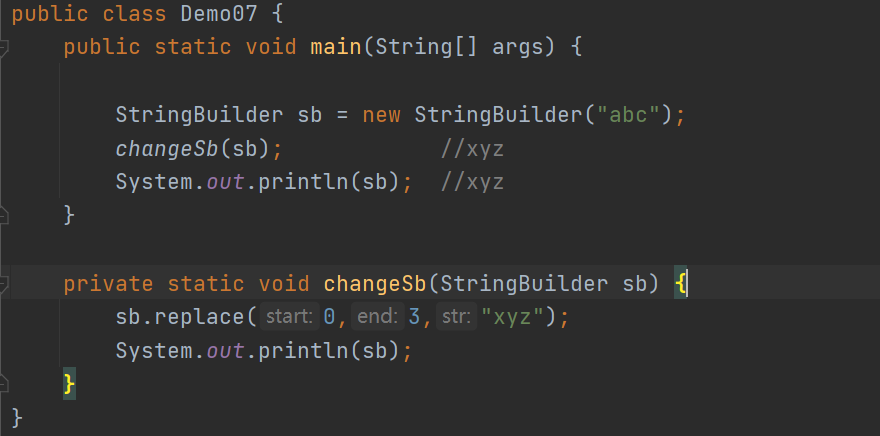

## 

## 基本类型的包装类

1.  基本数据类型：基本数据类型的变量中，存储的是数据本身，不是数据的地址值

byte short int long float double char boolean

1.  包装类型：将基本数据类型转为一个引用类型，转换之后的引用类型就称为包装类型，
    包装类型中有各种方法可以对基本类型的数据做操作。

2.  罗列：

byte Byte

short Short

int Integer

long Long

float Float

double Double

char Character

boolean Boolean

### Integer类型

概述：

（1）int类型只能表示一个整数

（2）Interger类型中不仅维护一个整数，还有一些操作该整数的方法

### 构造方法

1、Integer(int value) ：通过有参构造给类型中维护的整数赋值

2、Integer(String s) ：通过字符串给整数赋值，但是字符串只能是数字类型的字符串

代码

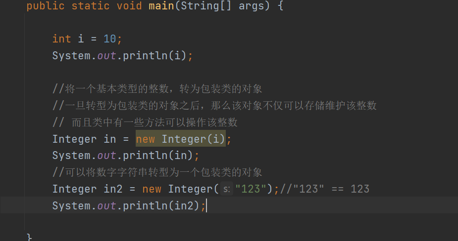

### Integer类型中维护的静态常量

static int BYTES

用于表示二进制补码二进制形式的 int值的字节数。

static int MAX_VALUE

一个持有最大值一个 int可以有2 31 -1。

static int MIN_VALUE

的常量保持的最小值的 int可以具有，-2 31。

static int SIZE

用于表示二进制补码二进制形式的 int值的位数。

static TYPE

类原始类型 int的 类实例。

代码

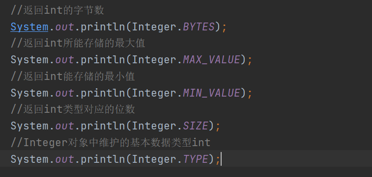

### Integer类型中常用的方法

非静态方法：intvalue()：将包装类型的对象转为int类型

doublevalue()：将包装类型的对象转为double类型

......

静态方法：

parseInt(String s) ：将字符串s转为基本数据类型int

parseInt(String s, int radix) ：将字符串s当做radix进制转为十进制int

toBinaryString(int i) ：将十进制的i变量，转为二进制的字符串

toHexString(int i) ：将十进制的i变量，转为十六进制的字符串

toOctalString(int i) ：将十进制的i变量，转为八进制的字符串

toString(int i, int radix) ：将十进制的i变量，转为指定进制的字符串

valueOf(int i)：将基本数据类型i转为包装类型对象

valueOf(String str)：将字符串str转为包装类型对象

总结：

int---\>String：

String :valueOf()

int + “”

Integer:toString()

String---\>int

Integer:parseInt(“100”)

int---\>Integer:

Integer in = new Integer(100)

Integer：valueOf()

Integer---\>int

intValue()

Integer ---\>String:

String:valueOf()

String----\>Integer

Integer:valueOf()

### 自动装箱和自动拆箱【jdk1.5版本及之后的版本】

1.  装箱：将基本数据类型包装为引用数据类型的对象

2.  拆箱：将引用数据类型的对象转为基本类型的数据

1.  自动装箱：直接使用引用数据类型的变量，接收基本数据类型的元素

2.  自动拆箱：直接使用基本数据类型的变量，接收引用数据类型的对象

直接使用引用数据类型的对象进行数据的运算

代码

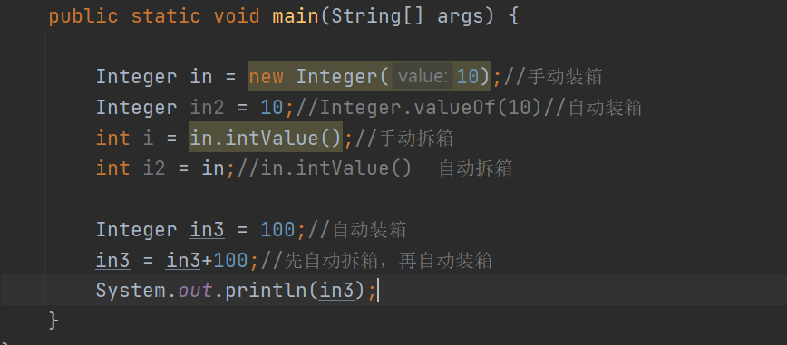

## 正则表达式

1.  概念：正则表达式是对字符串操作的一种逻辑公式，使用事先定义好的一些特定字符、
    及这些特定字符的组合，组成一个“规则字符串”，这个“规则字符串”用来表
    达对字符串的一种过滤逻辑。

2.  总结：

正则表达式本质还是一个字符串

不仅可以表示一个普通的字符串，而且还可以用来表示一类规则匹配其他字符串

### 案例

1.  写一个方法，用来验证一个字符串是否是一个合法的QQ号码？

2.  标准：

3.  字符串的长度必须：5 - 11

4.  字符串必须全部都是数字

5.  字符串首字母不能为0

代码

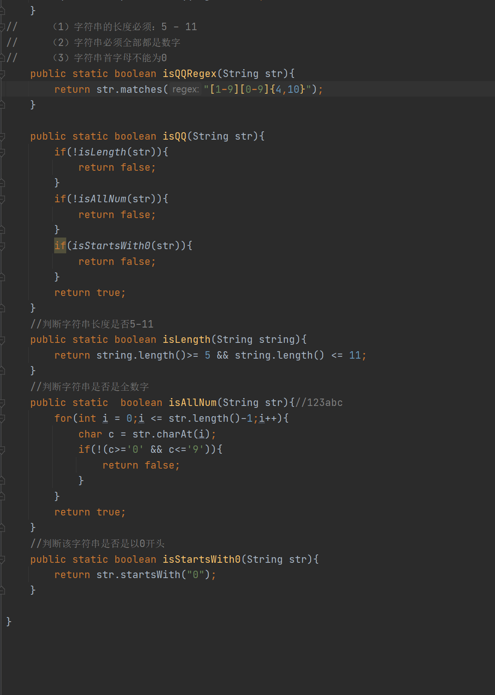

### 正则表达式中的字符类

1.  字符：单引号引起来 一个符号

2.  字符类：

（1）使用 [] 表示某一个单个符号

（2）不管 [] 中定义多少个字符，都只能表示其中一个字符

[abc]：表示其中一个字符 a或者b或者c的其中一个

[a-z]：表示a-z之间的其中一个字符

[a-zA-Z&_1]：表示其中一个字符

[\^a-z]：表示除了a-z之外的其中一个

1.  使用方式：要判断一个字符串是否满足某个正则表达式，需要使用matches方法

代码

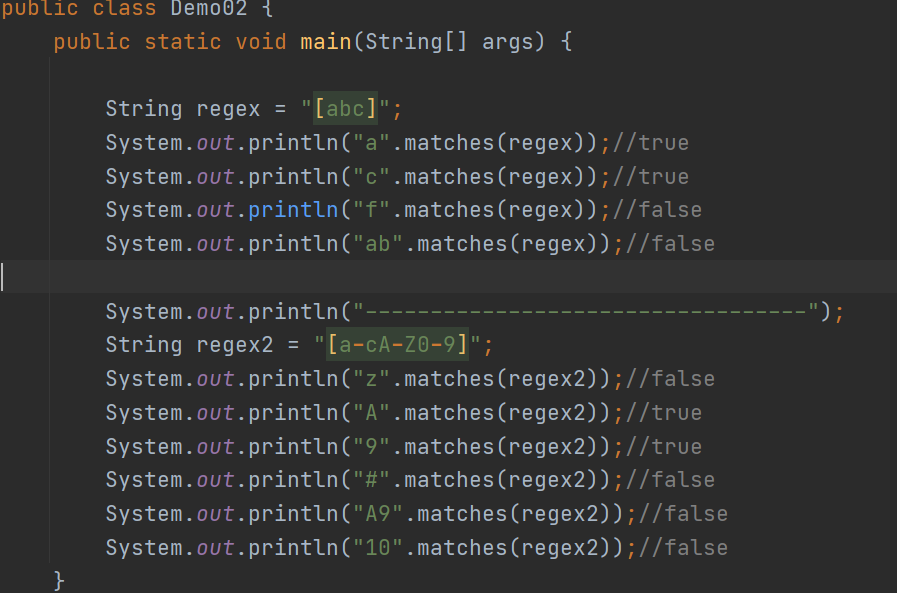

### 正则表达式中的预定义字符

1.  预定义字符：用来表示一些常用字符的特殊符号

2.  罗列：

. ：表示所有的单个字符

\\d ：所有的数字字符 [0-9]

\\D ：所有的非数字字符 [\^0-9]

\\s ：所有的空格字符

\\S：所有的非空格字符

\\w：表示0-9a-zA-Z\_

\\W：除了\\w的其中一个字符

1.  注意：虽然预定义字符可以表示很多种符号，但是都只能表示一个

代码

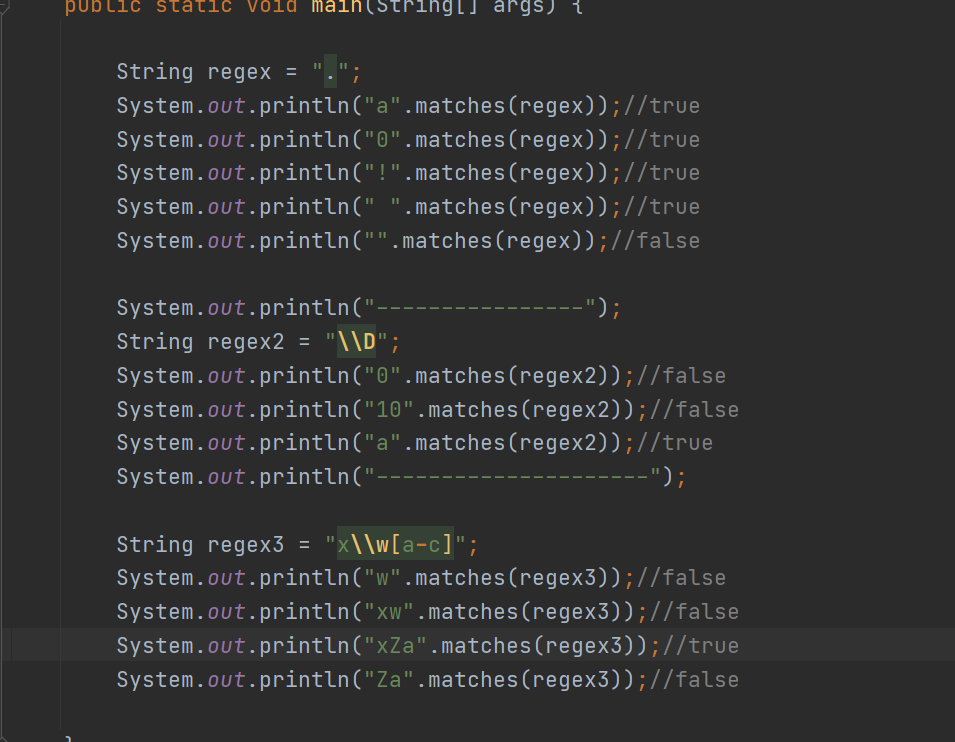

### 数量词

1.  字符类和预定义字符类都只能表示单个符号，如果需要表示多个符号，需要通过数量词
    来修饰。

2.  分类：

模糊的数量词

精确的数量词

1.  模糊的数量词

X?：x这个字符可以出现0次或者1次

X+：x这个字符出现1次或者多次

X\*：x这个字符可以出现0次1次或者多次

1.  精确的数量词

X{n}：表示x这个字符正好出现n次

X{n,}：表示x这个字符至少出现n次

X{n,m}：表示x这个字符出现n-m次

1.  注意：

修饰的数量词只能修饰前面的那一个字符

代码

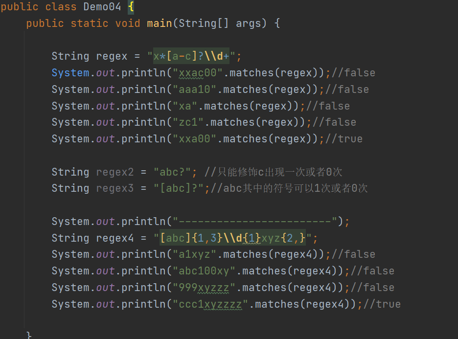

### 正则相关的三个方法

1.  matches(String regex)：判断调用者字符串是否和定义的正则字符串匹配

2.  split(String
    s)：切割调用者字符串，只要调用者字符串中满足s这个规则都可以进行切割

返回值是一个字符串数组，将切割后的内容存入到字符串数组中

1.  replaceAll(String s1,String s)：将满足s1的字符串全部替换成s字符串

代码

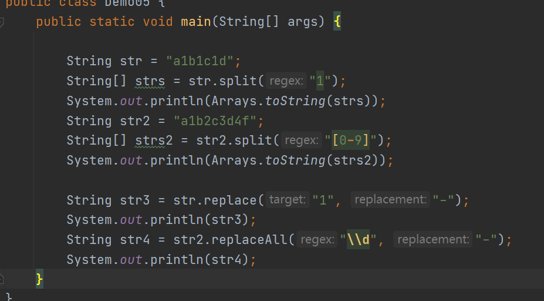
