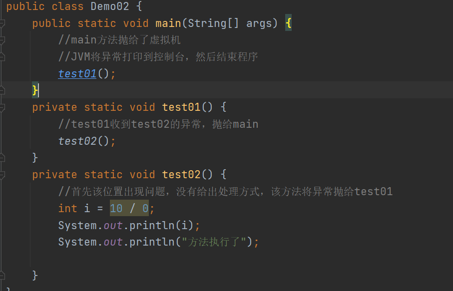

# Day13笔记

## 今日内容

1.  Math类型

2.  Date类型

3.  SimpleDateFormat类型

4.  异常

5.  可变参数

## Math类型

1、概述：Math类型是一个包含执行基本数字运算的方法的类型

2、特点：

（1）该类是一个工具类，类中全是静态方法

（2）该类在java.lang包，使用时不需要导包

3、静态字段：常量

E 自然对数的底数

PI 圆周率

4、常用方法：

abs（参数）:返回参数的绝对值

ceil(double a) ：向上取整

floor(double a)：向下取整

max(float a, float b) ：求出两个数的最大值

min(a,b)：求出两个数组的最小值

pow(double a, double b) :求出参数a的b次方

round(float a) ：求出a的四舍五入的结果

random() ：获取一个随机数 0.0---1.0之间

代码

## Date类型

1、概述：

Date是表示时间的类型，此类可以表示特定的瞬间,精确到毫秒

是Java中提供的表示时间日期数据的类型

### 定义对象的方法

1、public Date()：分配 Date 对象并初始化此对象，以表示分配它的时间(精确到毫秒)

2、public Date(long date)：分配 Date
对象并初始化此对象,以表示自从标准基准时间(称为" 历元(epoch)",即 1970 年 1 月 1
日 00:00:00 GMT)以来的指定 毫秒数。

### 常用方法

1、public long getTime()：返回自1970 年1月1日 00:00:00 GMT 以来此 Date
对象表示的 毫秒数

2、public void setTime(long time)：设置此Date对象,以表示 1970 年1月1日 00:00:00
GMT 以后 time 毫秒的时间点

代码

## SimpleDateFormat

1、概述：使用一个与语言环境有关的方式来格式化和解析日期的具体类

2、特点：

（1）java.text包，需要导包使用

（2）可以按照自定义的方式格式化日期

（3）可以按照指定格式解析日期

### 构造方法

1、public SimpleDateFormat()：用默认的模式和默认语言环境的日期格式创建对象

2、public SimpleDateFormat(String pattern)：指定解析日期的格式创建对象

### 常用方法

1、public final String format(Date date)：将一个 Date 格式化为日期/时间字符串

2、public Date parse(String source)：从给定字符串解析文本,以生成一个日期

注意事项：如果指定的格式不匹配，抛出ParseException

代码

### 案例

在控制台上输入一个long类型的毫秒值，将录入的毫秒值换算成对应的Date时间对象，将获取的Date对象格式化成“2020年10月1日
20时20分20秒 “这种形式进行展示。

代码

## 异常

1.  概述：

客观角度：不符合现实生活的各种情况，都可以理解为是异常

Java语言角度：在代码的运行过程中，出现的各种错误导致程序停止运行，那么这些错
误就是异常。

1.  注意：

异常在程序种是通过一个个对象来表示

1.  和异常相关的类型：

Throwable 该类型是所有异常类的父类

Error：错误 一般表示比较严重的问题，一旦出现该问题，无法通过代码解决

Exception：异常 一般表示比较轻微的问题，如果程序种出现异常，可以通过代码来处
理或者解决该异常。

编译时异常：除了运行时异常，其他类型都是编译时异常

运行时异常：RunTimeException 类型以及 它的子类类型

### 编译时异常和运行时异常

1.  编译时异常：在代码编译阶段，系统会检查代码的语法格式等情况，如果在检查的过程
    中出现了问题，就提示一个错误，这些问题就属于编译时异常。

2.  运行时异常：在代码编译阶段不对代码进行检查，但是在代码运行阶段，如果出现了一
    些导致程序意外终止的问题，这些问题就属于运行时异常。

3.  注意：

不管是编译时异常还是运行时异常，都只会在运行阶段出错。

### JAVA虚拟机默认处理异常的方式

1.  如果在代码中的某个方法内出现了错误情况，系统会将这个错误发生的原因，发生异常
    类型，发生的路径封装到异常对象中。

2.  如果当前方法中没有处理这个异常对象，就将异常往上抛出，抛给调用该方法的方法。

3.  如果调用的方法也没有处理异常，那么就一层一层往上抛出，直到抛给main方法，main
    方法再抛给虚拟机

4.  虚拟机将当前异常对象通过标准错误流，打印到控制台，并结束自己。

代码

### 手动处理异常的方式

1.  异常声明

2.  异常捕获

### 异常声明

1.  异常的声明：如果在某个方法中出现了编译时异常，可以在当前方法上声明这个异常的
    类型，声明之后编译时异常就会消失。

2、声明异常的格式：

修饰符 返回值类型 方法名称 （参数列表）throws 异常类型1，异常类型2…{

方法体语句；

}

3、注意事项：

（1）异常的声明，不能从本质上解决问题，只能在编译阶段不检查这段代码

如果后续传入一些错误的数据，在运行阶段也可能会发生错误。

（2）如果方法1中进行了异常的声明，方法2调用了方法1，那么方法2需要对该异
常进行捕获或者处理。

（3）在声明异常的时候，尽量声明小的异常类型

代码

### 异常的捕获

1、异常的捕获：如果代码的某个位置会出现了错误情况，可以使用特定的格式，捕获这个
错误，捕获之后可以按照自己定义的方式去处理异常。

2、格式：

try … catch

try … catch … finally

try … finally

### try … catch

1.  格式：

try{

可能会出现错误的代码

}catch(异常类型 异常对象名称){

处理异常的方式

}

1.  执行流程：

2.  先执行try中的代码，检测是否出现异常

3.  如果try中的代码没有出现问题，trycatch直接结束，代码正常执行trycatch后面的
    代码。

4.  如果try中出现了异常，程序立即跳转到catch中查看出现异常所属的类型和catch
    中声明的类型是否一样，如果一样，就捕获该异常按照指定的方式去处理异常，处
    理之后，trycatch结束，程序继续运行。

5.  如果try中出现了catch中没有声明的异常类型，就不能捕获该异常，这时虚拟
    机来处理这个异常（默认处理方式）。

6.  注意事项：

7.  如果在某行代码中，出现了异常，立即去catch块中去匹配异常类型，出现错误
    的代码后面的代码就不能执行了。

代码

### try…catch格式的多种异常情况

1.  格式：

try{

可能出现错误的代码

}catch(异常类型1 对象名1){

异常1的处理方式

}catch(异常类型2 对象名2){

异常2的处理方式

}...

1.  流程：

2.  先执行try中的代码，检测是否出现异常

3.  如果出现了异常， 就先和异常类型1匹配，如果能匹配上就执行异常1的处理方
    式，处理之后，直接结束整个try…catch语句，执行之外的代码。

4.  如果不能和异常类型1匹配，就继续和异常类型2匹配，如果能匹配上，就执行异
    常类型2的处理方式，之后结束整个try…catch语句，执行之外的代码。

5.  如果异常类型2不能匹配，依次类推，往后匹配。

6.  如果出现的异常，catch中的类型都不能匹配，虚拟机默认处理

7.  注意事项：

8.  如果定义的多个catch块中的类型，有子父类的关系，不能将父类的类型定义在
    子类的类型前面。

9.  如果ctach块中定义的多个异常类型，要使用同一种处理方式，可以使用\|来定义
    异常类型。

代码

### try … catch … finally

1.  格式：

try{

可能会发生错误的代码

}catch(异常类型1 异常对象1){

异常1的处理方式

}catch(异常类型2 异常对象2){

异常2的处理方式

…

}finally{

一定需要执行的代码

}

1.  finally：

使用原因：

（1）如果有某些代码一定要执行，将代码放在try中或者catch中或者trycatch外
都有可能执行不到

（2）将这段代码放在finally块中，不管遇到什么情况，系统都会去执行finally中的
内容。

3、注意事项：

（1）finally关键字不能单独使用，一般是用来定义一个代码块

（2）finally代码块也不能单独使用，一定是和try代码块一起使用

### try...finally格式

1.  格式：

try{

第一段代码

}finally{

第二段代码

}

1.  作用：

如果在程序中，有多段代码，多段代码都需要有执行的机会，那么可以将这多段代码，
分别放在try中和finally中，这样，多段代码之间就会互不影响，都有执行的机会。

用来分隔代码，让代码之间互不影响，都有执行的机会。

代码

### 异常类型中的方法

1.  概述：在异常的体系中，顶层父类Throwable中定义了一下操作异常对象方法

2.  常用的方法：

getMessage() ：返回发生异常的原因

getCause() ：返回引起调用者异常对象发生的另一个异常对象

toString() ：返回该异常对象发生的原因及所属的类型

printStackTrace() ：返回该异常发生的路径，原因及类型

代码

### 异常中的构造方法：

1、Throwable() ：创建一个没有任何属性值的异常对象

2、Throwable(String message) ：创建一个有原因的异常对象

### throw关键字

1.  throw：抛出异常

2.  使用场景：如果在某个方法中出现了和正常生活不符合的情况，开发人员可以在该方法
    中创建一个异常对象，但是创建的异常对象自己不会自动抛出，需要使用throw关键字
    抛出异常。

3.  注意事项：

（1）在创建一个异常对象之后，一定要主动抛出，如果不抛出，该异常对象就不起作 用。

（2）如果抛出的是一个运行时异常，在编译阶段不做检查，在运行阶段如果传入的数
据是错误的，就会执行该异常。

（3）如果抛出的是一个编译时异常，在抛出之后，编译期间就会出现这个异常，可以
声明也可以捕获处理。

### throw和throws关键字的区别

1.  throw关键字是用来抛出一个创建的异常对象

throws关键字使用来声明一个异常类型

1.  throw关键字在方法中使用

throws关键字在方法的声明上（参数列表的后面）使用

1.  throw一次只能抛出一个异常对象

throws可以一次抛出多个异常类型（抛出的多个类型之间使用逗号分隔）

### 自定义异常类型【了解】

1.  使用原因：

在异常的体系中官方定义了很多异常类型，但是大多类型都没有自己特殊的方法和属
性，目的就是为了使用不同的类型来区分各种问题，当看到对应的类型时，就知道代码
中出现了什么问题，方便去开发者分析代码并解决问题。

1.  步骤：

（1）创建一个类型以Exception结尾

（2）将这个异常类型继承Exception或者RunTimeException

如果继承了Exception类型，当前定义的类型就是一个编译时异常

如果继承了RuntimeException类型，当前定义的类型就是一个运行时异常类型

1.  在该类中调用父类的构造方法，用于让子类创建对象

## 可变参数

1、概述：

可变参数又称参数个数可变，一般用来定义方法的形参

2、使用场景：

如果某个方法的形式参数个数不确定，可以将该形参定义为可变参数

定义可变参数之后，该方法可以接收任何个数参数

3、好处：

由于参数数目不定，使用可变参数函数能缩短编码，灵活性和易用性较高

4、注意事项：

（1）可变参数底层是使用数组实现的

使用这个可变参数的方式，和使用数组的方式一模一样

（2）如果方法中存在多个参数，包括可变参数，可变参数要放在最后

（3）一个方法的参数列表中，只能存在一个可变参数

（4）在传递实际参数时，数据类型要和可变参数的数据类型对应

代码

