# Day14笔记

## 今日内容

1.  集合的概述

2.  Collection集合

3.  List集合

## 集合

1.  概述：可以存储多个数据的容器

2.  集合和数组的区别：

相同点：都可以存储多个数据

不同点：

（1）数组中可以存储多个数据，但是不能自由的实现数据的新增或者删除操作

集合也可以存储多个数据，但是集合中可以自由的实现数据的新增或者删除

（2）数组中既可以存储基本类型的数据，也可以存储引用类型的数据

集合中只能存储引用类型的数据，本质上不能存储基本类型的数据

（3）数组本身自带的功能较少，集合中自带的方法比较多使用起来更加方便

## 集合的体系

1、集合体系结构图：

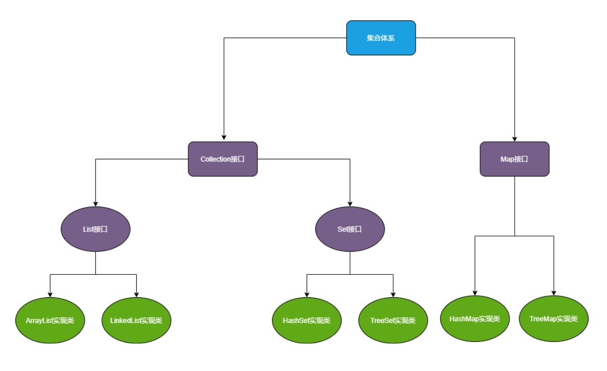

## 单列集合体系的详细讲解

## Collection 集合

1.  单词：收集，集合

2.  概述：此类是单列集合的顶层接口，任何单列集合都属于该接口的子接口或者实现类。

3.  特点：

（1）是一个接口不能去创建对象。只能通过实现类创建对象访问其中的方法。

（2）在java.util包，需要导包使用

（3）Collection中定义的方法，子接口和实现类都可以去使用。

### Collection集合的常用方法

add(E e) ：往集合中添加元素

addAll(Collection\<? extends E\> c) ：将集合c中的内容全添加到调用者集合中

remove(Object o) ：删除集合中的o元素

removeAll(Collection\<?\> c) ：删除调用者集合中和c集合中相同的元素

clear() ：清空集合

contains(Object o) ：判断集合中是否包含元素o

containsAll(Collection\<?\> c) ：判断调用者集合中是否全部包含集合c的所有元素

isEmpty() ：判断集合是否为空

size() ：返回集合中元素的个数

代码

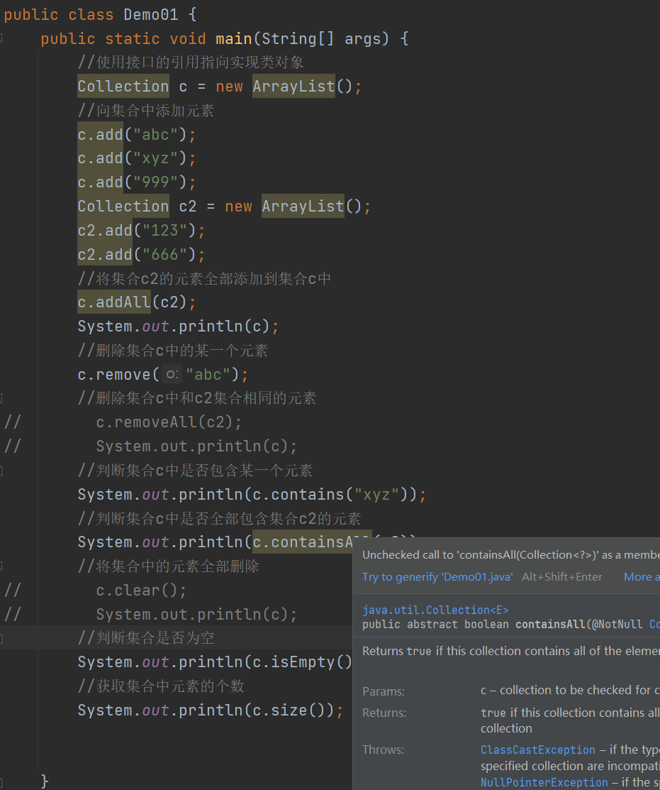

### Collection集合的遍历方式

### Collection集合的第一种遍历方式

1.  方式：转数组遍历：将集合中的数据转到一个数组中，再遍历数组，等于是间接的遍历
    集合。

2.  集合转为数组的方法：toArray()

代码

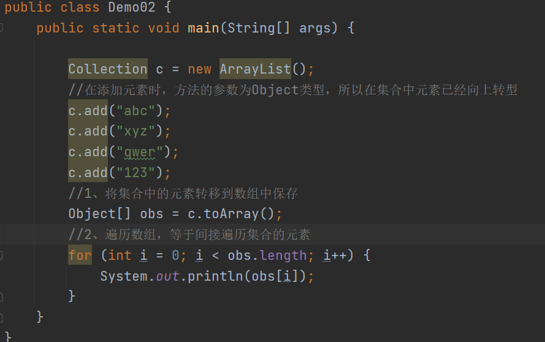

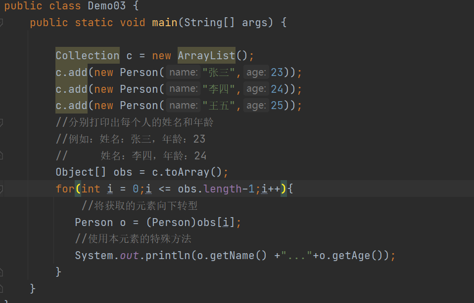

### Collection集合的第二种遍历方式

1.  方式：使用迭代器遍历集合

迭代：更新换代，一个到下一个

迭代器：用来获取集合中每一个元素的对象

1.  获取迭代器的方式：通过集合定义的方法来获取：iterator()

2.  迭代器对象可以使用的方法：

next();

hasNext();

1.  注意事项：

2.  虽然每次使用的方法都是next，但是获取的值是不同的

3.  next方法不仅可以获取下一个元素，而且获取之后，可以将指针指向下一个元素

4.  hasnext方法只可以判断是否有下一个元素，不能移动指针

5.  如果集合中没有下一个元素了，仍然获取，会出现一个异常：
    NoSuchElementException

代码

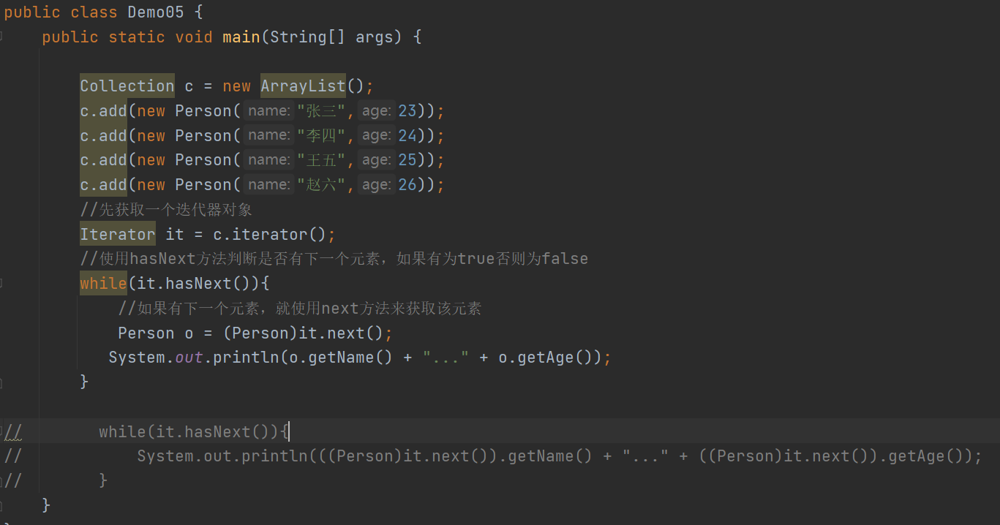

### Collection集合的第三种遍历方式

1、方式：使用增强for循环遍历

2、增强for循环：

它是JDK5之后出现的，其内部原理Iterator迭代器相同

3、格式：

for(元素的数据类型 元素名称：集合或者数组名称){

元素名称的使用

}

代码

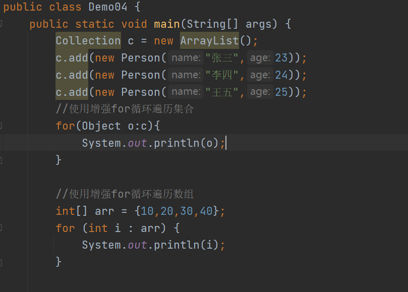

## List集合

1.  概述：List集合是Collection接口下的子接口

2.  特点：

（1）属于一个单列集合   
（2）不能直接创建对象，可以通过实现类创建对象

（3）该集合中的元素特点：

有序：元素存入的和取出的顺序可以保证一致

有索引：每个元素都有自己的一个位置，通过有序的序号来表示这个位置，索引
可重复：集合中可以存储相同的元素值

### List集合特殊的方法

add(int index, E element) ：往集合中的指定位置添加元素

get(int index) ：获取集合中指定元素的值

remove(int index) ：删除指定位置的元素

set(int index, E element) ：修改集合中指定位置的元素值为ele

代码

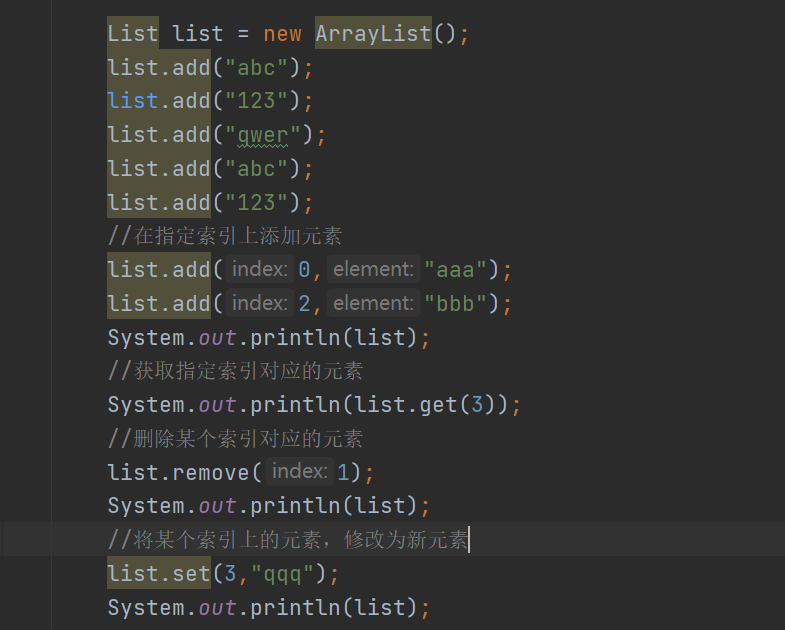

List集合遍历总结

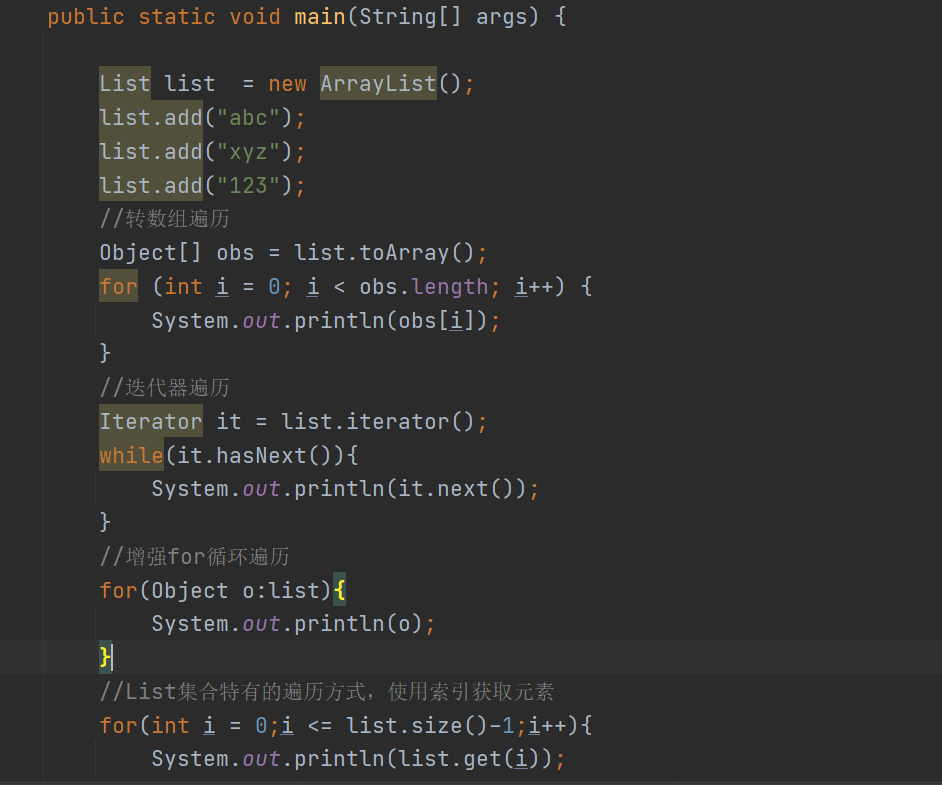

### 并发修改异常

1.  ConcurrentModificationException

2.  出现该异常的原因：

一边使用迭代器对象遍历集合，一边使用集合对象增加或者删除元素

1.  解决方案：

一边使用集合对象遍历，一边使用集合对象增加或者删除

一边使用迭代器遍历，一边使用迭代器增加或删除

4、第一种方式：

使用集合遍历：list.size方法和List.get方法

使用集合增加：list.add

1.  第二种方式：

迭代器遍历：hasnext next

迭代器增加：使用父类中获取迭代器对象的方式，没有增加元素的方法，所以要使用
List集合特有的获取方式：listIterator（）

通过这个特有的方式获取的迭代器对象，不仅可以遍历集合，而且有add 方法来增加元素。

代码

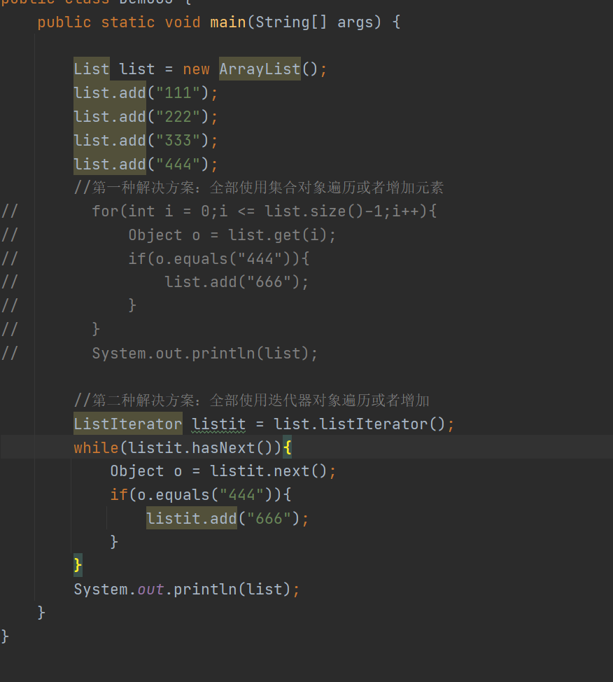

### 数据结构概述

栈

1、栈概述：stack，又称堆栈，它是运算受限的线性表，其限制是仅允许在标的一端进行插入和删除操作，不允许在其他任何位置进行添加、查找、删除等操作。

2、特点: 先进后出，后进先出

元素先存储栈，后取出

元素后存储栈，先取出

3、相关术语：

存入元素：进栈，压栈

取出元素：出栈，弹栈

4、图示理解：

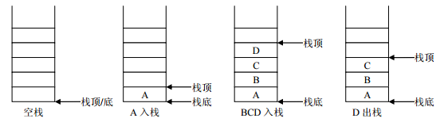

队列

1、概述：queue,简称队，它同堆栈一样，也是一种运算受限的线性表，其限制是仅允许在
表的一端进行插入，而在表的另一端进行删除。

2、特点：

（1）先进先出，后进后出

（2）队列的入口、出口各占一侧。

3、相关术语：

存入元素：入队

取出元素：出队

4、图示：

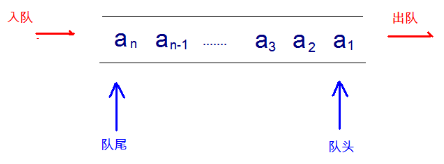

数组

1、Array：是有序的元素序列，数组是在内存中开辟一段连续的空间，并在此空间存放元素。

2、特点：

（1）数组存储元素的空间，在内存中是相邻连续的，所以数组中的元素是有序的

（2）数组存储元素，查询元素的效率高

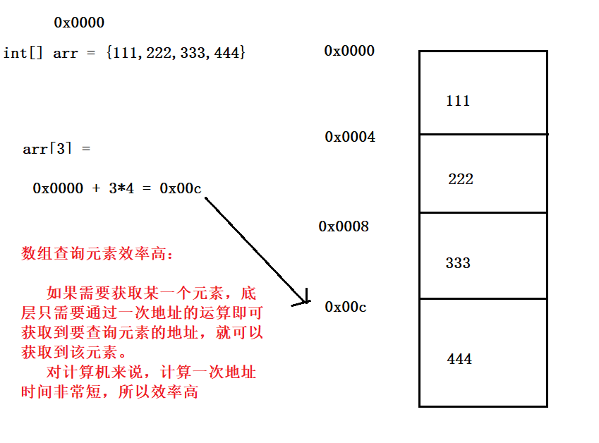

1.  数组存储元素，增加删除元素效率低

原因：数组本身大小是固定的，不能直接新增或者删除元素。

如果需要向数组中新增元素，需要先对数组实现扩容，然后再将之前数组
的值全部拷贝到新数组中，然后在指定的位置添加新元素。

如果需要删除某一个元素，需要让当前元素后面的每一个值都往前移动，
移动之后，再将最后空出来的空间隐藏掉。

链表

1.  链表：linkedlist，链表中的每一个元素（节点）都是有一个Node对象组成

2.  特点：

3.  每一个节点由两部分组成：数据域、指针域

4.  节点之间也是有序连接，所以链表存储元素也是有序的

5.  链表查询元素效率低

6.  链表增加或者删除元素效率高

7.  链表有两种分类：

双向链表：当前节点中，既记录了上一个元素的地址，也记录了下一个元素地址

单向链表：当前节点只记录下一个元素的地址，没有记录上一个元素的地址

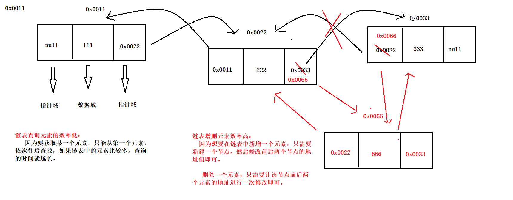

### List的实现类

1.  概述：List集合也是一个接口，根据底层存储数据方式的不同有不同的实现类

2.  分类：

ArrayList

LinkedList

### ArrayList

1.  List集合的实现类，本类没有特殊的方法，只能使用接口中定义的方法

2.  特点：

（1）底层数组实现，可以表示元素有序

（2）查询元素的效率高，增删元素的效率低

（3）特点：元素有序，元素有索引，元素可以重复

3、总结：

（1）使用空参构造创建一个ArrayList集合对象，其实底层维护了一个空Object数组

（2）当第一次向集合中添加元素，底层先将数组扩容，从0扩容10

（3）当10个元素存储之后，继续存储其他元素，底层继续对数组进行扩容，扩容原来
的1.5倍，依次类推。

### LinkedList

1.  属于List接口的实现类，可以使用接口中继承方法

2.  特点：

（1）底层通过双向链表实现，可以保证元素有序

（2）查询元素效率低，增删元素效率高

（3）使用构造方法创建一个LinkedList对象，底层什么也没有维护（数据是保存在Node
对象中，如果没有数据，就不需要创建Node对象）

如果使用该集合对象增加一个元素，那么底层就会新建一个Node对象（节点）
来保存该元素的值，以及上一个元素和下一个元素的地址值，如果继续新增元素，
那么该新增的元素就是最后一个元素，将上一个元素的last地址改为新元素的地
址，也会将新元素的上一个元素地址进行保存

1.  特有方法：因为linkedList可以记录头部和尾部元素的地址，所以有一些操作头部和尾部
    元素的方法：

addFirst(); 在头部位置添加元素

addLast(); 在尾部添加元素

removeFirst(); 删除头部位置的元素

removeLast(); 删除尾部的元素

getFirst(); 获取头部元素

getLast(); 获取尾部元素

总结：

1.  数组和集合的区别

2.  Colllection特点

方法

1.  Collection遍历方式

转数组：toArray

迭代器：iterator

增强for循环

1.  List集合特点

元素有序 有索引 可以存储重复值

add(index ,e) get(index) remove(index) set(index,e)

特特有的遍历方式： size() get(index)

1.  异常：并发修改异常

解决：使用同一个对象遍历集合，增删元素

1.  ArrayList：

底层数组实现，查询快，增删慢

1.  LinkedList：

底层双向链表实现，查询慢，增删快

有特殊的方法
