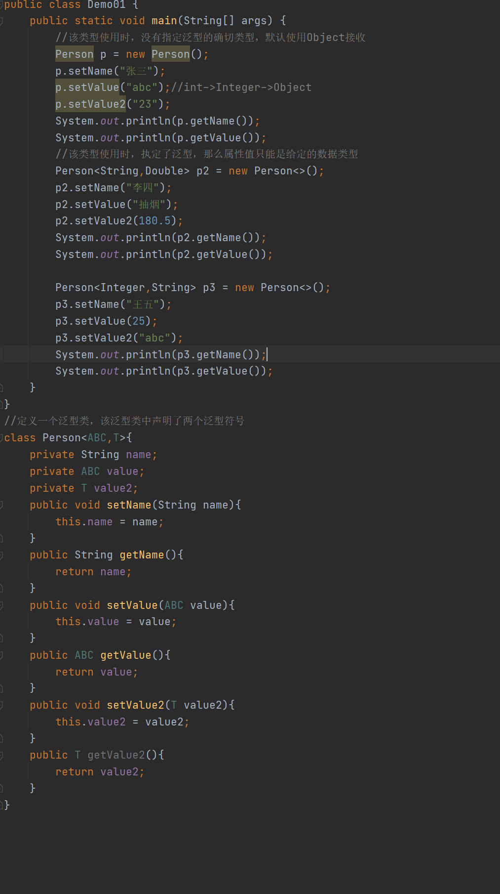
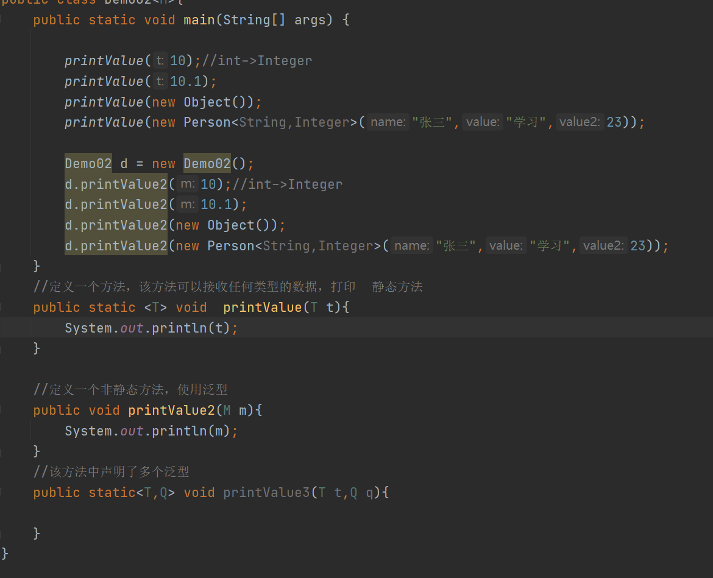
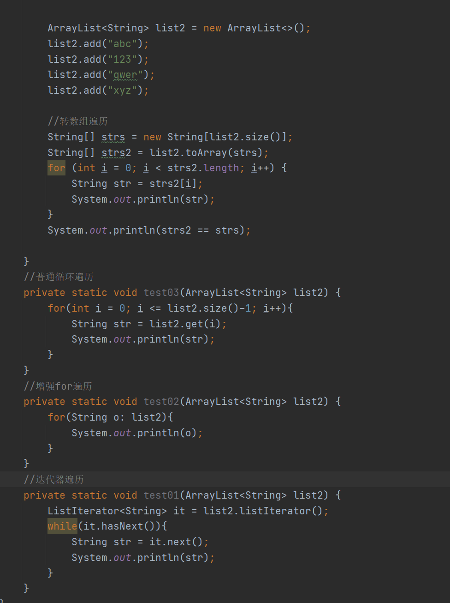
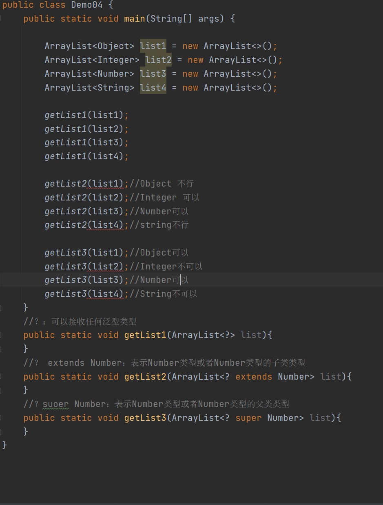

# Day15笔记

## 今日内容

1.  泛型

2.  学生管理系统案例

## 泛型

1.  概念：是一个未知的数据类型，是一个参数化类型

2.  使用场景：

3.  如果需要给一个类型定义属性，但是这个类型中的属性不确定，可以使用泛型来
    代替定义。

4.  如果需要定义一个方法，但是该方法的参数列表类型和返回值类型不确定，可以
    使用泛型来定义。

### 泛型应用之：泛型类的定义和使用【掌握】

1.  概念：在定义类型时，类上有泛型的使用，那么该类就是泛型类

2.  格式：

class 类名\<泛型\>{

}

1.  注意事项：

2.  如果想要在类中使用泛型，首先需要在类的声明上，声明该泛型符号

3.  如何定义泛型：

泛型符号可以是任意标识符

但是一般使用大写的字母来表示 M T Q L

1.  如果一个类型定义了泛型，在使用这个类型的时候，可以确定泛型也可以不确定
    泛型。如果不确定泛型的话：默认使用Object来接收参数

如果确定了泛型：那么就只能使用确定的类型来接收参数

1.  在确定泛型的时候，泛型前后要一致

后面的泛型类型可以不写，因为可以根据泛型推断，将后面的类型会默认和前面
保持一致。但是\<\>不能省略。

1.  可以在一个类中使用多个不同的泛型，使用几种就需要声明几种

2.  在使用类型时，如果类型声明了多个泛型，要么一个都不指定，要么全都指定

3.  好处：

可以提高类型的扩展性

代码

### 泛型应用之：泛型方法的定义和使用【掌握】

1.  概念：使用泛型定义的方法

2.  格式：

修饰符 \<泛型的声明\> 返回值类型 方法名(){  
}

1.  注意事项：

2.  如果定义了一个静态方法，该静态方法中需要使用泛型，那么静态方法只能自己
    先声明，后使用。不能使用类上声明的泛型。

3.  如果定义了一个非静态方法，该方法既可以使用类上声明的泛型，也可以自己声
    明泛型。

4.  方法中如果需要声明泛型，也可以同时声明多个泛型

代码

## 泛型接口的定义和使用【掌握】

1.  概述：如果接口中的抽象方法需要使用泛型，也需要先在接口上声明该泛型

2.  注意：

3.  将来接口的实现类如果实现了接口，但是没有指定泛型类型，在实现类中默认使 用
    Object来表示该泛型。

4.  实现类实现接口之后，如果需要使用该泛型，就要在实现接口时，就要指定该泛
    型的类型，指定的类型是谁， 就使用谁。

5.  如果实现类实现接口之后，没有指定泛型，也需要使用这个泛型符号，只能在实
    现类中也声明该泛型。

### 泛型应用之：集合对泛型的使用【掌握】

1.  概述：学习的集合是支持泛型的

可以使用泛型，也可以不使用泛型

如果定义集合之后，没有使用泛型：元素在集合中都是Object接收

如果定义集合之后，使用了泛型，元素在集合中就是定义的类型

1.  使用泛型定义集合的特点：

（1）如果定义的集合使用了泛型，那么当前集合中只能添加对应类型的元素；

（2）如果集合定义了泛型，添加元素之后，不会再默认向上转型

（3）使用集合元素特有的方法时，不需要向下转型，直接使用即可

3、集合遍历的总结：

（1）使用迭代器或者增强for循环遍历集合时，因为集合制定了确切的泛型类型，所
以在使用集合的元素时不需要再向下转型

（2）使用转数组：toArray方法遍历的时候，该方法的返回值固定是Object类型

所以使用元素的特殊方法时，也需要向下转型。

（3）但是转数组，有另外一种方式：toArray(T[] arr)

在转数组的时候，可以自主准备一个数组，用来存储元素，数组可以和数据的类
型保持一致，那么在转换之后也不需要向下转型。

I：如果准备的数组空间正好够存，或者空间多余元素，那么可以转移到自己的数 组中。

II：如果准备的数组空间不够存储元素，该方法会返回一个新数组用来存储数据

代码

## 泛型的通配符【了解】

1.  概述：将来定义数据类型时，如果这个数据类型不确定，可以使用泛型来表示这个不确
    定的类型；也可以使用泛型通配符来定义这个不确定的类型。

2.  分类：

？：泛型的通配符 可以表示任何泛型

？ extends E： 泛型通配符 可以表示泛型E类型或者泛型E类型子类类型

？ super E： 泛型通配符 可以表示泛型E类型或者泛型E类型的父类类型

代码

## 

## 

## 学生管理系统

一：案例需求：

针对目前我们的所学内容，完成一个综合案例：

学生管理系统！该系统主要功能如下：

（1）添加学生：通过键盘录入学生信息，将该学生添加到集合中

（2）删除学生：通过键盘录入学生的学号，将该学生从集合中删除

（3）修改学生：通过键盘录入学生的学号，将该学生其他信息进行修改

（4）查看学生：将集合中的所有学生信息进行展示

（5）退出系统：结束程序

二：实现步骤：

1、定义学生类，包含以下成员变量

学生类：

Student成员变量：属性私有化，提供公共的访问方式

学号：sid String

姓名：name String

年龄：age String

地址：address String

构造方法：

空参构造

有参构造

2、学生管理系统主界面的搭建

主界面内容举例：

\*\*\*\*\*欢迎来到学生管理系统\*\*\*\*\*

请录入您要进行的操作：

1、添加学生信息

2、删除学生信息

3、修改学生信息

4、查看学生信息

5、退出当前系统

要求：输入对应的序号，进行对应的功能实现，实现之后，需要再次提示录入，进行下
次操作，直到录入5，退出系统才结束整个操作。

3、学生管理系统的添加学生功能实现步骤

3.1 用键盘录入选择添加学生

3.2 定义一个方法，用于添加学生

注意：

（1）要求添加学生的学号、姓名、年龄、地址

（2）添加的学号不能重复，如果重复提示学号已有，重新录入

（3）录入之后，将学生添加到集合中

（3）添加成功后，提示添加成功，继续下次操作

4、学生管理系统的查看学生功能实现步骤

4.1 录入对应序号，查看所有的学生的信息

4.2 定义一个方法，用于展示集合中所有学生信息

5、学生管理系统的删除学生功能实现步骤

5.1 录入对应序号，进行删除功能

5.2 用键盘录入学号选择删除哪一个学生信息（根据学号删除）

5.2 定义一个方法，用于删除学生信息

注意：

（1）键盘录入要删除的学生学号

如果该学生存在，则删除，之后提示删除成功

如果学生不存在，提示没有该学生，重新进行删除操作

（2）删除之后，提示成功，然后进行下次操作

6、学生管理系统的修改学生功能实现步骤

6.1 录入对应序号，进行修改功能

6.2 用键盘录入学号，选择修改哪一个学生信息（根据学号修改）

6.2 定义一个方法，用于修改学生信息

注意：

（1）键盘录入要修改的学生学号

如果存在该学生则将该学生除学号外的其他信息进行修改

如果不存在该学生则提示没有此人，重新进行修改操作

1.  修改之后，提示成功，然后进行下次操作
