# Day16笔记

## 今日内容

1.  Set集合

2.  Map集合

## Set集合

1、概述：该集合是一个单列集合，是Collection集合的子接口。

2、特点：

（1）在java.util包中

（2）该类元素特点：

不可重复：集合中不可以存储相同的元素（去重）

没有索引：集合中没有一些操作元素索引的方法

无序：元素存储的顺序和取出的顺序不能保持一致

## TreeSet集合

1、概述：TreeSet集合为Set集合的实现类。

2、特点：

（1）不可重复：集合不可以存放重复的元素（去重）

（2）无序：元素存入和取出的顺序不一致

（3）无索引：元素没有索引来对应

（4）该集合底层使用二叉树来存储

虽然该集合是无序存入和取出，但是该集合可以对元素进行排序

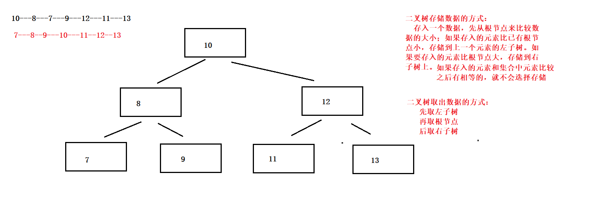

4、存储元素排序方式：

（1）如果集合中存储的是整数、小数则按照数据的大小，从小到达排序

（2）如果集合中存储的是字符、则按照字符转码后的整数从小到达排序

（2）如果是非中文字符串类型，则按照字符串中字符转码后的整数从小到达排序

（3）如果是中文字符串则按照中文字符解码后的数字大小，从小到大排列

（4）如果是自定义的类型对象，不能直接使用TreeSet集合存储

解决方案：实现Comparable接口，并重写接口中的compareTo方法

4、compareTo方法排序原理：

（1）Comparable接口: 是一个比较接口

（2）需要重写该接口的方法： public int compareTo(Object o)

（3）方法的比较规则：

返回值为0 默认添加的元素重复，就实现去重

返回值为正 默认添加的元素大，将元素存储在右子树（后取）

返回值为负 默认添加的元素小，将元素存储在左子树（先取）

### Comparator比较器使用

1、概述：Comparator和Comparable一样都是用来比较数据的接口

2、Comparable接口如果使用，需要被自定义类实现，且重写其中的compareTo方法

3、Comparator接口如果使用，需要在创建TreeSet集合对象时传入一个该接口的实现
类对象，且重写其中的compare方法

4、方法：compare(Object o1, Object o2)：

o1表示要添加的数据，o2表示集合中已有的数据

返回值为0 默认添加的元素重复，就实现去重

返回值为正 默认添加的元素大，将元素存储在右子树

返回值为负 默认添加的元素小，将元素存储在左子树

代码

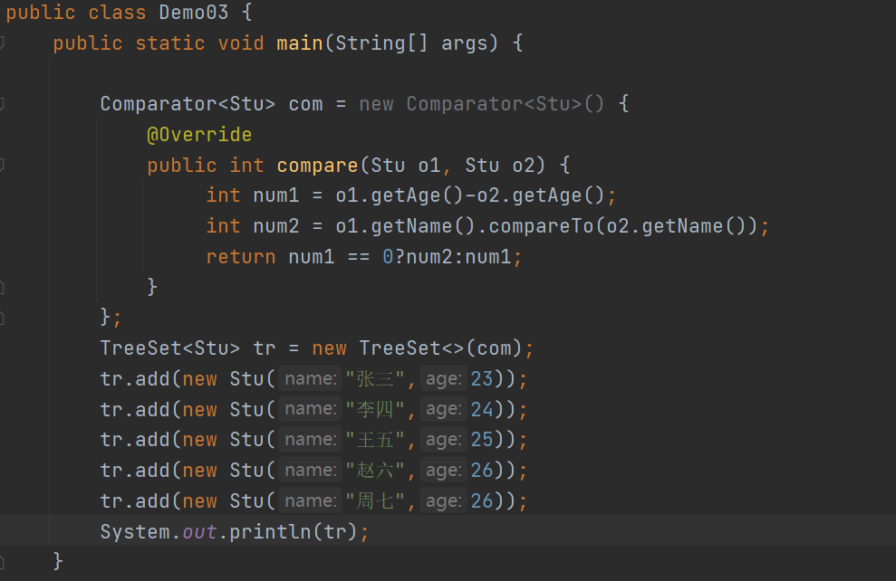

### 案例

使用TreeSet集合存储多个学生信息，

先按照学生的总成绩升序排列

如果总成绩相同，则按照语文成绩升序排列

如果语文成绩也相同，则按照名字的自然排序升序排列

学生类：

属性：姓名 语文成绩 数学成绩

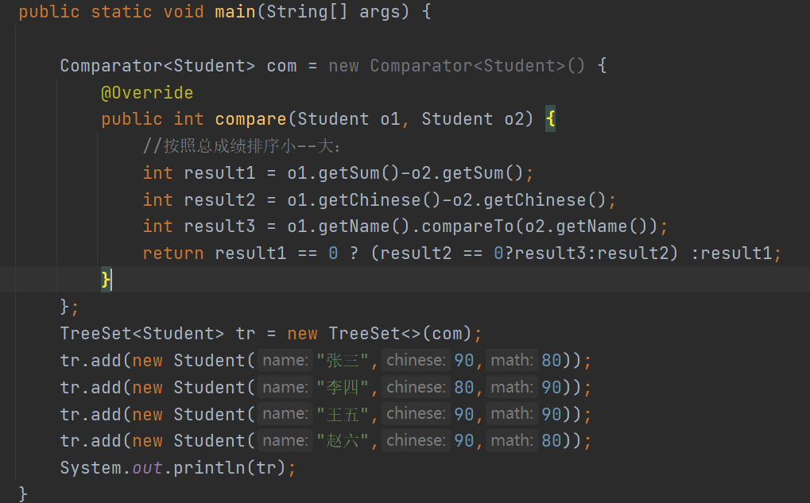

## HashSet集合

1.  概念：属于set集合的实现类

2.  特点：

（1）无序，没有索引，不可重复

（2）该集合没有特殊的方法，可以使用单列接口中定义的方法

（3）该集合存储元素的方式，底层是根据哈希表来进行存储的

### 哈希值简介

哈希值简介：

1、是JDK根据对象的地址或者字符串或者数字算出来的int类型的数值

2、如何获取哈希值

Object类中的public int hashCode()：返回对象的哈希码值

3、哈希值的特点

（1）同一个对象多次调用hashCode()方法返回的哈希值是相同的

（2）默认情况下，不同对象的哈希值不同

哈希值特点总结：

（1）两个对象的哈希值不同，肯定是不同的对象

（2）如果两个对象的哈希值一样，可能不是同一个对象

### 哈希表图示

1.  哈希表：底层就是使用 数组 + 链表 结合产生的。

JDK1.7版本哈希表的图示

使用数组和链表组成

JDK1.8之后对哈希表的优化

优化的原因：因为如果链表的长度过长，该链表中的数据在查询时，查询的效率低，所
以当链表长度\>=8时，会将该链表转为红黑树（特殊的二叉树）来存储，转换之后，链
表的长度就会缩短，提高查询效率。

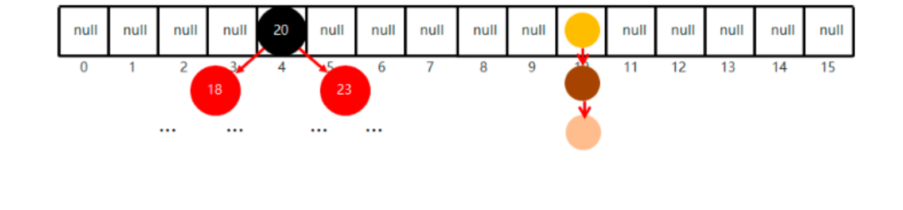

### HashSet集合保证元素唯一性原理

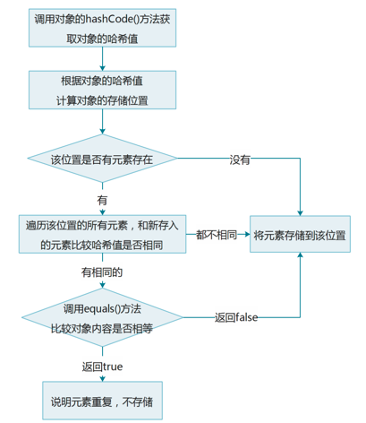

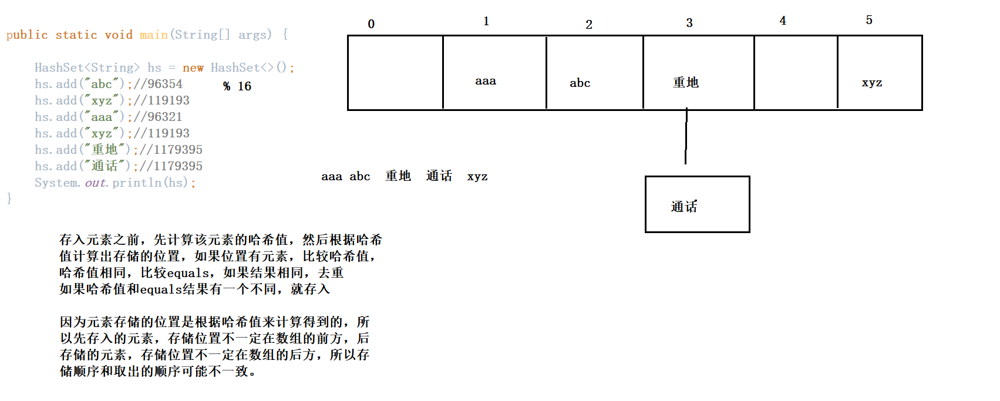

## LinkedHashSet集合

1.  概述：是一个单列集合，是HashSet集合的子类

2.  特点：

（1）没有特殊的方法，可以使用父类中继承的方法

（2）元素特点：

无索引

不可重复：和父类去重的原理一样

有序：可以保证元素存入的和取出的顺序

有序的原理和链表原理相同

## 单列集合总结

1.  Collection接口：单列集合的顶层接口

方法需要多写

三种遍历方式

1.  List：Collection集合的子接口

特点：有序 有索引 可重复

特有方法：通过索引操作元素的方法

特有的遍历方式：size get

并发修改异常：解决：使用同一个对象操作集合

1.  ArrayList：

底层使用数组实现，查询快，增删慢

1.  LinkedList：

底层使用双向链表实现，查询慢，增删快

特有方法，操作头部和尾部元素方法

1.  Set：Collection接口的子接口

特点：无序 无索引 去重

三种遍历方式

1.  TreeSet：

底层使用二叉树实现

去重原理和无序原理：通过比较器对象Compator对象的compare

Comparable接口的compareTo方法

可以对元素进行排序

1.  HashSet集合：

底层使用哈希表实现

去重原理：通过比较元素的哈希值和equals结果来去重

比较之后，两个结果都相同去重，有一个不同就存入

1.  LinkedHashSet集合：

HashSet集合的子类：哈希表实现

特点：有序 无索引 去重

## Map集合

1.  概念：

现实生活中，我们常会看到这样的一种关系：IP地址与主机名，身份证号与个人，
用户名与密码，等等。这种一一对应的关系，就叫做映射。Java提供了专门的集合类用
来存放这种对象关系的数据，存储映射关系的集合就是双列集合。

2、特点：

（1）该接口是双列集合顶层接口，不能直接创建对象

（2）该类在java.util.包中，使用时需要导包

（3）该集合中的每个元素是由一对数据组成，即：键值对

键值对是由 键（key）和值（value）组成

（4）键值对中的键是唯一的（不可重复）去重

值是可以重复的

### Map集合中常用的方法

put(K key, V value) ：往集合中添加元素 每个元素是由键值对组成

如果key值是第一次出现，就是添加

如果key值第二次出现，就是替换

remove(Object key) ：根据制定的key删除对应的键值对

remove(Object key, Object value) ：根据键和值删除对应键值对

clear() ：清空集合

containsKey(Object key) ：判断集合中是否包含key

containsValue(Object value) ：判断集合中是否包含value

get(Object key) :根据key值获取对应的value值

isEmpty() ：判断集合是否为空

replace(K key, V value) ：替换key对应的value值

[size](mk:@MSITStore:C:\Users\Administrator\Desktop\jdk%20api%201.8_google.CHM::/java/util/../../java/util/Map.html#size--)()：获取集合中键值对的对数

代码

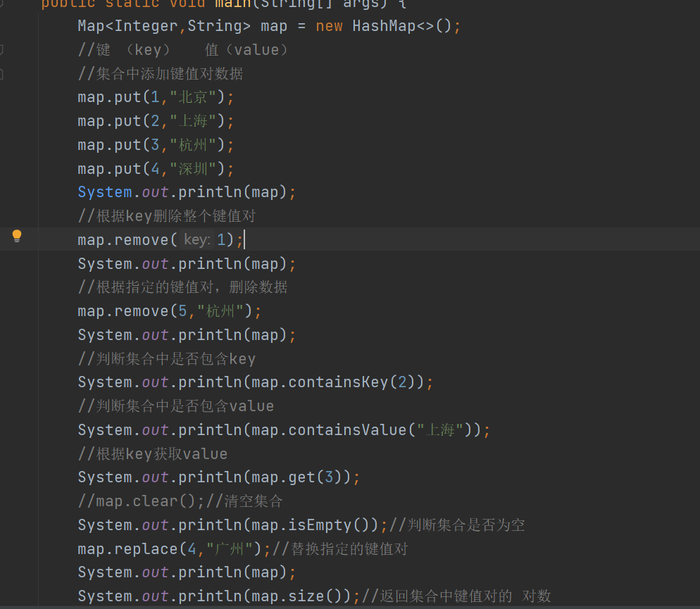

## Map集合的遍历

### Map集合遍历的第一种思路：通过key获取value

1.  概述：

先将Map集合中的key单独获取到一个单列集合中，然后遍历该单列集合获取每一个
key，再通过key依次获取每一个对应的value。

1.  如何获取每一个key：keySet()

2.  遍历set集合：

三种方式

1.  遍历set集合获取每一个key，再使用get方法获取key对应的value

2.  图示：

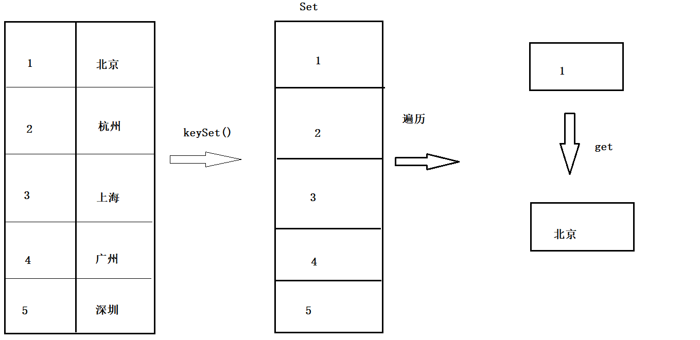

代码

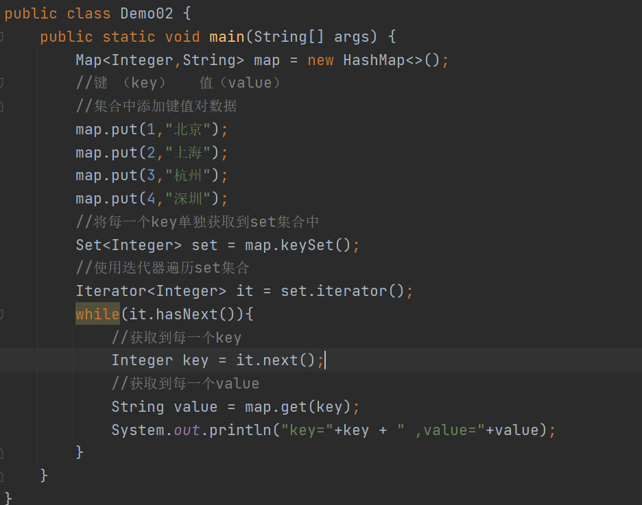

### Map集合第二种遍历：通过键值对对象来获取key和value

1.  思路：

先将Map集合中的每一个键值对数据封装为一个个键值对对象，然后将每一个对象保
存在set中，遍历set集合，获取每一个键值对对象，通过方法获取该对象中的key和 value

1.  获取键值对对象到set中的方法：entrySet()

集合set中保存的是：一个个键值对对象 该简直对象所属的类型是Entry接口

Entry接口是,Map集合中内部接口

该接口中由两个方法：getKey获取key

getValue获取value

1.  获取set集合之后，遍历set获取每一个键值对

三种遍历方式

1.  遍历set集合之后，可以得到每一个键值对，如何获取对应的keyvalue

getKey获取key

getValue获取value

1.  图示：

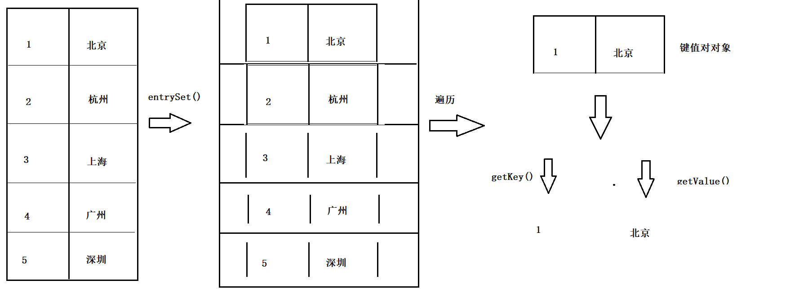

代码

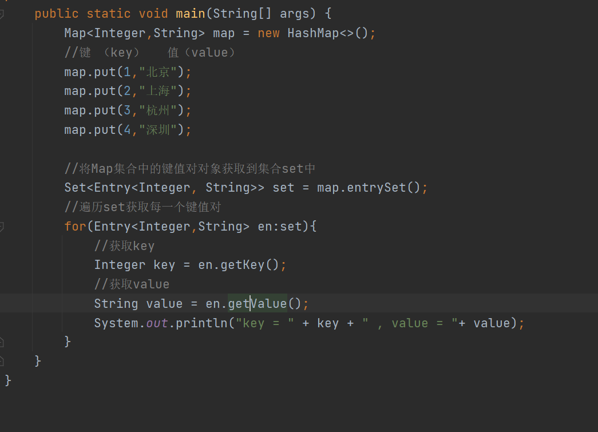
