# Day17笔记

## 今日内容

1.  Map集合实现类

2.  Collections工具类

3.  File类

4.  递归

## Map集合实现类

1.  概述：Map集合为双列集合的顶层接口，底层根据不同的实现方式，有不同的实现类

2.  实现类：

TreeMap和HashMap

### TreeMap集合

1、概述：是一个双列集合，是Map集合的实现类

2、特点：

（1）集合中的key值是唯一的，元素是无序的

TreeMap集合key值去重以及排序的原理和TreeSet原理一致

底层都是通过二叉树来实现的

（2）TreeSet集合和TreeMap集合的关系：

TreeSet集合的底层就是使用TreeMap集合实现的

### HashMap集合

1.  概述：是一个双列集合，属于map集合的实现类。

2.  特点：

3.  集合中的key值是唯一的，元素是无序的

HashMap集合去重原理和无序原理和HashSet集合原理一致

通过比较key的哈希值和equals的结果来实现去重

（2）HashSet集合底层就是使用HashMap来实现的

### LinkedHashMap集合

1.  概述：是一个双列集合，是HashMap集合的子类

2.  特点：

（1）本类没有特殊的方法，只能使用父类中继承的

（2）集合中元素有序

（3）集合中的key值唯一

### 练习

键盘录入一个字符串，统计每个字符出现的次数，并按照指定格式进行输出（按照元素录入字符的顺序输出）

例如，录入数据为：aaaabbccddd!@\#@\#\$@\#\$%cc66ff

打印出来：a有4个，b有2个，c有4个，d有3个，!有1个，@有3个，\$有2个，%
有1个，6有2个，f有2个

解决方式

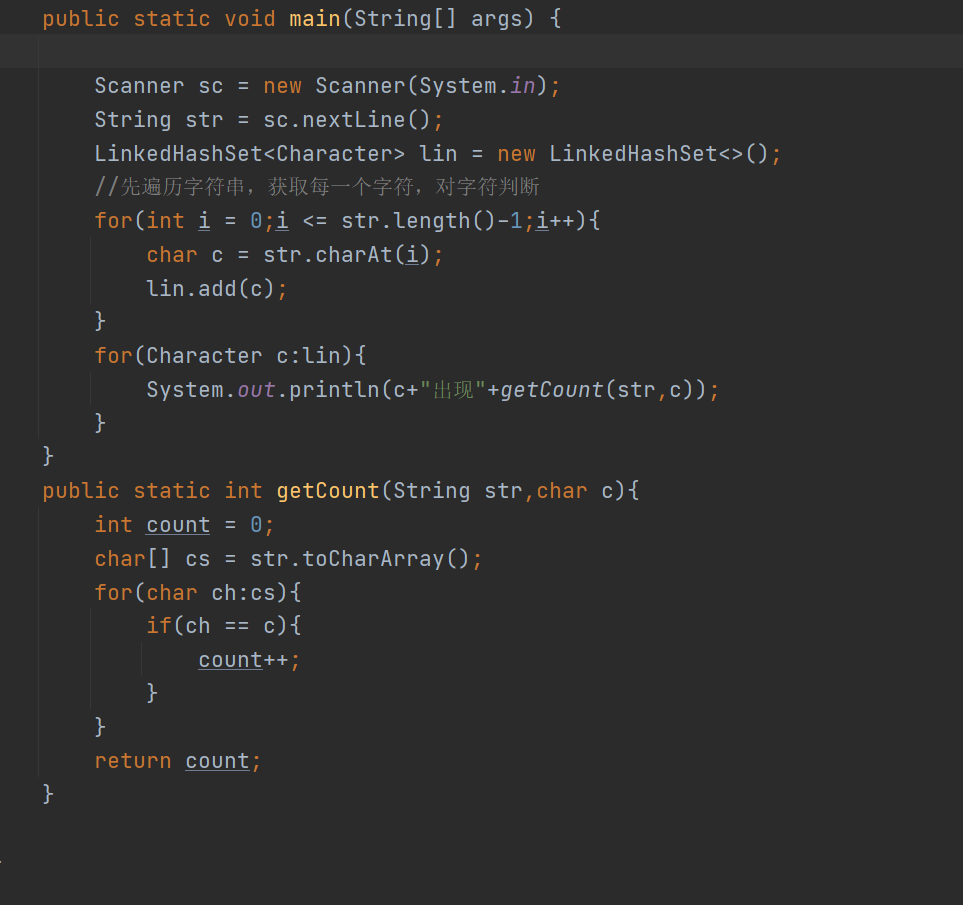

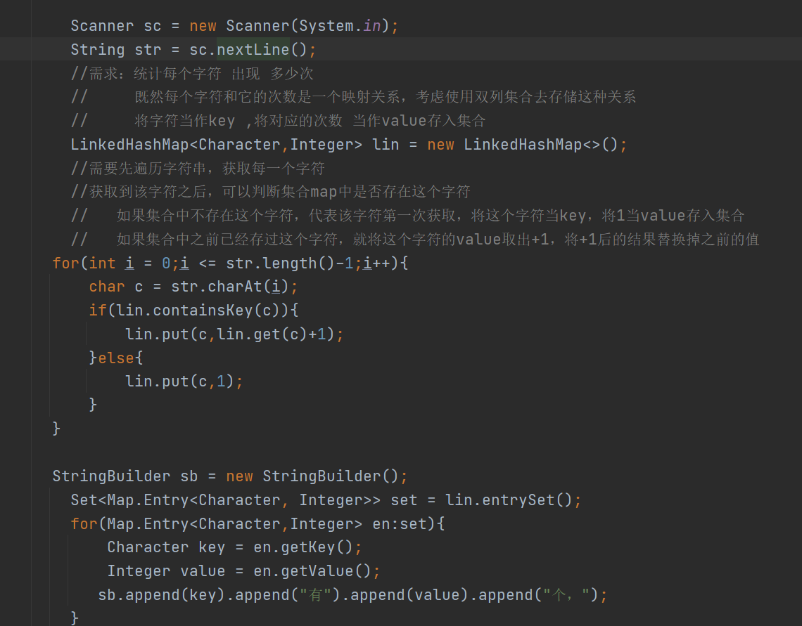

### HashMap集合域HashTable集合的区别【笔试题】

1.  相同点：

2.  两个集合都是Map接口的实现类，都属于双列集合

3.  两个集合底层是使用哈希表来存储数据

4.  两个集合中的方法大致相同

5.  不同点：

6.  版本不同：前者是jdk1.2出现的，后者jdk1.0出现

7.  线程安全性不同：前者是线程不安全的，后者线程安全的

8.  存储的值不同：前者可以存储null键null值，后者不可以存储null

## Collections工具类

1.  概述：本类是JDK提供的操作集合的工具类，类中定义了一些操作集合元素的方法

2、常用方法：

（1）binarySearch(List\<? extends Comparable\<? super T\>\> list, T key) ：

通过二分查找法查找元素key在集合中的索引

前提数组或者集合一定是升序排列

（2）frequency(Collection\<?\> c, Object o) ：

获取集合中o元素出现的次数

（3）max(Collection c)

求出集合中的最大值

（4）min(Collection c)

求出集合中的最小值

（5）reverse(List\<?\> list)

反转集合中的元素顺序

（6）shuffle(List\<?\> list)

随机排列集合元素的顺序

（7）sort(List\<T\> list)

将集合中的元素进行升序排列

（8）swap(List\<?\> list, int i, int j)

交换集合中两个元素的位置

## 

## 

## 

## File类

1.  概述：可以用来操作磁盘上文件或者文件夹的类型

将文件或者文件夹的路径封装为File类对象，通过类中提供的方法操作

1.  路径：

绝对路径：从根目录开始，表示一个文件或者文件夹在磁盘位置的一个字符串

相对路径：从某一个指定路径开始的剩余路径所对应的字符串

在IDEA中想要表示一个相对路径，默认相对于项目

### 构造方法

1.  File(String pathname) ：将参数描述的字符串路径封装为一个file对象

2.  File(String parent, String child)
    ：将两个字符串拼接之后的路径封装为一个file对象

3.  File(File parent, String child)
    ：将第一个参数描述的file对象路径，和第二个参数字符串
    拼接之后的路径再封装到一个新的对象中

代码

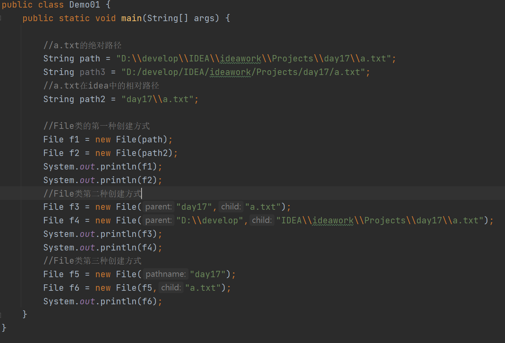

### File类的创建方法

1.  createNewFile() ：创建一个文件

2.  mkdir() ：创建一个文件夹，如果父级路径不存在，就不能创建成功

3.  mkdirs() ：创建一个文件夹，如果父级路径不存在，连着父级路径一起创建

代码

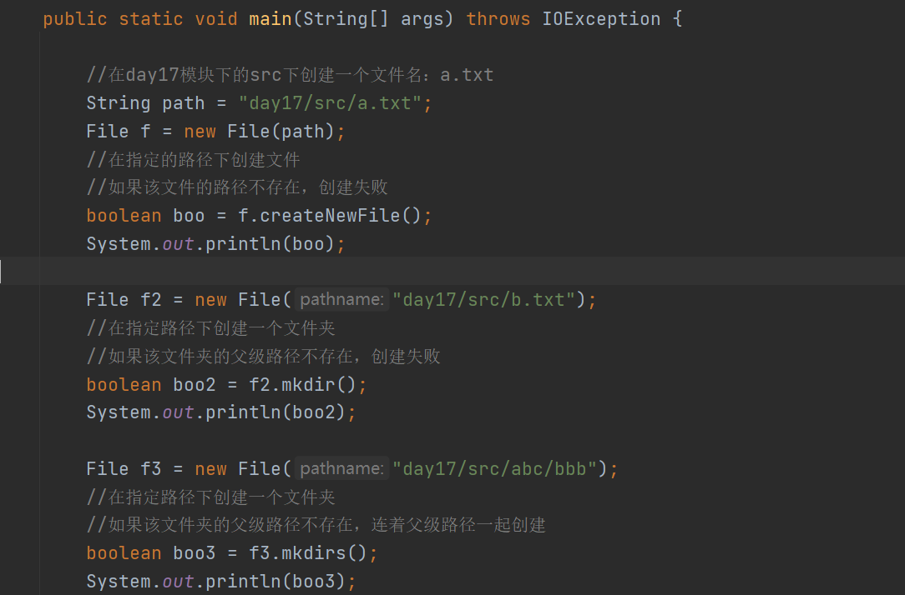

### File类的删除功能

1.  delete() ：删除调用者所描述的文件或者文件夹

2.  注意：

不能删除非空文件夹

使用该方法删除之后，不走回收站

代码

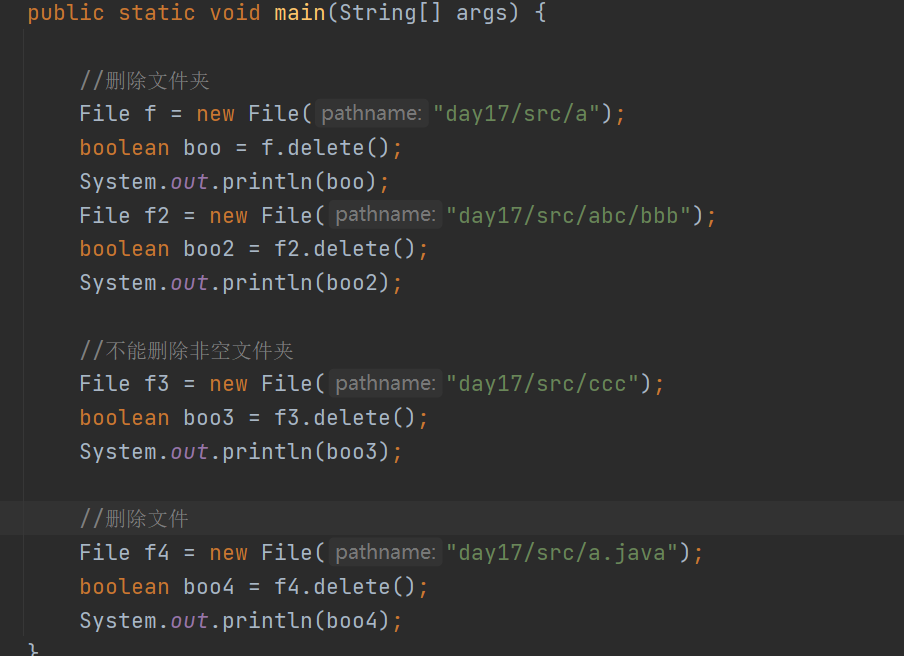

### File类的重命名

1.  renameTo(File dest) ：

注意：

1、参数不是一个字符串，而是一个改名之后的位置字符串所属的file对象

2、如果在同一个文件夹中，就是重名

3、如果在不同文件夹中，就是剪切

代码

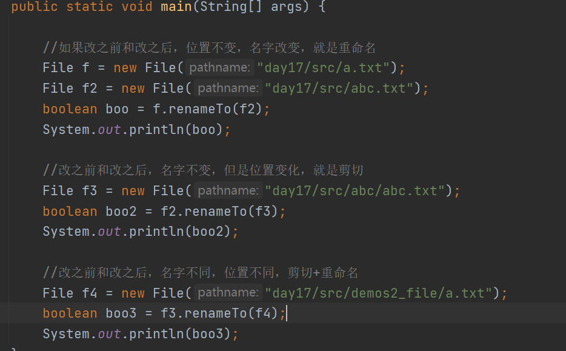

### File类的判断功能

1.  exists() ：判断调用者描述的文件或者文件夹是否存在

2.  isDirectory() ：判断调用者是不是一个文件夹

3.  isFile() ：判断调用者是不是一个文件

4.  isAbsolute() :判断调用者描述的路径是不是一个绝对路径

代码

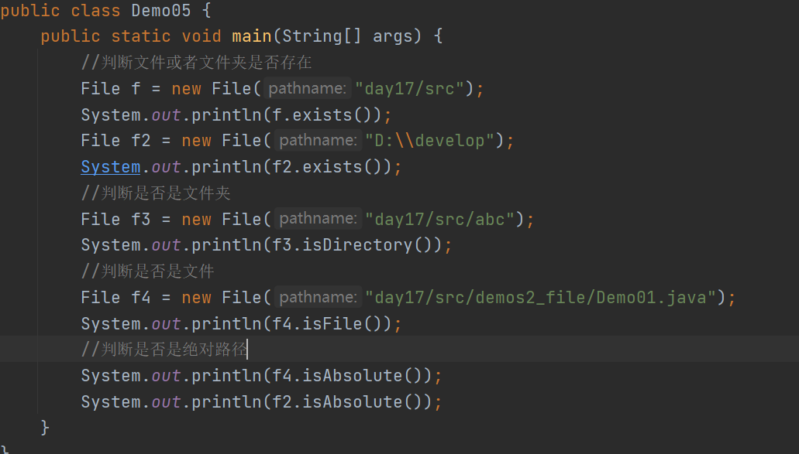

### File类的获取功能

1.  getAbsolutePath() ：返回绝对路径

2.  getPath() ：获取相对路径

3.  getName() ：获取调用者描述的文件名或者文件夹名

4.  length() :获取文件中的字节大小

此方法只能适用于文件的对象使用，不适用于文件夹的对象

数据只能再文件中直接存储，不能直接再文件夹的存储

1.  list() ：获取当前调用者目录下所有的文件和文件夹的名称到一个字符串数组中

2.  listFiles()
    ：获取当前调用者目录下所有文件和文件夹的名称之后，再将每个名称字符串
    封装为一个个file对象，到一个File数组中。

代码

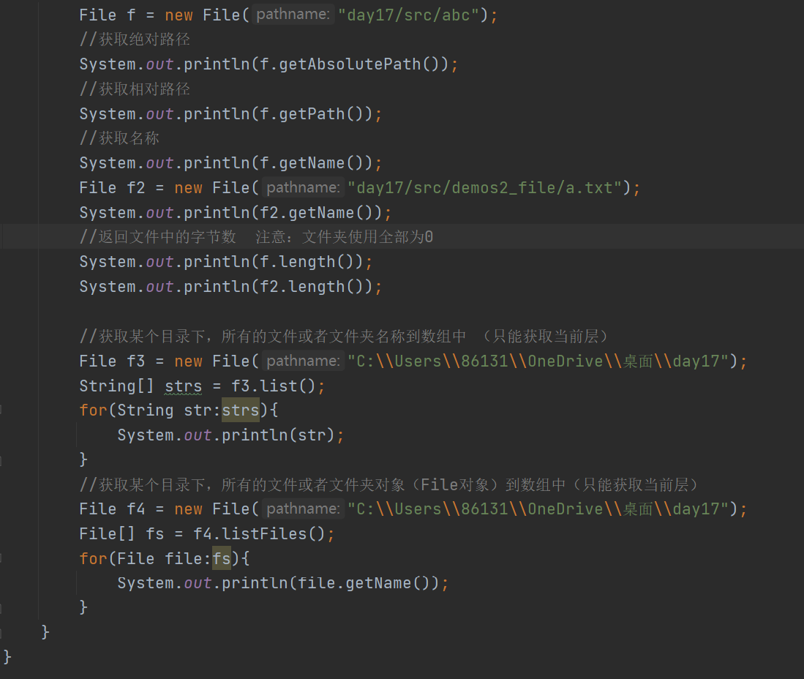

### 

### 练习

（1）键盘录入一个字符串，表示一个路径

（2）如果该路径表示对应的不是一个文件夹路径，则提示重新录入

（3）如果该路径是文件夹路径则打印该层目录下的所有文件的文件名

## 

## 递归

1.  概念：递归是调用方法的一种方式

在Java语言中，方法自己调用自己就是递归

2、递归的特点：

（1）如果想要实现递归，该方法需要有两条分支：

第一条分支是方法调用自己的分支，是为了逐渐的解决问题

第二条分支是为了结束自己的分支，为了防止方法的无限调用

1.  使用递归的好处：

通过一些简单代码，完成复杂的逻辑

1.  缺点：

耗费内存。如果多次调用方法，有可能会出现栈内存溢出异常

1.  图示：

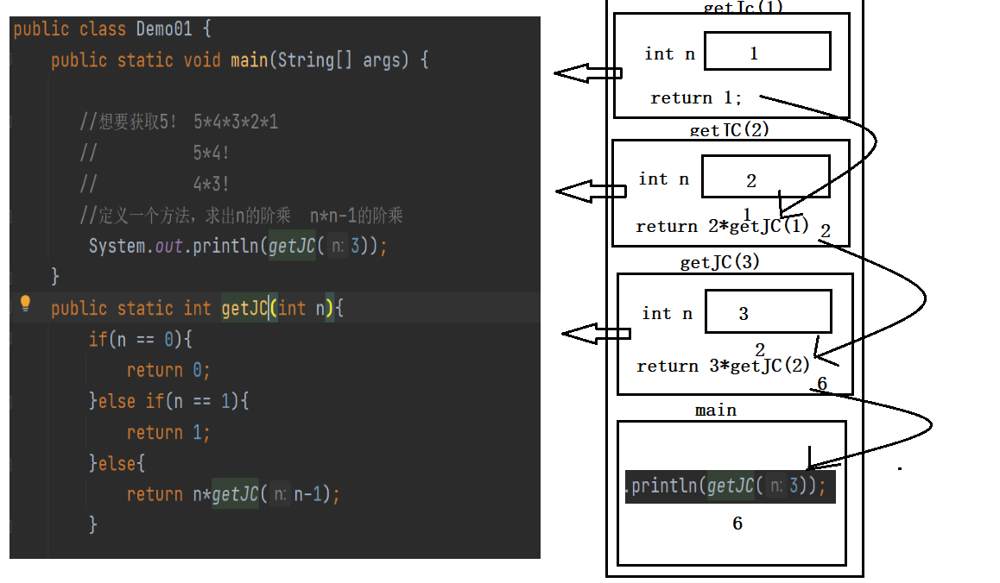

### 递归练习1

1.  观察如下数列的规律，使用递归的方式获取第20个值应该是多少?

1 , 1, 2,3 ,5 ,8 ,13 ,21 ,34 ,55 ... （斐波那契数列）

利用规律：前两个数相加的和是下一个数

代码

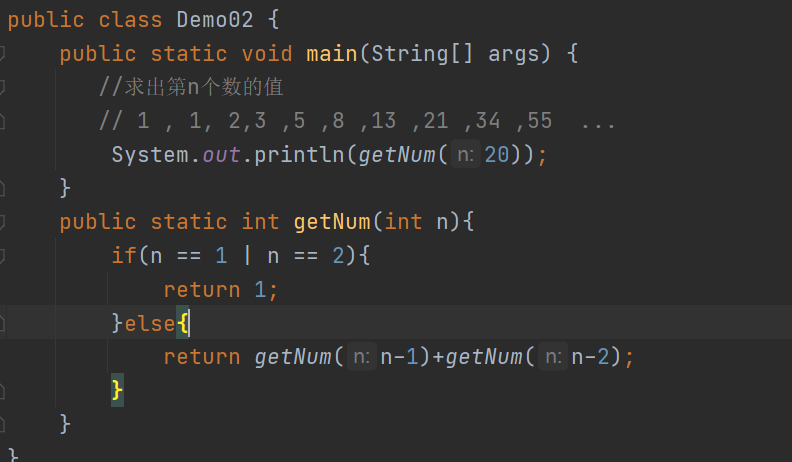

### 

### 递归练习2

1.  定义一个方法，求出n的m次方

n和m当作参数传给方法，根据传入的n和m的值返回对应的结果

代码

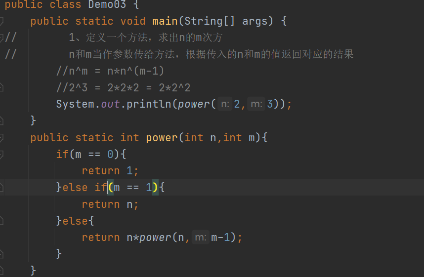
