# Day18笔记

## 今日内容

1.  IO流概述

2.  字节流

3.  字符流

## IO概述

1.  概述：IO是Input和Output的缩写。

两个单词一个表示输入，一个表示输出。表示的是数据的输入和数据的输出。

相对于运行内存来说，数据从其他地方进入运行内存，就是输入

数据从运行内存到其他地方，就是输出

IO:表示的不是一个特定的类型，表示的是数据的输入和输出的概念

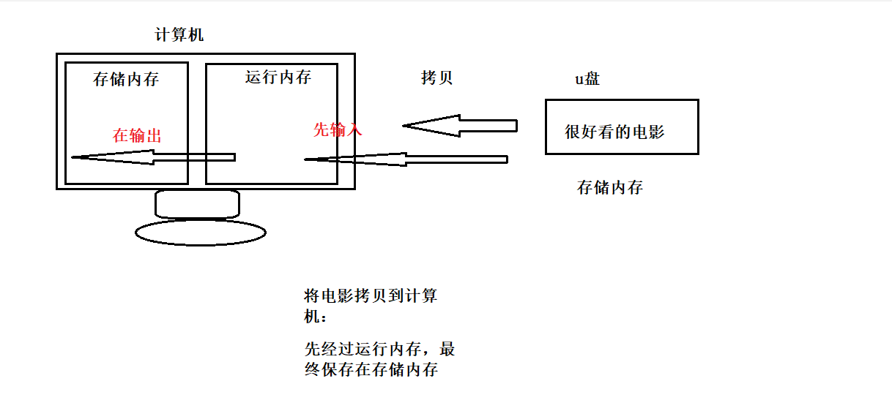

1.  IO分类：

按照功能分类：

字节流：控制字节信息输入和输出

字符流：控制字符信息的输入和输出

按照流向分类：

输入流：控制信息从其他设备到运行内存

输出流：控制信息从运行内存到其他设备

1.  具体分类：

字节输入流：InputStream

字节输出流：OutputStream

字符输入流：Reader

字符输出流：Writer

## 字节流

1.  概述：用来操作字节信息输入内存和输出内存

2.  字节输入流InputStream 字节输出流OutputStream

### InputStream

1.  概述：字节输入流，本类是一个抽象类，不能直接创建对象，需要通过子类创建

2.  方法：

read() ：从流中读取一个字节信息，将读取的信息进行返回。

该方法的返回值是int值：因为默认将读取的每个byte字节强制转为 了int类型。

如果不转为int类型，而是使用byte类型直接接收，那么byte表示的
范围为：-128---127，如果读取了一个信息为-1.-1是到达文件末尾还
是读取的字节数据，不能区别，所以就将读取的每个字节统统转为
int，一旦转为int类型之后，不管读取的信息是负数还是整数，结果
都是为正数，当在读取到一个-1时，表示肯定时文件到达末尾。

read(byte[] b) ：从流对象中一次读取b.length个字节

将读取的信息保存在数组中，返回的是读取的个数

read(byte[] b, int off, int len) ：从流中读取指定长度的数据到数组中

将读取的信息保存在数组中，返回的是读取的个数

available() ：将流中还没有读取的字节个数进行返回

close() ：关闭流资源

### FileInputStream

1.  概述：属于字节输入流的子类，该类的对象可以将磁盘上的文件数据读取到运行内存中

2.  构造方法：

（1）FileInputStream(File file)：将file文件对象封装为文件字节输入流对象

（2）FileInputStream(String str) ：将str字符串所描述的文件封装为字节输入流对象

3、注意：

指定路径时，文件的路径要存在

给定的路径一定要是文件的路径，不能时文件夹，因为文件中才可以保存数据

代码

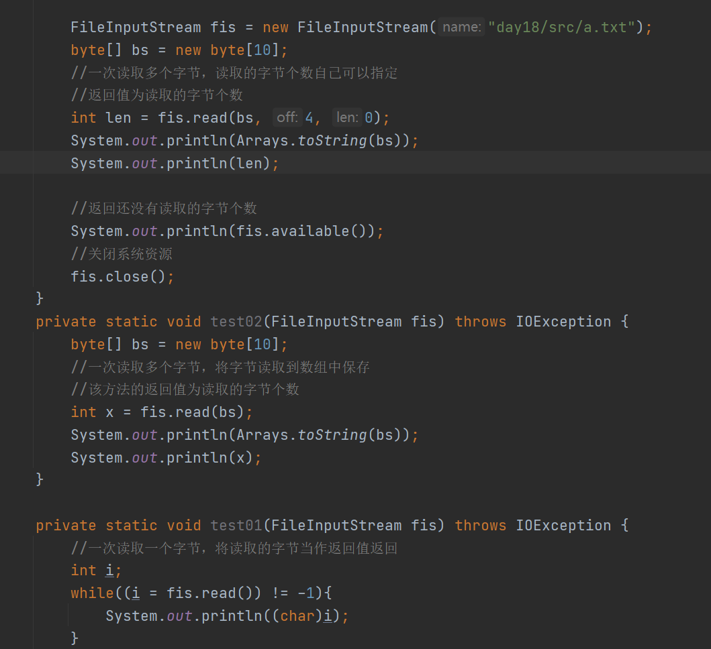

### OutPutStream

1.  概述：字节输出流，将字节信息从内存中写出到其他设备。也是一个抽象类，需要通过
    子类创建对象。

2.  方法：

write(int b) ：将一个字节信息写出内存

write(byte[] b) ：将一个数组中的信息写出内存

write(byte[] b, int off, int len) ：将数组中的一部分信息写出内容

close() ：关闭流资源

### FileOutputStream

1.  概述：文件字节输出流，将字节信息从内存中写出到目标磁盘文件中。

2.  构造方法：

FileOutputStream(File file) ：将file对象封装为一个字节输出流对象

FileOutputStream(String name) ：将name字符串对应的文件封装为字节输出流对象

FileOutputStream((File file,boolean b)
：将name字符串对应的文件封装为字节输出流对
象，如果后面的值为false，表示替换写入信息

FileOutputStream(String name,boolean b) ：将name字符串对应的文件封装为字节输出
流对象，如果后面的值为true，表示追加写入信息

1.  注意：

在写出信息时，写出的路径一定是文件的路径不能是文件夹路径

代码

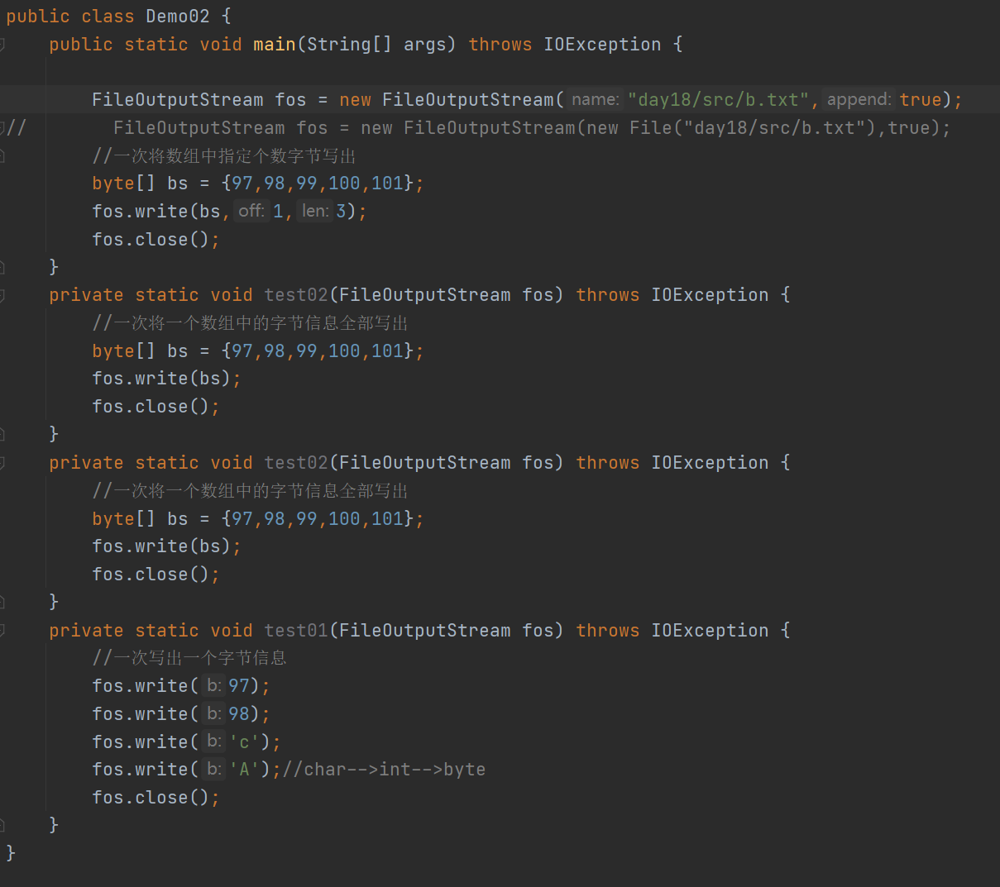

### 文件的拷贝

1、概述：将一个文件中的内容，全部复制到另外一个文件中。

2、思路：

先读取源文件中的数据，然后再将读取的数据写出到另外一个文件中

1.  图示原理：

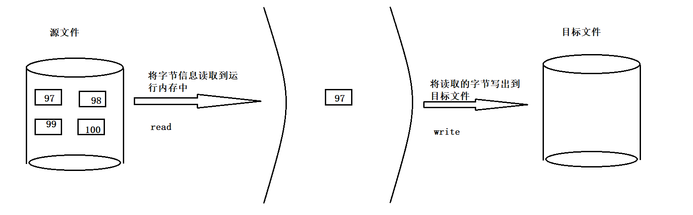

代码

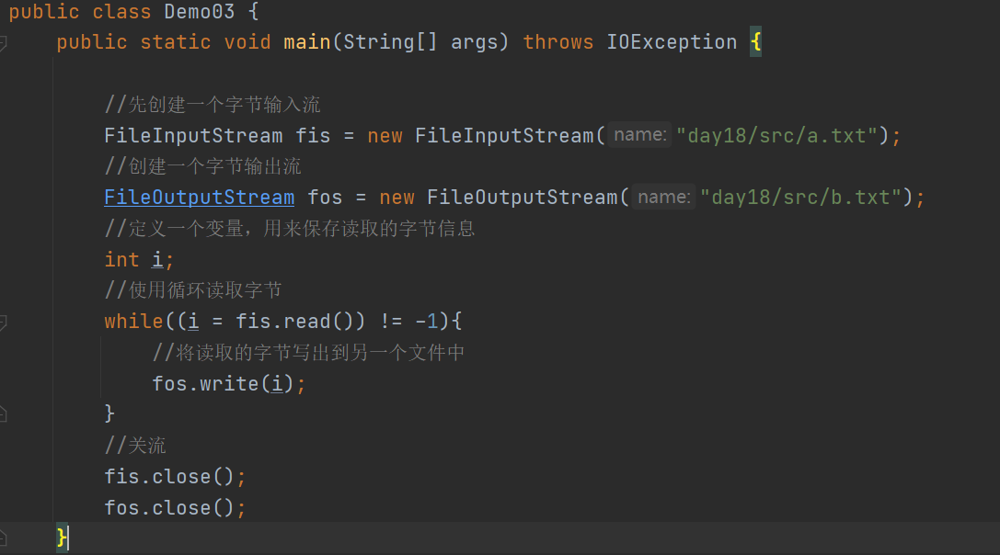

### 拷贝效率的提升

1.  为什么需要提升效率：

当需要拷贝一个文件，该文件的大小过大，拷贝的时间就非常久。

因为一个字节需要IO两次

1.  提升的方式：

每次可以多读入几个字节，多写出几个字节。

可以准备一个数组，数组的大小为：文件的字节大小

使用数组的方式，一次读取完毕，一次写出完毕即可

优点：一次读取一次写出，时间短，效率高

缺点：如果需要创建的数组大小过大，对运行内存的要求久比较高，一旦数组的大小超
过了或者临近运行内存，那么久可能出先一些内存不够的问题。

1.  最终方案：使用小数组拷贝

使用数组来进行读取和写出，但是数组空间不需要创建那么大，一次虽然拷贝不完，但
是也比一个个拷贝要快。

使用小数组注意：每次读取几个字节，就应该写出几个字节，避免数据写出重复

代码

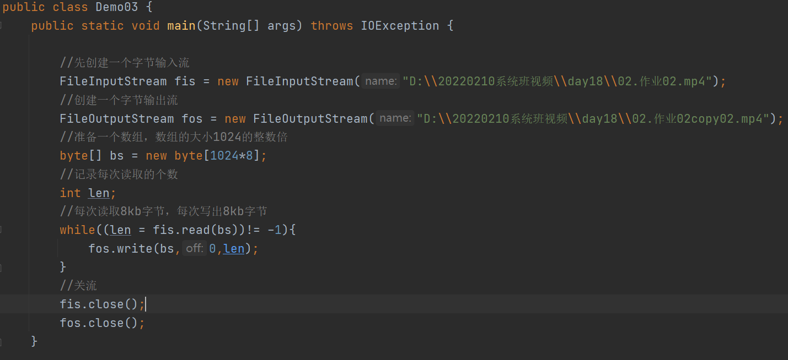

### 高效缓冲字节流

1.  高效缓冲字节输入流：BufferedInputStream

2.  高效缓冲字节输出流：BufferedOutPutStream

3.  构造方法：

BufferedInputStream(InputStream in) ：将基础的字节输入流对象进行包装成为一个高效
字节输入流

BufferedOutputStream(OutputStream out) ：将基础的字节输出流对象进行包装

1.  三种拷贝方式原理对比：

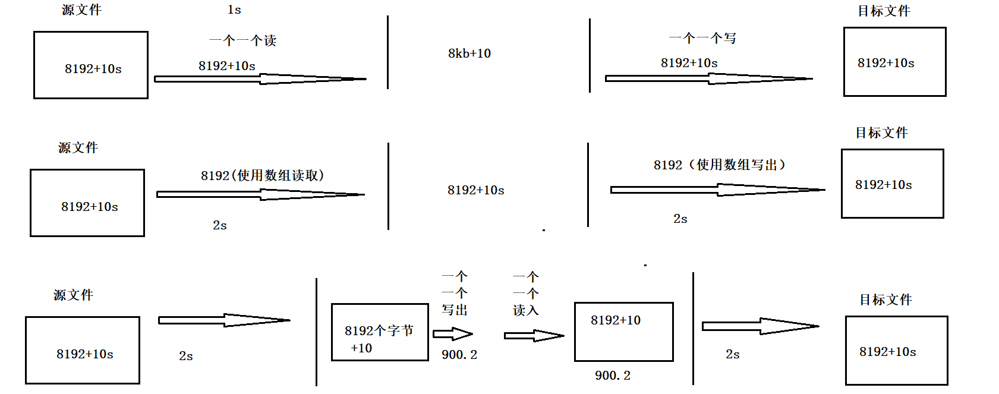

代码

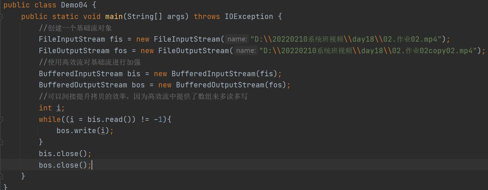

### close和flush方法的区别

1.  两个方法都可以将数据从缓冲区刷新到目标文件中

2.  不同点：

close不仅可以刷新数据进入目标文件，还可以关闭系统资源

flush只能用来刷新数据进入目标文件

## 字符流

### 使用字符流的原因

1.  如果想要读取文件中的信息，这个文件中信息全部英文，可以使用字节流一次读取一个
    字节，进行转码展示。

2.  如果文件中的信息，是全中文，可以每次读取三个或者两个，将读取的三个或者两次字
    节也可以转成字符串展示。

3.  如果文件中的信息，是中英文混杂，每次读取几个字节就不确定，就有可能出现乱码。

4.  如果要写出一些字符串，没法直接通过字节流写出，需要先将这个字符串转为字节数组
    才可以写出，每次都进行转换，浪费时间，也浪费空间。

### 概述

1.  字符流：可以以字符为单位操作数据的输入和输出的对象所属的类型

2.  分类：

字符输入流 Reader

字符输出流 Writer

### Reader

1.  字符输入流，也是一个抽象父类，不能直接创建对象

2.  方法：

read() ：读取一个字符信息，将读到的信息进行返回

read(char[] c) ：读取c.length个字符到数组中，返回的是读取的字符个数

read(char[] c,in t offset,int len)：读取一部分字符到数组中

close() ：关闭流资源

1.  使用子类创建对象：FileReader

FileReader(File file)

FileReader(String fileName)

代码

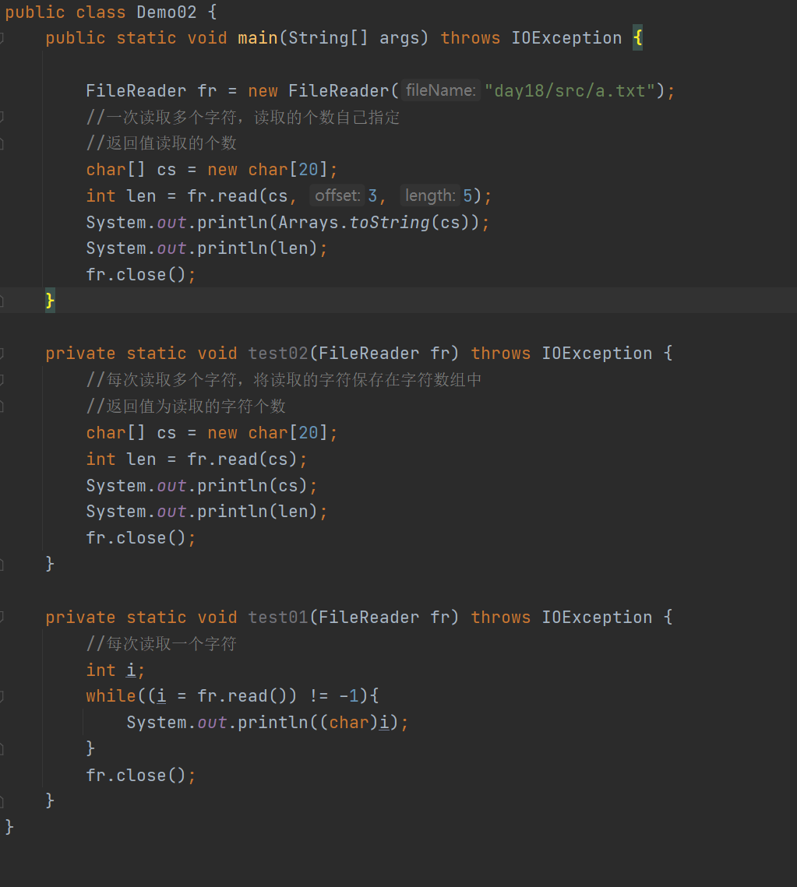

### Writer

1.  字符输出流，是一个抽象父类，不能直接创建对象

2.  方法：

write(int c) ：写出一个字符

write(String str) ：写出一个字符串

write(char[] cbuf) ：写出一个数组中的字符

write(char[] cbuf, int off, int len) ：写出数组的一部分到目标文件

write(String str, int off, int len) ：写出字符串的一部分

close()

1.  FileWriter：文件字符输出流

FileWriter(File file)

FileWriter(String fileName)

代码

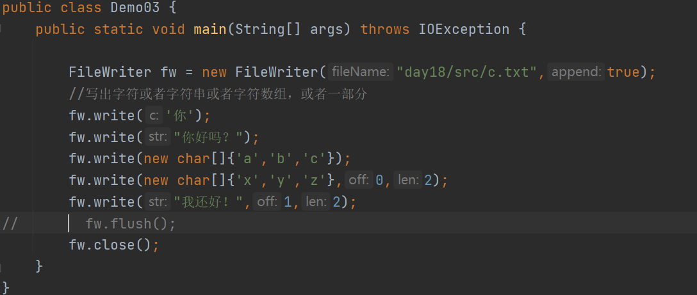

### 使用字符流拷贝文件

1.  使用字符流一样可以拷贝文本文件

2.  原理：

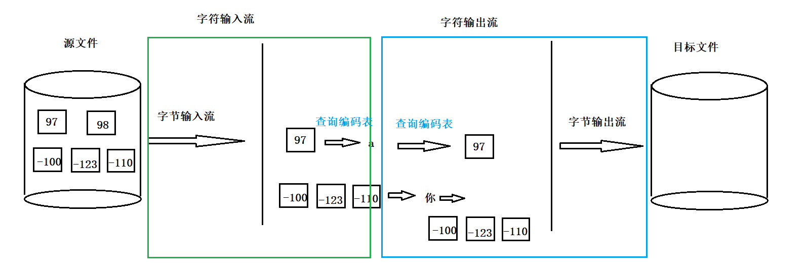

1.  区别使用：

如果以后仅仅是为了拷贝文件，使用字节流来拷贝

如果后续需要查看文件的内容，或者要写出内容，使用字符流来完成

### 使用字符流不可以拷贝非纯文本文件

1.  纯文本文件：文件中的信息全都是通过字符组成

2.  非纯文本文件：比如：视频 音频 图片

3.  为什么字符流不能拷贝非纯文本文件：

因为非纯文本文件中的字节可能在编码表中没有对应字符信息，如果读取一个字节，没
有字符与之对应，在解码时，就会将这个没有对应字符的字节通过？字符来代替，再写
出的时候，写出的是？字符对应的字节，这一步对信息发生了篡改，就导致文件的数据
拷贝错误，源文件的内容可能再拷贝之后就无法使用。

### 高效缓冲字符流

1.  类型：BufferedReader和BufferedWriter

2.  概述：都是包装类型，需要对基础的字符流对象进行包装。包装之后，一次也可以读取
    多个字 符，可以写出多个字符。

3.  构造：BufferedReader(Reader in)

方法：readLine() ：一次可以从输入流中读取一行信息

返回值就是读取的这一行数据，如果到达文件的末尾，返回null

1.  构造：BufferedWriter(Writer out)

方法：newLine() ：表示在文件中进行换行

代码

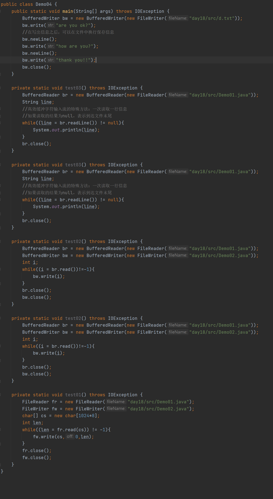
