# Day19笔记

## 今日内容

1.  转换流

2.  标准输入输出流

3.  打印流

4.  对象序列化流

5.  Properties类

## 转换流

### 转换输入流和转换输出流

1.  OutputStreamWriter：转换输出流，在输出数据时，可以指定编码格式

构造方法：

OutputStreamWriter(OutputStream in, Charset cs) ：使用基础的输出流对象，指定以cs
编码格式来写出信息

1.  InputStreamReader：转换输入流，在输入数据时，可以指定编码格式

InputStreamReader(InputStream in, Charset cs)
：使用基础的输入流对象，指定以cs编码 格式读取信息

1.  注意：

2.  当读取信息时，应该以源文件的编码格式读取信息（解析信息）

3.  当写出信息时，应该以目标文件的编码格式写出信息

4.  不管是转换输入流还是转换输出流，都是字符流

5.  转换流也是字节流到字符流的桥梁

代码

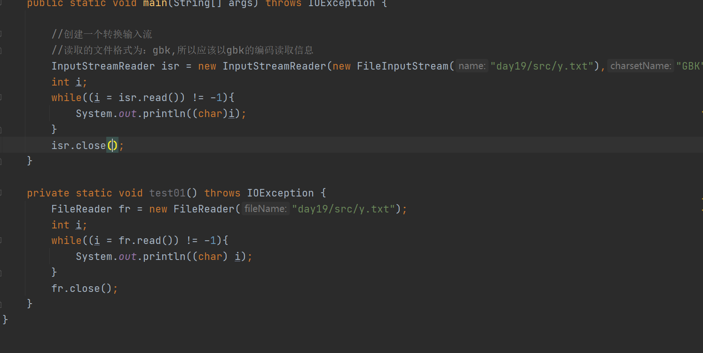

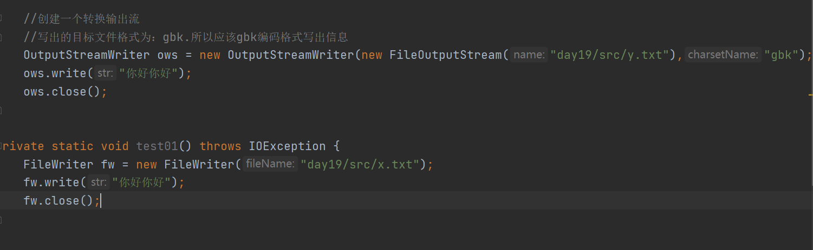

## 标准输入流输出流

### 标准输入流

1、概述：System.in

（1）该流的类型为InputStream，属于是字节流

（2）默认关联的设备为键盘，即数据源为键盘

（3）通过System.setIn(InputStream in)方法，可以更改标准输入流关联的设备

（4）一般该输入流和Scanner类型一起用更方便

代码

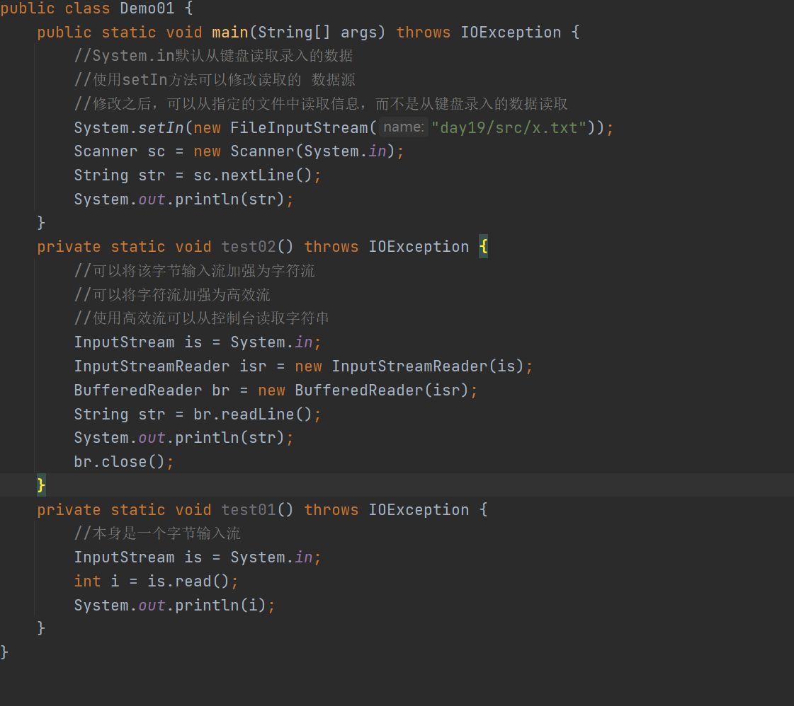

### 标准输出流

1、概述：System.out

（1）该流的类型为PrintStream，其父类为OutputStream是一个字节输出流

（2）默认关联的设备为控制台，即数据目的地为控制台

（3）通过System.setOut(PrintStreamout)方法，可以更改标准输出流关联的设备

代码

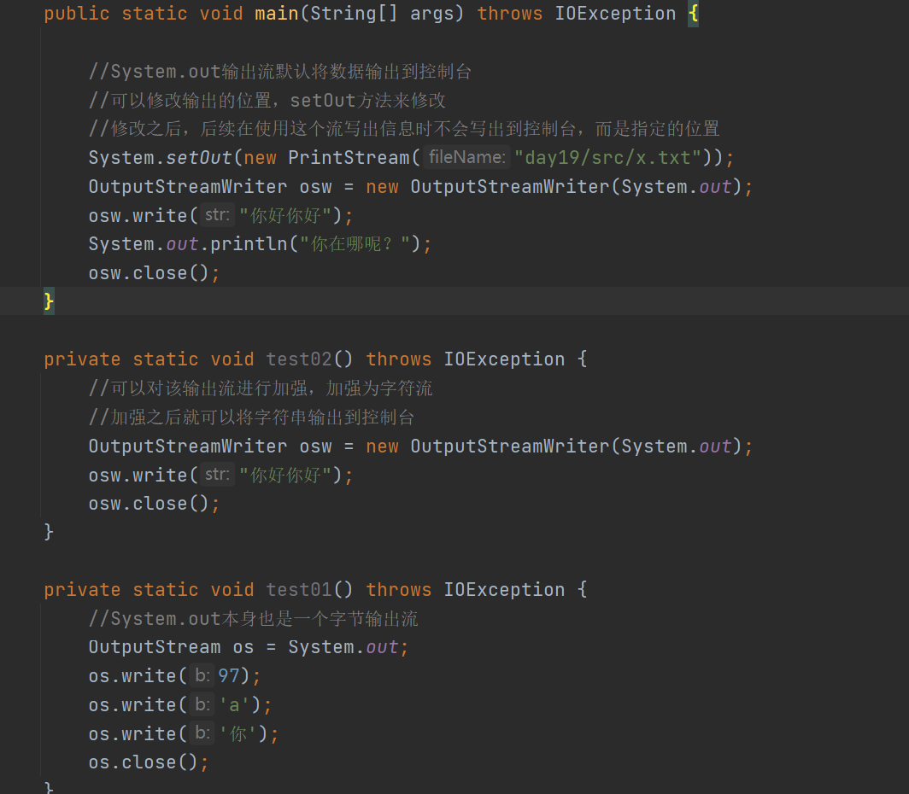

## 打印流

1、打印流介绍：

（1）打印流分为打印字节流和打印字符流：

PrintStream打印字节流 字节输出流

PrintWriter打印字符流 字符输出流

（2）打印流属于输出流。

### 打印字节流

1、打印字节流：

PrintStream：是OutPutStream的间接子类，是一个输出流，也是一个字节流

2、构造方法：

PrintStream(File file) ：创建具有指定文件的新打印流。

PrintStream(String fileName) ：创建指定文件路径的新打印流。

PrintStream(OutputStream out)：将一个字节流对象，封装为一个打印流

3、常用方法：

（1）从父类中继承的方法：write()

注意：只可以写出一个字节信息

（2）自己特有的方法：print println

不仅可以输出字节信息，还可以输出各种数据类型的信息

比如：整数、小数、字符、字符串、对象

代码

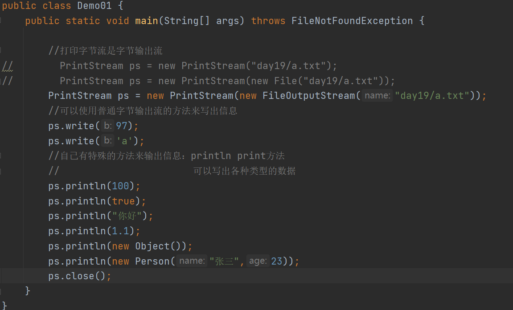

### 打印字符流

1、打印字节流：

PrintWriter：是Writer的间接子类，是一个输出流，也是一个字符流

2、构造方法：

PrintWriter (File file) ：创建具有指定文件的新打印流。

PrintWriter (String fileName) ：创建指定文件路径的新打印流。

PrintWriter(OutputStream out)：将一个字节流封装为一个打印字符流

PrintWriter(Writer out) ：将一个字符流封装为一个打印流

PrintWriter(OutputStream out,boolean b)：将一个字节流封装为一个打印字符流

可以实现自动刷新功能

PrintWriter(Writer out,boolean b) ：将一个字符流封装为一个打印流

可以实现自动刷新功能

3、常用方法：

（1）从父类中继承的方法：write()

注意：可以写出一个字符，也可以写出一个字符串

1.  自己特有的方法：print println

代码

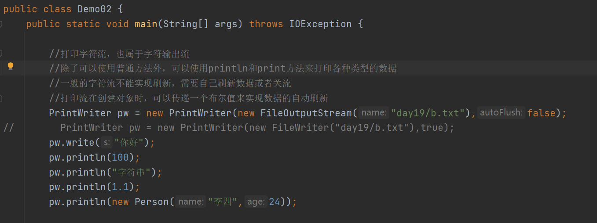

## 对象序列化流

1、相关概念：

（1）数据的状态：

游离态：在运行内存中的运行的数据。随着程序的结束，数据也会被回收

持久态：在磁盘中进行保存的数据。随着程序的结束，随着计算机的关机和开机，
数据并不会消失。

（2）序列化：

将数据从运行内存中 ===\> 到磁盘中

数据从游离态===\>持久态 （输出）

（3）反序列化：

将数据从磁盘中 ===\> 到运行内存中

持久态===\>游离态 （输入）

2、对象序列化流的使用：

构造方法：

ObjectOutputStream(OutputStream out)：将一个输出流，封装为一个对象序列化流

序列化对象方法：

writeObject(Object obj)：将指定对象写出到流中传输

1.  将对象实现序列化之后，文件的内容看不懂，是正常情况，因为保存的是一个个
    对象数据，而不是字符串。

2.  如果需要将一个类型的对象实现序列化，那么该类型就需要实现一个接口：

Serializable：序列化接口（标记型接口）

该接口没有任何方法需要重写，只需要让类型实现接口，就可以实现序列化和反 序列化。

3、反序列化流的使用：

构造方法：

ObjectInputStream(InputStream inp)：将一个输入流，封装为一个对象序列化流

反序列化对象方法：

readObject()：将对象从文件中读取到内存中

1.  注意事项：

（1）读取文件中的对象时，注意如果文件中数据读取完毕，继续读取出现：EOFException

（2）当需要序列化多个对象时，一般将这多个对象先保存在集合对象中，只需要序列
化一个集合对象即可。后续在反序列化的时候，也只需要读取一次，读取的是集
合对象，然后可以遍历读取的集合依次获取每一个保存的对象。

（3）当类型需要参与序列化和反序列化，一般都给定一个固定的序列化ID

给定之后，后续就可以随意对类型进行修改，即使修改了也不影响对象的序列化
或者反序列化

代码

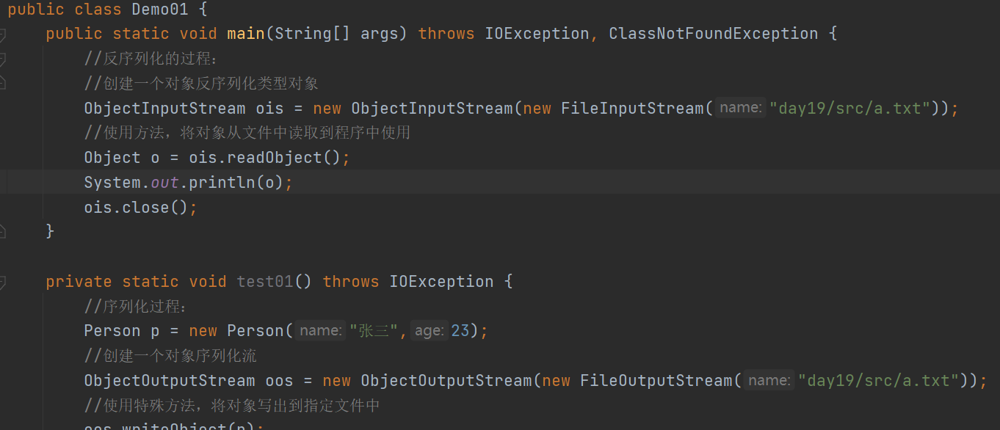

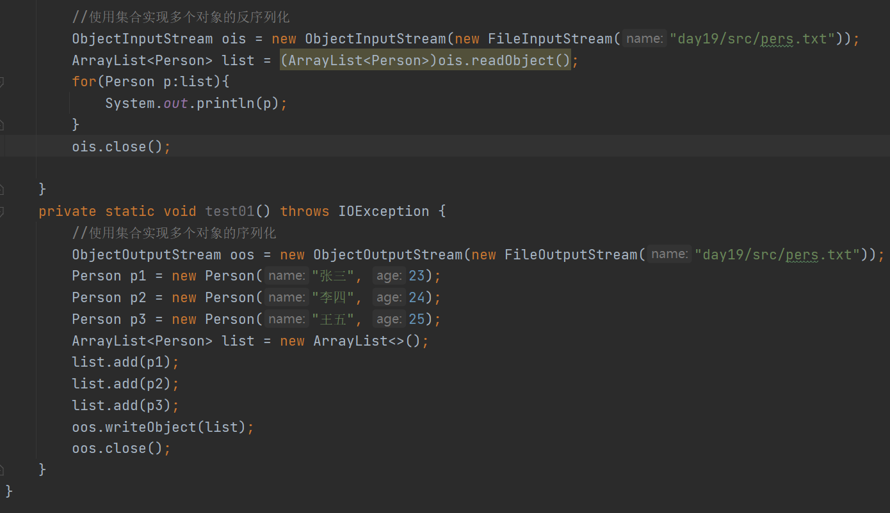

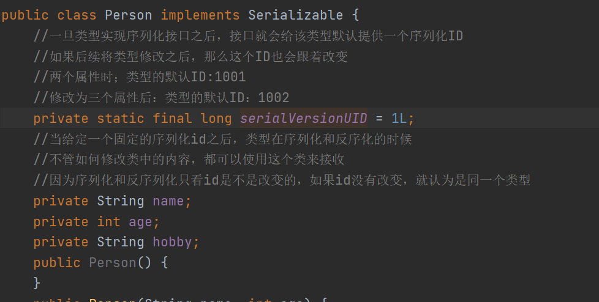

### transient关键字

1.  在实现对象的序列化和反序列化时，如果某些特定的属性不需要参与，就可以通过关键
    字：transient来修饰该属性，一旦属性被关键字修饰之后，就不参与读取和写出。

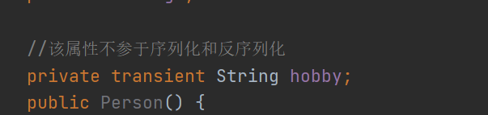

## Properties

1、概述：

是一个双列集合，是一个Map体系的集合类，是Hashtable的子类

### Properties特殊方法

1.  setProperty(String key, String value)：添加键值对

2.  getProperty(String key)：根据指定的键获取对应的值

3.  stringPropertyNames()：将集合中的键获取到一个单列集合Set中进行存储

### Properties和IO流相结合的方法

1、load(Reader reader)：从输入字符流读取属性列表（键和元素对）

2、load(InputStream in)：从输入字节流读取属性列表（键和元素对）

3、store(Writer writer, String
comments)：将此属性列表（键和元素对）写入Properties文件

4、store(OutputStream out, String comments)
：将此属性列表（键和元素对）写入Properties

代码

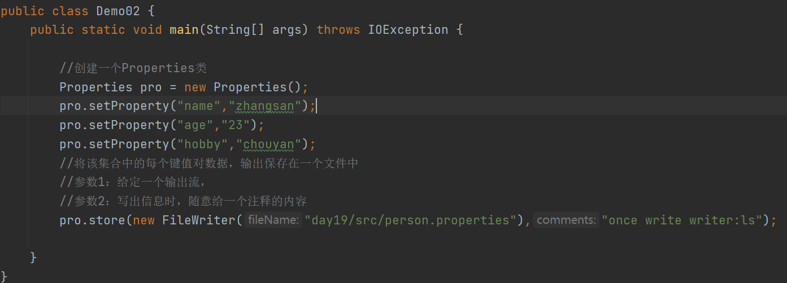

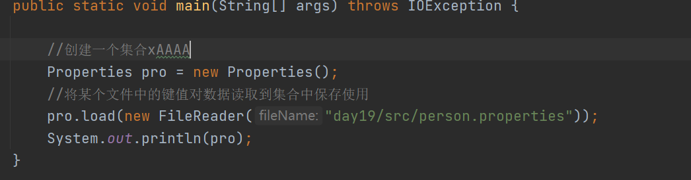

练习1：

需求：

（1）在Properties文件中有如下信息：

name=张三

age=18

hobby=玩游戏

1.  将数据读取到集合中

2.  将读取的数据封装成一个学生对象，将该对象输出本地文件中永久保存

代码

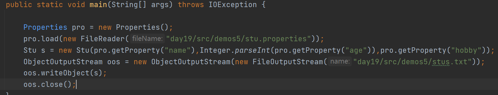

练习2：

（1）在Properties文件中有如下信息：

name=张三

age=18

hobby=玩游戏

1.  将该文件中的name=张三，改为name=李四

2.  要求：使用代码完成内容的修改

代码

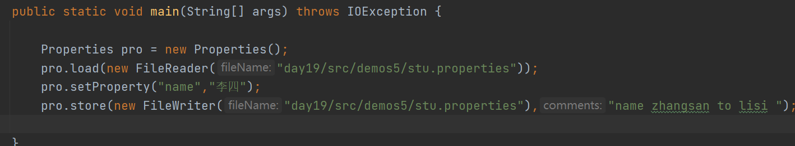

## 关流方式

JDK1.7版本及之前的关流方式：

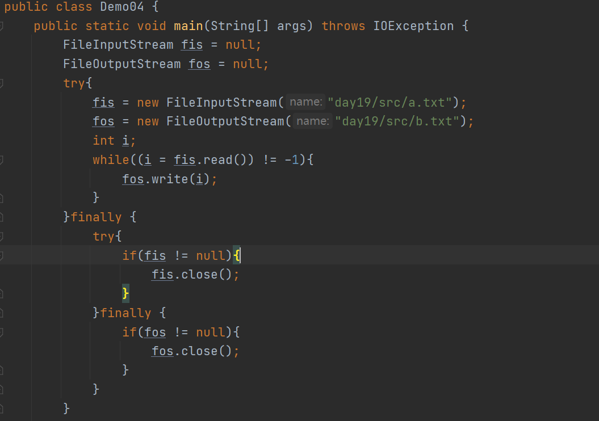

JDK1.8版本关流方式：

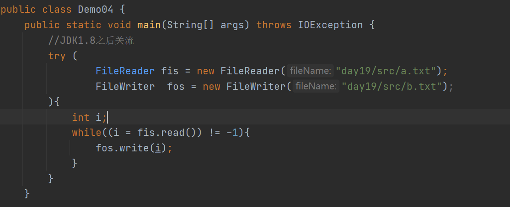
