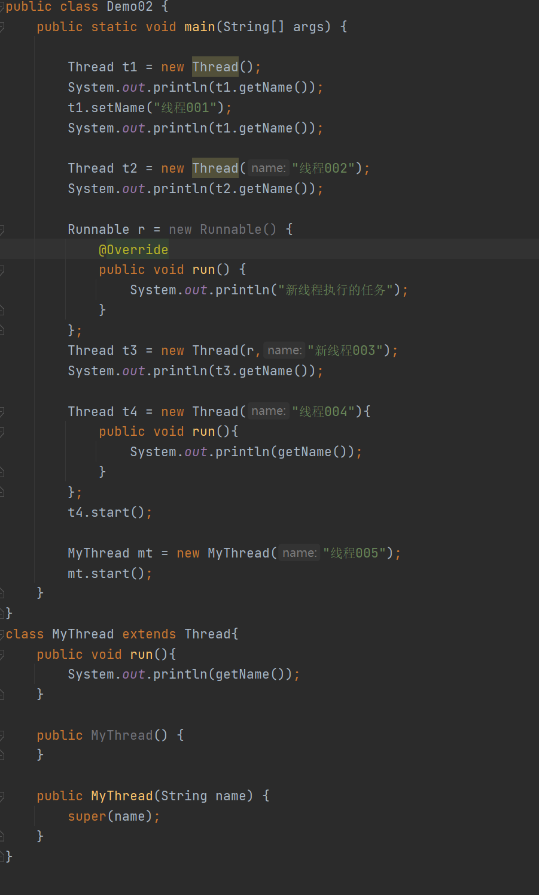
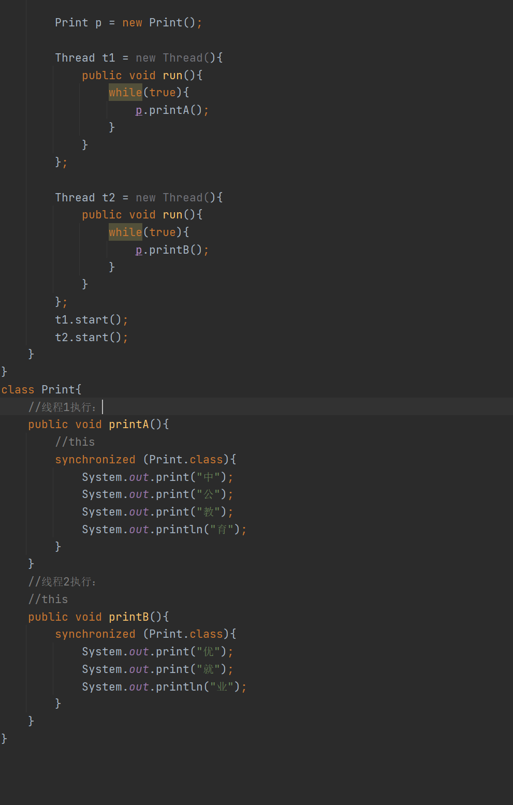

# Day20笔记

## 今日内容

1、多线程相关概念

2、多线程的创建方式

3、Thread类

4、多线程安全问题

## 多线程相关的三组概念

### 程序和进程

1.  程序：可以用来运行的文件。（可执行文件）

该文件可以运行，但是还没有运行。还没有运行的可执行文件（程序）

1.  进程：正在运行的程序。

一旦程序变为进程，计算机要给该进程分配系统资源（运行内存，cpu）

### 进程和线程

1.  进程：正在执行的程序。

2.  线程：进程中的一条独立的执行单元。

开发部门：前端 后端 测试 UI

任务：完成一个项目的研发 【进程】

UI 【线程】

前端 【线程】

后端 【线程】

测试 【线程】

销售部门：销售经理 销售员工

任务：完成一套房子的售卖

销售经理做一些数据的处理

销售员工和客户谈业务

1.  进程和线程的关系：

2.  进程是由线程组成的

3.  一个进程中最少需要一条线程

4.  进程之间的资源不共享，每条进程互不影响

5.  一个进程中的每一条线程资源共享

### 并行和并发

1.  并行：在某一个时刻，多个进程（线程）同时在执行。

进程或者线程想要执行，需要cpu，在某一个特定的时刻，一个cpu只能执行一 个任务

如果计算机想要实现3个进程的并行，需要什么条件？

需要3个cpu

如果需要同时去做四件事情： 吃饭 睡觉 打游戏 学习

至少需要四个人

1.  并发：在某一个时刻，多个进程(线程)同时启动，同时启动的多个任务会被cpu交替执
    行。

在某一个时刻，将四个任务分发给同一个人去做：吃饭 睡觉 打游戏 学习

一个人可以在某个时间段，去完成四件事情

1.  计算机使用并发原理，提升了计算机的效率还是降低了？

对于系统而言是提升了运行的效率

## 多线程的第一种继承方式

1.  方式：继承方式

2.  步骤：

3.  自定义一个线程类型

4.  继承Thread类型

5.  重写父类中的run方法表示一个具体的任务

6.  在主方法中创建一个线程类对象

7.  启动线程

8.  注意事项：

9.  新线程的启动借助主线程

10. 一旦新线程启动之后，两条线程之间并发原理执行，一个cpu在两条线程之间切
    换执行，去谁那就执行谁。

11. 在线程中制定任务，在run方法中制定

12. 启动新线程，使用start方法启动

13. 一旦新线程启动之后，两条线程之间互不影响，主线程结束，新线程继续执行，
    线程结束主线程也不受影响。

代码

## 多线程的第二种实现方式

1.  方式：实现方式

2.  步骤：

3.  定义一个类型，表示一个任务类

4.  实现Runnable接口

5.  重写接口中的run方法表示需要执行的任务

6.  在方法中创建一个任务类对象，表示一个具体任务

7.  创建一个Thread类的线程对象，将任务对象提交给线程对象

8.  启动线程

代码

### 继承方式和实现方式的区别

1、复杂程序：

继承方式更加简单：只需要定义一个线程类，创建线程对象启动

实现方式更加复杂：不仅需要定义一个任务类，需要创建任务对象，还需要创建一个线
程对象，最后将任务提交给线程，再启动。

2、灵活性方面：

继承方式灵活性差：将执行的任务定义再线程类中，以后该线程类的对象就只能执行定
义好的任务，不能执行其他任务。

实现方式灵活性强：因为将线程和任务分开定义，创建的任务对象可以提交给不同的线
程去执行；创建的线程对象也可以接收不同的任务执行。

1.  类型的扩展性方面：

继承方式不能再继承其他父类，扩展性差

实现方式可以继续继承其他父类，扩展性强

## 多线程的第三种创建方式

1、实现Callable接口

2、步骤：

（1）定义一个类实现Callable接口

（2）在类中重写call()方法

（3）创建自定义类的对象

（4）创建Future的实现类FutureTask对象，把自定义类对象作为构造方法的参数传递

（5）创建Thread类的对象，把FutureTask对象作为构造方法的参数传递

（6）启动线程

（7）再调用get方法，就可以获取线程结束之后的结果。

代码

### 匿名内部类实现多线程

## Thread类

### 获取线程名称

1.  getName() ：

获取线程名称

1.  特点：

2.  如果定义一个线程对象之后，没有给该线程对象起名，会有一个默认名称：

Thread-x:x从0开始依次递增

代码

### 设置线程名称

1.  setName(String name) ：给线程对象设置名称

2.  Thread(String name) ：通过构造给线程命名

3.  Thread(Runnable target, String name) ：在接收一个任务的同时给线程命名

4.  注意：

5.  如果使用匿名内部类创建子类的线程对象，可以直接通过构造命名

6.  如果单独定义子类，那么子类中需要自己定义有参构造给name命名

代码

### 获取线程对象

1.  方法：currentThread()

2.  注意：

3.  该方法是静态方法，使用类名直接调用

4.  哪一个线程执行该方法，返回的是该线程的对象

代码

练习

1.  获取main线程的线程名称

2.  获取垃圾回收线程名称

代码

### 线程休眠

1.  Thread.sleep(long time)：让执行这段代码的线程休息一会

2.  注意：

3.  该方法是静态方法，参数是一个毫秒值，表示线程休眠的时间

4.  哪一个线程执行该方法，就让哪一个线程休息

5.  如果在一个普通方法中使用sleep，可以选择声明异常也可以选择处理异常

6.  如果在一个重写的方法中使用sleep，只能处理异常不能声明异常

父类或者接口中的方法没有异常的声明，在重写时不能声明

1.  将来调用sleep方法的线程，不一定是执行该方法的线程

2.  使用interrupt强制唤醒某一个线程，一旦线程的休眠被唤醒之后，就会抛出线程
    中断异常。

代码

### 守护线程（后台线程）

1.  概念：保护其他线程能够正常运行的线程就是守护线程。

2.  方法：

setDaemon(boolean on) ：将当前线程对象设置为指定线程，参数为true为守护线程否
则为非守护线程。

isDaemon()：判断当前对象是否是一个守护线程

1.  特点：

2.  自己创建的线程对象，都默认为非守护线程（用户线程）

3.  如果被守护的线程结束了，那么守护线程也跟着结束了

4.  如果程序中有多条用户线程及一条守护线程，只要用户线程还在运行，守护线程
    也会继续运行，并不会随着其中一条用户线程的结束而结束。

代码

练习

1.  判断main线程是否是一个守护线程

2.  判断垃圾回收线程是否是一个守护线程

### 设置线程优先级

1.  线程的优先级：

定义的每一条线程都有一个默认的优先级，默认的优先级都是相同的5，如果线程的优
先级都相同，那么每次被cpu执行的几率都是相同。

1.  设置优先级的方法：

setPriority(int newPriority) ：设置线程优先级

10：最高

1：最低

1.  静态常量：

static int MAX_PRIORITY 10

线程可以拥有的最大优先级。

static int MIN_PRIORITY 1

线程可以拥有的最小优先级。

static int NORM_PRIORITY 5

分配给线程的默认优先级。

代码

## 线程安全问题【掌握】

问题的概述：

当多个线程执行同一个任务时，多个线程再使用并发原理执行同一个任务，就容易出现
线程安全问题。

### 同步代码块

1.  同步代码块：使用同步代码块括起来的代码，可以保证代码的完整性和一致性、原子性

2.  格式：

synchronized(锁对象){

需要保证完整性的代码。

}

1.  原理分析：

如果代码使用同步代码块同步了。

线程想要执行同步的代码，需要先获取锁对象，获取到锁对象之后，才可以执行代码，
如果在执行的过程中，代码没有执行完，锁对象不会被释放。如果在执行的时候，cpu
执行其他线程了，其他线程想要执行代码，也需要获取锁对象，这时不能获取到锁对象
（对象被线程1拿着呢，没有执行不会释放），cpu就无法执行线程2代码，只能在获
取线程1继续执行，执行完之后，才会释放。释放锁之后，两个线程开始互相争抢，谁
先抢到，谁就先执行代码。

1.  如果想要保证两段都互不影响，应该让两个线程使用同一个锁对象

2.  注意：保证代码同步，使用同一个锁，类.class是最保险的

代码

### 同步方法

1.  概念：如果一个方法中的所有内容都需要保持同步，可以使用同步方法来代替同步代码
    块以达到简化代码的操作。

2.  格式：

修饰符 synchronized 返回值类型 方法名称(){

}

1.  注意：

如果方法是一个非静态方法，那么锁对象默认为 this

如果方法是静态方法，锁对象默认为类.class

代码

### 

### 

### 

## 

## 

## 

## 作业

卖火车票：

需求：

模拟火车站卖票方式，完成如下需求：

（1）定义三个窗口，模拟三个窗口同时售卖一百张火车票，在卖票之后，在控制台
展示卖票结果，当第100张票卖出后，结束程序即可。

（2）比如：

窗口1卖出一张票，还剩99张票

窗口1卖出一张票，还剩98张票

窗口3卖出一张票，还剩97张票

窗口2卖出一张票，还剩96张票

……

窗口1卖出一张票，还剩0张票

提示：

卖火车票的操作可以制定为一个需要执行的任务

三个窗口可以通过线程来实现

三个窗口同时售卖一百张火车票，可以理解为三个线程执行同一个任务
