# Day21笔记

## 今日内容

1.  Lock锁

2.  死锁【了解】

3.  线程的生命周期

4.  线程池

5.  单例设计模式

6.  枚举类型

## Lock锁

1、概述：

虽然我们可以理解同步代码块和同步方法的锁对象问题，但是并不能直观看到线程在哪
里获取了锁，在哪里释放了锁，所以为了更清晰的展示如何加锁和释放锁，JDK5以后
提供了一个新的锁对象Lock，可以使用此对象，来表示锁的创建和释放。

2、特点：

（1）Lock是接口不能直接实例化，这里采用它的实现类ReentrantLock来实例化

（2）同步代码块、同步方法、以及Lock锁的默认创建方式都是非公平情况

（3）再创建Lock锁对象时，可以将参数传递true，那么该锁就变为一个公平锁，一旦
变为公平锁之后，每个线程都有被执行的机会。

3、构造方法：

ReentrantLock()：创建一个ReentrantLock的实例

4、加锁解锁方法：

void lock() ：获得锁

void unlock()：释放锁

代码

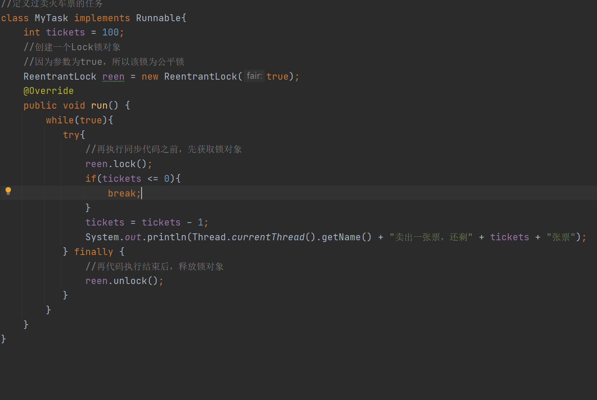

### 死锁【了解】

死锁概述：

线程死锁是指由两个或者多个线程互相持有并且需要对方的的资源（锁），导致这些线
程处于等待状态，无法前往执行

问题：

线程A：需要获取到锁x以及锁y 线程A获取到x锁，需要锁y才可以执行

线程B：需要获取到锁x以及锁y 线程B获取到y锁，需要锁x才可以执行

解决：

可以让线程A和线程B先抢同一支筷子，拿到第一支筷子的线程，才能获取第二支筷
子。如果线程第一支筷子没有拿到，没有机会拿第二支筷子

图示：

死锁代码示例

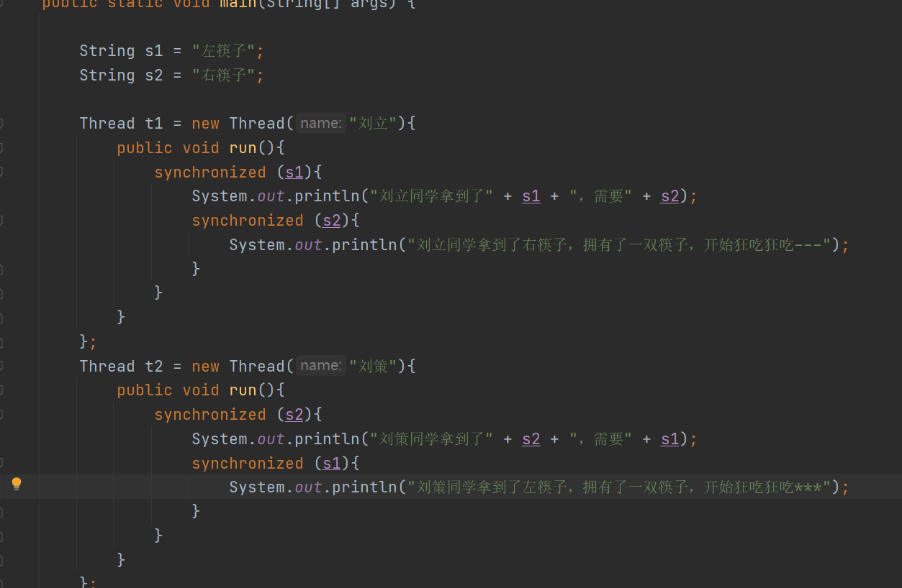

## 线程的生命周期

1.  线程从创建到销毁的过程就是线程的生命周期

再线程的生命周期中有很多状态的描述

1.  线程生命周期中的状态：

新建态：线程对象刚创建好的状态

就绪态：线程启动之后，等待cpu来执行的状态

运行态：正在被cpu执行的状态

阻塞态：即使cpu来执行该线程，该线程也无法执行的状态

等待锁 线程休眠 IO数据

死亡态（消亡）：线程正常将任务执行完成，或者碰到异常意外销毁

1.  线程状态之间的关系：

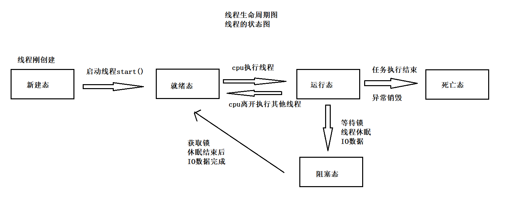

1.  获取线程的状态：

概述：以上所说的线程的状态，都是理论分析的状态，如果需要在代码中获取线程的状
态，可以获取。

获取线程状态的方法：getState()

特点：该方法的返回值是Thread类中的内部类：State，该类型是一个枚举类，该类中
定义了六个对象，来表示线程的六种状态对象。

罗列：

NEW：新建态

RUNNABLE：就绪态或者运行态

BLOCKED：阻塞态 IO数据导致的阻塞

WAITING：阻塞态 wait方法导致的阻塞

TIMED_WAITING：阻塞态 sleep方法导致的阻塞态

TERMINATED：死亡态

代码

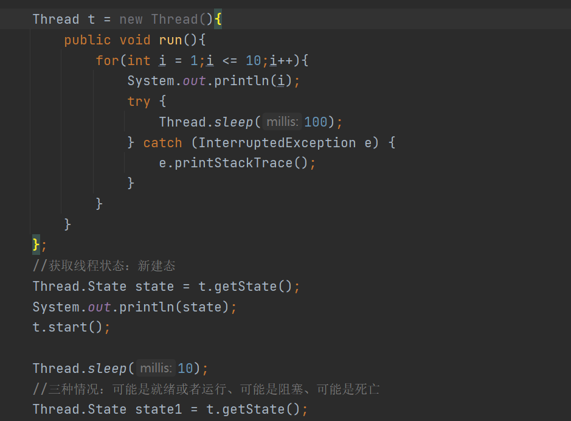

## 线程池

1.  概述：用来存储线程的一个容器

2.  使用线程池的原因：

如果Java语言不支持线程池：

想要使用新线程完成任务，自己创建一个线程对象，将任务对象提交给线程对象，
启动线程，完成任务，当任务完成之后，该线程对象就会被销毁。如果程序种有很
多任务，就需要花费很多的时间在线程的创建和销毁上，就降低了程序的运行效率。
反复的对线程创建和销毁造成了资源的浪费。

如果某条线程在执行任务的过程中，该线程被意外销毁了，那么就导致任务无法完 成。

如果Java语言提供了线程池：

想要完成多个任务，不需要自己新创建线程对象，直接从线程池种获取线程来完成
任务，解决创建线程对象的时间；当线程池种的线程完成任务之后，将该线程对象
回收到线程池种，以后可以反复使用，避免了资源的浪费；如果线程池种的线程在
完成任务的过程种被意外销毁，如果被销毁，线程池会继续分配线程完成该任务。

### 线程池的使用

1.  步骤：

2.  获取线程池对象

3.  创建任务类对象

4.  将任务对象提交给线程池

5.  关闭线程池对象

1.  获取线程池对象：

Executors：工具类 获取线程池的工具类

newSingleThreadExecutor() ：获取一个具有单个线程的线程池对象

newFixedThreadPool(int n) ：获取一个有n条线程的线程池对象

newCachedThreadPool() ：获取一个线程池对象，根据提交的任务分配线程

1.  将任务提交给线程池对象：

submit(Runnable r);

1.  如果线程池种的线程少，任务多；存在的线程先并发完成任务，那一条线程先完
    成任务，就继续做等待的任务。

2.  如果线程池种线程多，任务少：首先随机分配线程去并发完成提交的任务，多余
    的线程等待任务的提交。

3.  如果线程池中线程和任务一样多，线程之间并发完成任务。

4、关闭线程池的方法：

shutdown() ：将已经提交的任务全部完成之后，再关闭线程池。关闭后，不能再提交

shutdownNow() ：将正在运行的任务完成之后，关闭线程池。已经提交还没运行的任务，
不再运行。

代码

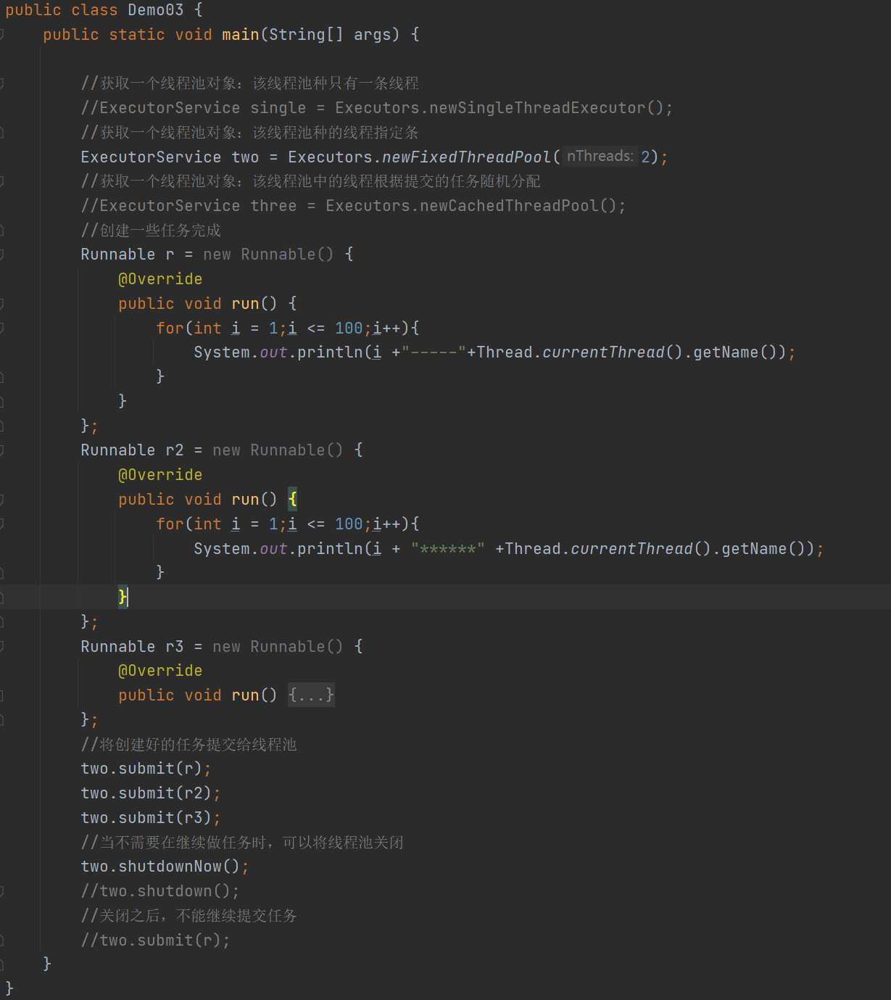

## 单例设计模式

### 概述

1.  设计模式：前人根据自己的经验总结的一种设计的规范。其实也不仅仅是一种设计规范，
    更多的是一种设计经验或者设计套路。

2.  单例设计模式：

在定义类型时，如果该类的对象，在整个系统中只能提供一个，可以使用该模式定义类 型

1.  单例模式的设计原则：

（1）构造方法私有化：防止在其他类中随意创建

（2）在类中创建好该类对象：因为构造私有化，其他类无法创建，只能提供一个公用

（3）在类中，给外界提供获取该对象的方式

### 单例设计模式：第一种饿汉式

概述：因为该对象是静态修饰的，类型加载之后，就已经存在该对象。

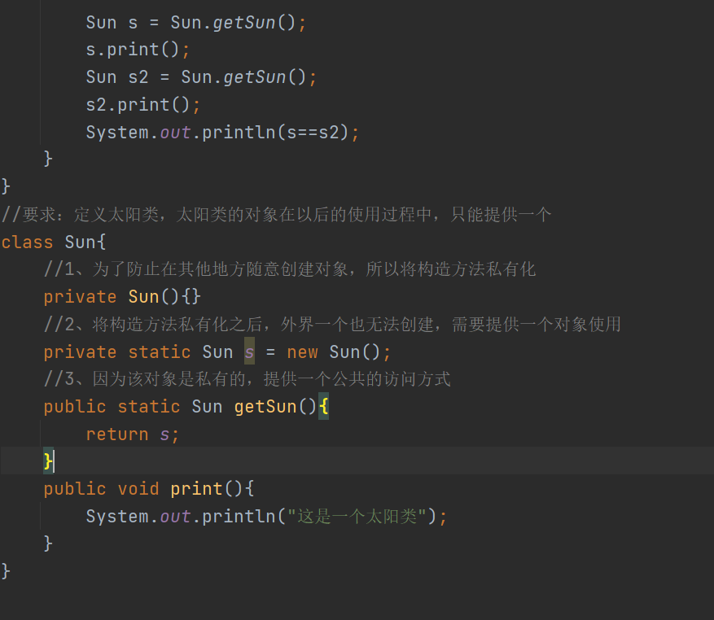

### 单例设计模式：第二种：饿汉式的优化版

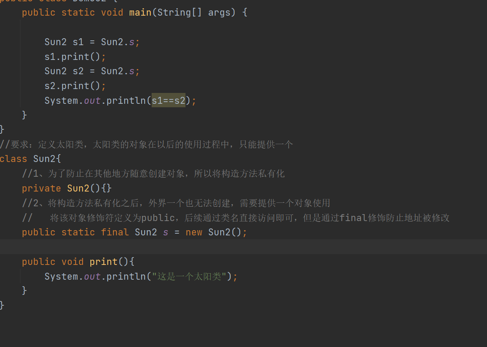

### 单例设计模式：第三种：懒汉式

概述：因为什么时候使用方法获取对象，什么时候创建该对象

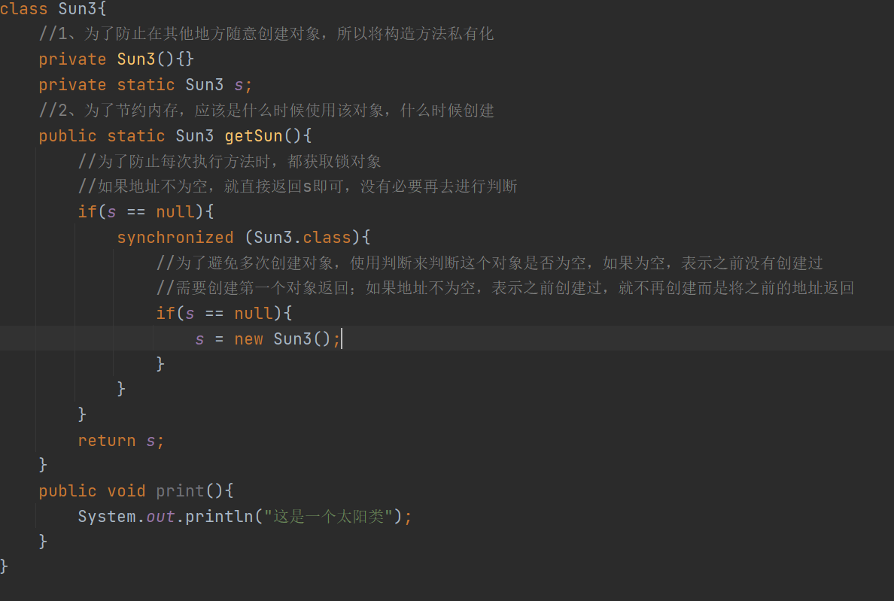

##    枚举类型

### 概述

1.  概述：如果某个类型的对象是有限个，可以使用枚举来定义该类型。

### 定义枚举的第一种方式

1.  特点：

2.  定义枚举类，使用关键字：enum

3.  枚举类中需要几个对象，就写几个对象名即可

4.  定义的枚举的对象，有一个别名（枚举项）

5.  多个枚举项之间，使用逗号分隔，必须都在第一行定义

6.  定义一个枚举类之后，么有提供构造方法，类型默认提供一个空参构造，将空参
    构造私有化

代码

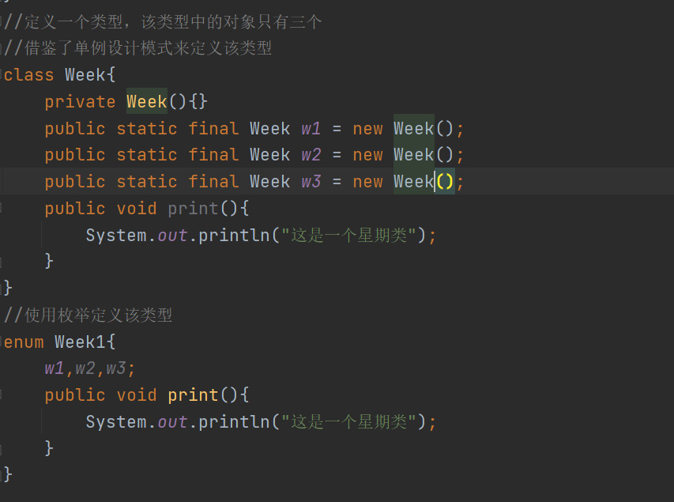

### 定义枚举的第二种方式

1、特点：

（1）在枚举类中也可以正常定义属性，属性可以私有化，也可以正常提供公共的访问
方式。

（2）如果需要当对象中的属性有值的，就需要提供有参构造，有参构造私有修饰

（3）在枚举项定义的时候，如果该对象需要属性值，就直接在对象名后面写一个小括
号，小括号中给定要赋的值即可。

代码

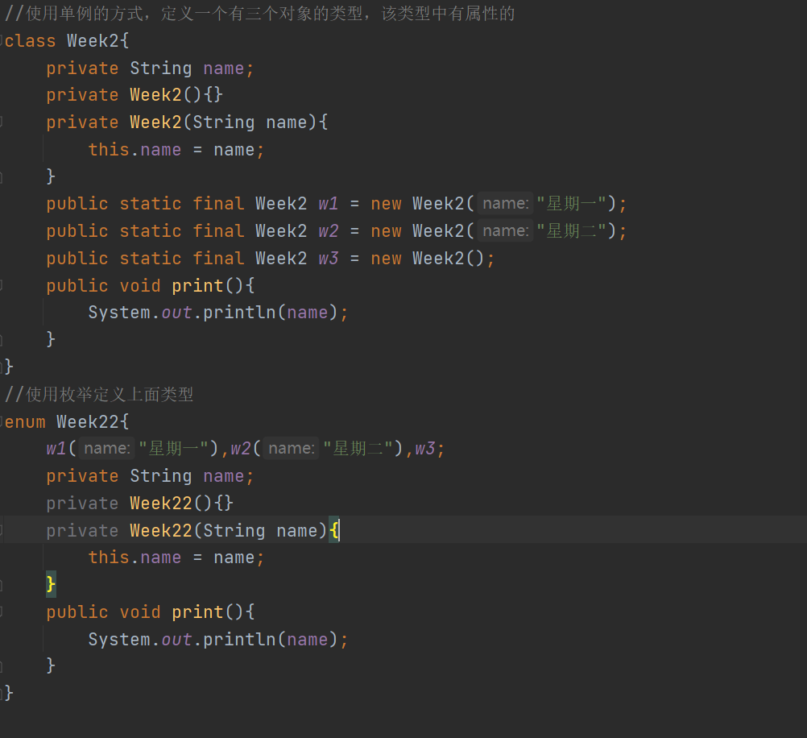

### 枚举定义的第三种格式

1.  特点：

2.  在枚举类中可以正常定义抽象方法，而且类型不需要通过abstract来修饰

3.  在定义枚举项时，使用匿名内部类的方式来定义该类的子类对象

4.  之间使用逗号分隔

代码

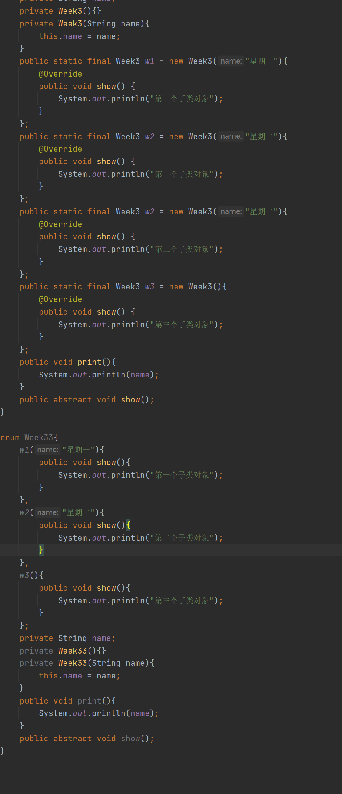
