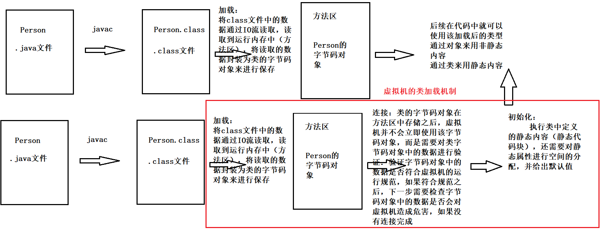
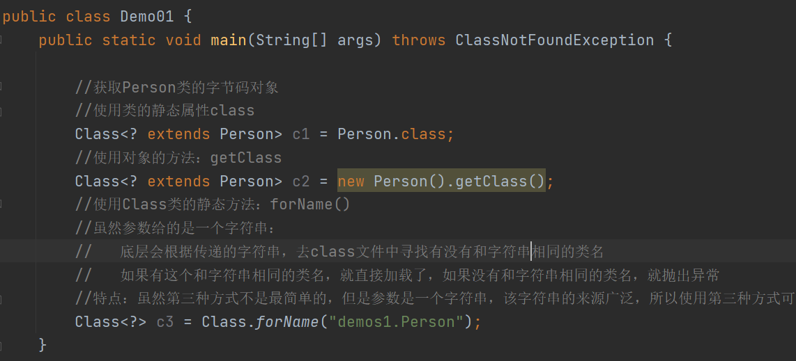
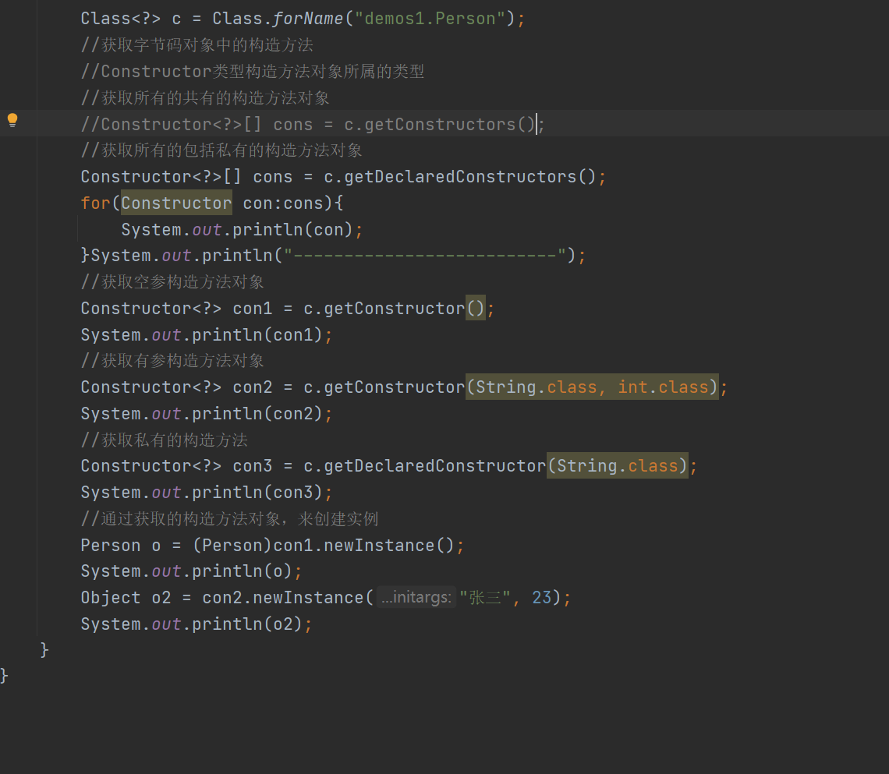
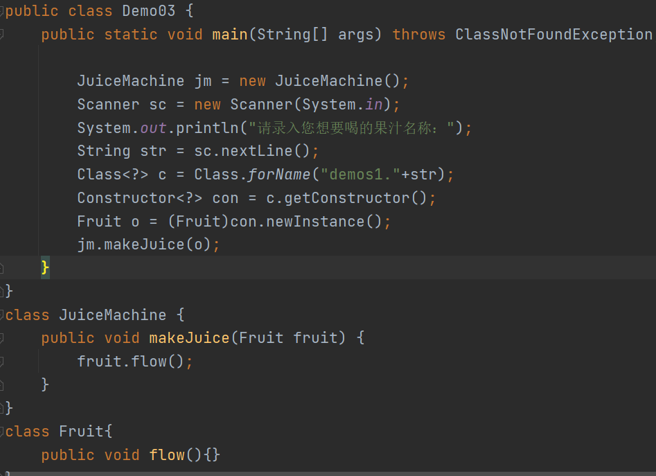
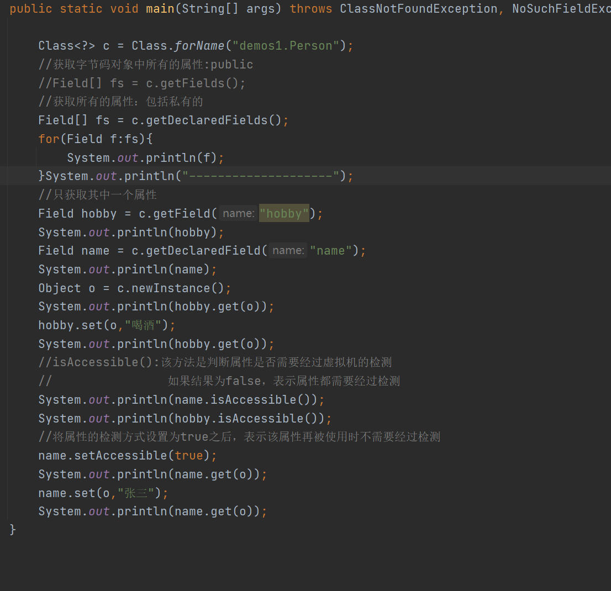
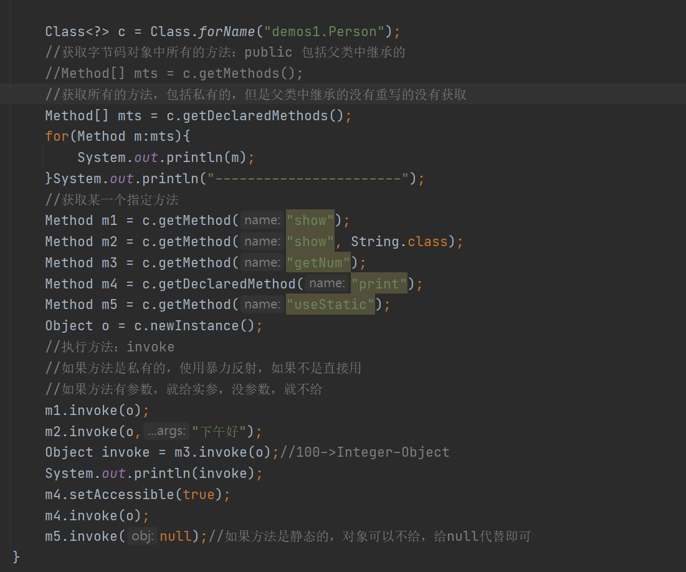
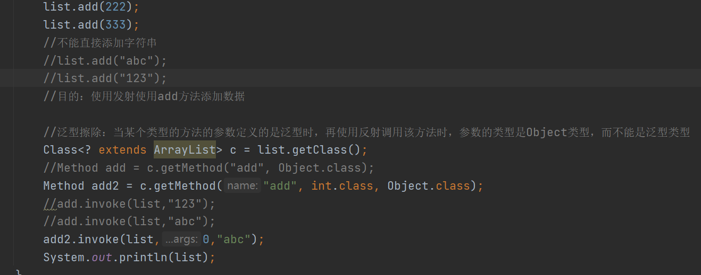
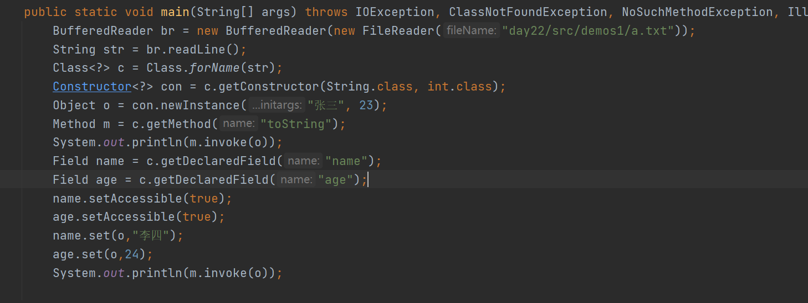

# Day22笔记

## 课程内容

1.  虚拟机类加载机制

2.  类加载器

3.  反射

## 虚拟机类加载机制

1.  概述：

如果需要使用某一个类型，虚拟机把描述类的数据从class文件中加载到运行内存，并
对数据进行校验，转换解析和初始化，最终形成可以被java虚拟机直接使用的类型，
这就是虚拟机的类加载机制。

1.  加载机制的过程：

当程序要使用某个类时，如果该类还未被加载到内存中，系统会通过加载，连接，初始
化三步来实现对这个类的加载。

（1）加载：就是指将class文件中的信息读入内存，并为之创建一个Class对象

注意：任何类被使用时系统都会建立一个Class对象

1.  连接：

验证是字节码对象是否有正确的内部结构，检验是否符合官方制定的class
文件规范，以及检查字节码对象中的数据是否会对虚拟机造成危害

1.  初始化：负责为类的静态成员分配内存，并设置默认初始化值

1.  类加载时机：

（1）创建类的实例 创建对象时

（2）类的静态成员使用 类名.访问静态方法或者属性时

（3）使用反射方式来访问类型时

（4）初始化某个类的子类 Stu extends Person new Stu();

（5）直接使用java.exe命令来运行某个主类时

## 类加载器

1.  概述：类加载器是负责加载类的对象。

将class文件中的数据加载到运行内存中，并为之生成对应的字节码对象。

1.  分类：

（1）Bootstrap ClassLoader 引导类加载器

也被称为根类加载器，负责Java核心类的加载。

（2）Extension ClassLoader 扩展类加载器

（3）Application ClassLoader 系统类加载器

负责在JVM启动时加载来自java命令的class文件

3、类加载器之间的继承关系

\-Bootstrap ClassLoader

\-Extension ClassLoader

\-Application ClassLoader

4、类加载器加载类型的双亲委派机制：

（1）概述：双亲委派机制是指当一个类加载器收到一个类加载请求时，该类加载器首
先会把请求委派给父类加载器，父类加载器再将该请求委派给父类的父类
加载器，如果该在父类加载器在自己的搜索范围内找不到指定类时，子类
加载器才会尝试自己去加载

（2）举例：String类型需要加载，只能将加载请求给Application加载器加载，该加载
器并不会直接加载，直接将加载请求给父类加载器加载，Extension加载器
收到子类的加载请求之后，该加载器将该请求委派给他的父类加载， Bootstrap
加载器收到类的加载请求之后，该类加载器在收到请求之后会先
检查这个类型它能否加载，如果可以加载，就直接家藏完成。

（3）举例：如果需要加载Person类型，将加载请求给Application加载，直接将该请求
给父类加载器Extension 加载器加载，Extension 收到子类的请求之后，一
样将请求委派给父类Bootstrap 加载，当Bootstrap 加载器收到请求之后，
先检查该类能否加载，Person类型Bootstrap 加载器无法进行加载，只能
将请求返回给Extension 去加载，Extension 加载器也无法加载给类型，就
只能将请求再返回给子类Application ，Application 加载器收到父类返回的
请求后，发现该类型可以被加载，所以就加载了该类型。

## 反射

1.  概述：

反射是指在加载类型之后，通过该类的字节码对象来获取需要的信息，然后通过获取到
的信息来实现对应的功能，这种机制就是反射。由于这种动态性，可以极大的增强程序
的灵活性和扩展性。

1.  获取类字节码对象的方式：（使用反射的前提）

2.  类名.class

3.  对象名的.getClass()

4.  Class.forName(类的全类名)

代码

### 反射获取字节码对象中的构造方法并实例化

1.  概述：根据类的字节码对象获取该类的构造方法，并创造该类对象

2.  获取构造方法的方式：

（1）getConstructors()：返回所有公共的构造方法对象

（2）getDeclaredConstructors()：返回所有构造方法对象

（3）getConstructor()：返回空参构造对象

（4）getConstructor(Class\<?\>... parameterTypes)：

返回单个指定参数的公共有参构造方法对象

（5）getDeclaredConstructor(Class\<?\>...parameterTypes)：

返回单个指定参数的有参构造方法对象

1.  通过构造方法对象，创建类的实例：

newInstance(Object...initargs)

如果是空参构造，就不需要给出实参

如果是有参构造对象，就需要给出对应的实际参数

代码

案例

### 反射获取成员变量并使用

1.  获取方法：

（1）getFields()：返回所有公共成员变量对象

（2）getDeclaredFields()：返回所有成员变量对象

（3）getField(String name)：返回指定的公共成员变量对象

（4）getDeclaredField(String name)：返回单个成员变量对象

2、访问成员属性的方法：

set(Object obj，Object value): 用于给obj对象中的该成员变量赋value值

get(Object obj)：用于获取obj对象的指定成员变量值

1.  暴力反射：

概述：如果类型中的某些属性是私有化的，那么就不能直接使用方法访问该属性

所以只能使用暴力反射来强制访问。

相关方法：

isAccessible()：判断当前属性对象是否需要参与虚拟机的检测

setAccessible(boolean flag)：将当前对象设置为不需要被虚拟机检测

代码

### 反射获取成员方法并使用

1.  方法：

2.  getMethods()：返回所有公共成员方法对象

3.  getDeclaredMethods()：返回所有成员方法对象

4.  getMethod(String methodName, Class\<?\>...parameterTypes)：

返回指定的公共成员方法对象

1.  getDeclaredMethod(String methodName, Class\<?\>...parameterTypes)：

返回指定的成员方法对象

1.  执行方法的方式：

invoke(Object o，Class...paramsTypre)

1.  如果方法是已经非静态方法，需要传递一个对象执行

2.  如果方法是一个静态方法，不需要传入对象，直接传入Null

代码

### 案例

需求：

定义一个List集合（泛型定义为Integer），如：ArrayList\<Integer\> list = new
ArrayList\<\>();

要求利用反射的原理，在集合中添加若干字符串并且不报错，最终输出集合中的内容

代码

### 反射练习

1.  自定义一个Stu类型

属性：String name; int age （私有化，定义公共的访问方式）

方法：toString（展示当前属性的信息）

1.  手动将这个类型的全类名写在文件中的第一行

2.  读取文件中的类名，并创建一个该类对象（通过有参构造创建）

3.  使用toString方法展示对象属性

4.  使用公共的访问方法给属性改值，并再次调用show方法展示属性值

代码

