# Day23笔记

## 今日内容

1、Java8接口新特性

2、Lambda表达式

3、函数式接口

4、Stream类

## Java8接口新特性

1.  Java8之前接口定义：只可以定义抽象方法，不能定义非抽象方法的特殊类型

2.  Java8接口的定义：即可以定义抽象方法，也可以定义非抽象方法

如果需要定义非抽象方法，需要将该方法通过关键字：static来修饰 或者default来修饰

1.  注意事项：

2.  在接口中定义的静态方法，不能被实现类继承（子父类中静态方法可以被继承）

3.  如果一个实现类同时实现了多个接口，那么实现类要重写多个接口的抽象方法

4.  如果一个实现类同时实现了多个接口，多个接口中有两个（多个）相同声明的非
    抽象方法，那么实现类只能强制继承其中一个，强制继承的方式：

接口名.super.方法名();

也可以在同一个方法中同时强制继承两个方法（一般不用）

1.  如果实现类同时实现多个接口，多个接口中有多个相同的抽象方法，实现类只需
    要重写一次即可。

2.  如果实现类继承父类的同时实现了接口，父类和接口中有相同的非抽象方法，那
    么实现类默认继承父类的该方法。也可以选择强制继承接口的该方法，实现方式：

接口名.super.方法名();

1.  改变的原因：

JDK1.7版本：接口中只可以定义抽象方法

如果定义了一个接口，接口中有很多抽象方法，而且该接口已经在项目中使用。

后续为了提高接口方法的功能，就在接口中新定义了一些抽象方法，那么就导
致使用过该接口的项目直接报错。

JDK1.8版本：接口中可以定义抽象方法或者非抽象方法

如果定义了一个接口，接口中有很多方法，接口已经参与使用。后续需要给接
口新增功能， 可以将新增的功能定义为default修饰的，之前的项目并不会报错，
因为会默认继承。

## 

## Lambda表达式

1.  概念：

本质上是一个对象，可以当作是匿名内部类创建的对象的简写格式。

1.  格式：

(参数)-\>{方法体}

1.  说明：

参数：需要重写的抽象方法中的形参列表

\-\>：为了分隔前后两部分，Lambda运算符或者箭头运算符

方法体：需要对抽象方法重写的内容

1.  案例：

（1）如果抽象方法没有参数，方法体只有一句：

方法体外的大括号可以省略。

格式：()-\>方法体语句;

（2）如果抽象方法中有一个参数：

参数的类型可以省略，参数外的小括号可以省略

格式：参数名-\>{方法体语句}；

（3）如果方法的参数有多个：

参数外的小括号不能省略，参数类型可以省略。

格式：(参数名称1，参数名称2)-\>{方法体语句};

（4）如果方法有返回值：

直接在方法体中的大括号中对数据进行return即可

格式：(参数名称)-\>{

方法体语句：

return语句；

};

（5）如果方法需要返回值，而且方法体只有一句：

可以将大括号和return关键字一起省略

格式：(参数名称)-\>要返回的数据;

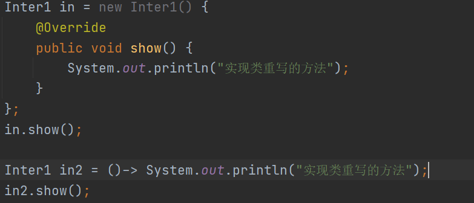

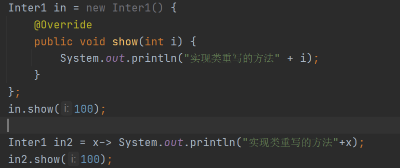

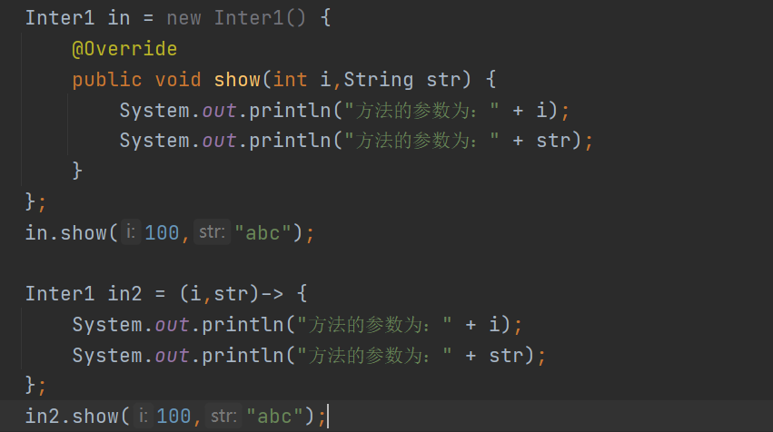

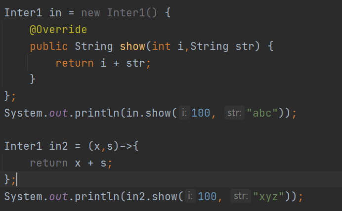

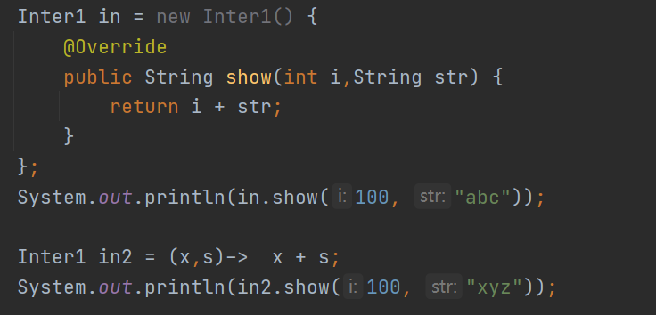

1.  Lambda表达式和匿名内部类的区别：

2.  如果接口中有多个抽象方法，只能使用匿名内部类实现；不能使用Lambda表达
    式方式实现

3.  如果定义了一个抽象类，不能使用Lambda表达式定义抽象类的子类对象；Lambda
    只适用于接口

4.  使用匿名内部类创建接口的实现类对象，会生成一个对应的class文件，但是使用
    Lambda表达式则没有对应的class文件

## 

## 函数式接口

1.  概念：

一个接口中的抽象方法只有一个，那么这个接口就是一个函数式接口。

1.  通过注解检测一个接口是否是一个函数式接口：

@FunctionalInterface

在接口上直接加上注解，如果这个接口是一个函数式接口则不报错，否则编译报错

1.  作用：

2.  是Lambda表达式的使用前提

3.  概念层面，为了表示接口就代表这个抽象方法，所以将名起为函数式接口

### 内置的函数式接口

1.  在jdk8之后，官方定义了一些常用的函数式接口，如果以后需要使用类似的接口，直接
    使用即可，不需要再单独定义。

2.  分类：

Consumer\<T\> ：消费型接口

void accept(T t)

Supplier\<T\> ：供给型接口

T get()

Function\<T,R\> ：函数型接口

R apply(T t)

Predicate\<T\> ：断言型接口

boolean test(T t);

### 消费型接口

1.  接口名称：Consumer\<T\>

2、抽象方法：void accept(T t)：消费一个参数数据

3、概述：该接口中的方法可以接收一个参数，接收的参数类型由泛型指定，对参数的操作
方式根据该接口的实现类决定，不需要返回值。

4、拓展的非抽象方法：

default Consumer\<T\> andThen(Consumer\<? super T\> after) ：

返回一个组合的 Consumer ，按顺序执行该操作，然后执行 after操作。

### 代码

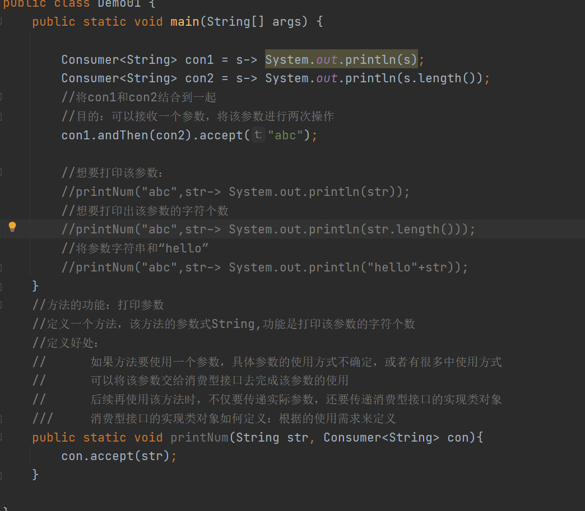

### 供给型接口

1.  接口名：Supplier\<T\> :

2、抽象方法：T get()：该方法不需要参数，它会按照某种逻辑，返回一个具体的数据

3、概述：

该接口也被称为生产型接口，如果指定了泛型是什么类型，那类中的get方法就会返回
一个该类型的一个具体数据。返回的数据，由该接口的实现类对象决定。

代码

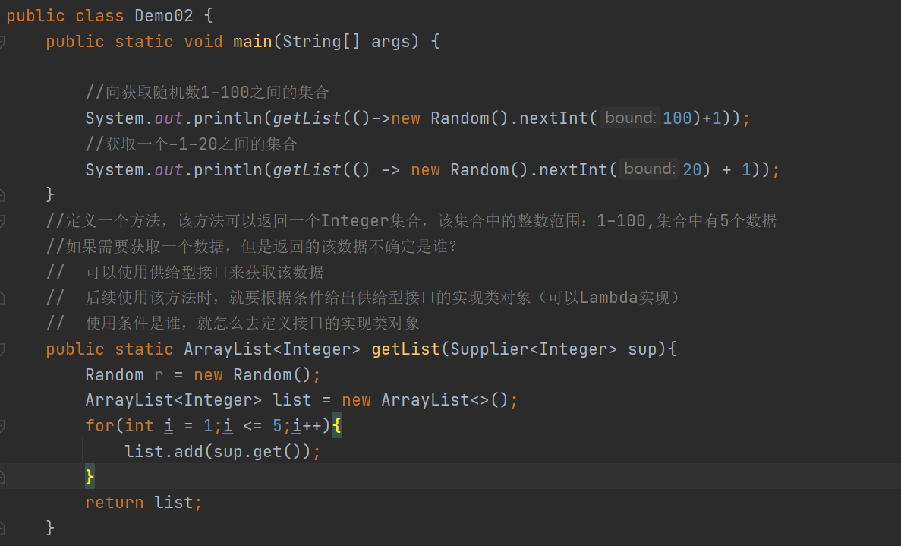

### 函数型接口

1.  接口名：Function\<T,R\>

2.  抽象方法：R apply(T)：接收一个数据，操作数据之后，返回一个新的数据

3.  概述：

该接口可以接收一个数据，数据的类型根据泛型指定，然后通过该接口的实现类对象对
该数据进行操作，操作之后返回一个新的数据。

1.  拓展的非抽象方法：

default Function andThen(Function f)：

先通过调用者对象处理参数，将处理的结果再通过f对象处理，将两个处理的结果进
行返回。

代码

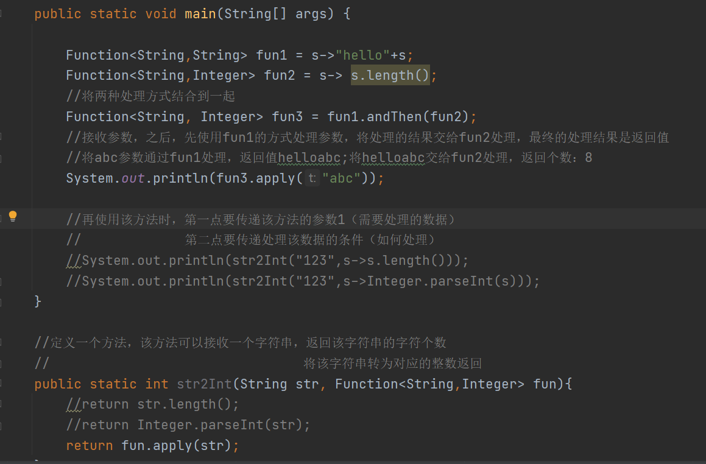

### 断言型接口

1.  Predicate\<T\>：

boolean test(T t)：对数据做出指定的判断

1.  概述：

该接口是一个判断接口，接口可以接收一个指定泛型的参数，并根据该接口的实现类
对象对该参数做出对应的判断，返回只为boolean类型

1.  额外功能：

and(Predicate\<T\> p)：先将参数通过调用者判断真假，再将参数通过p判断真假，全真
为真，否则为假

or(Predicate\<T\> p):全假为假，否则为真

negate():取反

代码

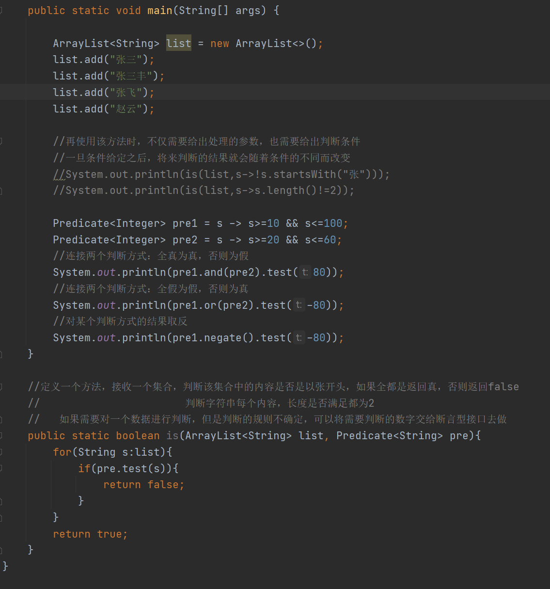

### 方法引用

1.  概念：

对lambda表达式的扩展，在定义lambda表达式的内容时，如果这个内容之前已经定
义过，那么就不需要再定义一遍，直接调用即可。

1.  格式：

如果是一个构造方法：类名：：new

如果是一个静态方法：类名：：方法名

如果是一个非静态方法：对象名：：方法名

代码

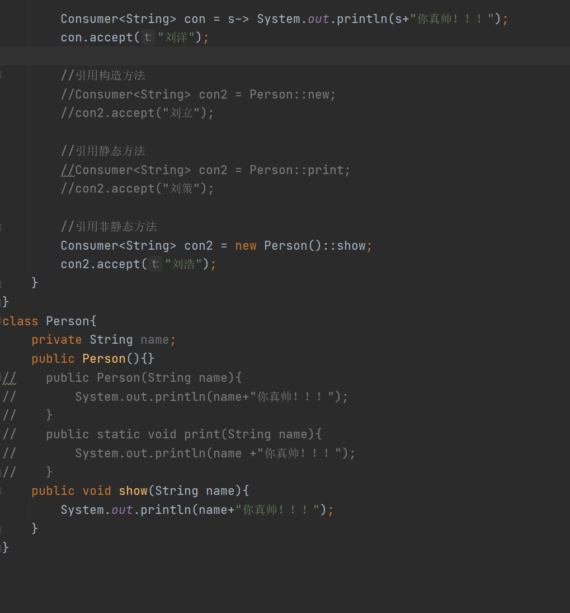

## Stream类【Stream流】

1.  概述：Java8之后提供的一个新的类型。

2.  作用：使用集合和数组操作元素时，可以使用此类代替循环和判断语句完成代码的简化

### Stream类对象的获取

1.  Collection集合的获取方式：

对象名.stream();

1.  Map集合获取方式：

ketSet().stream();

values().stream();

entrySet().stream();

1.  数组的获取方式：

Stream.of(数组名);

1.  注意事项：

因为Stream类型提供的功能主要是对循环做替换，所以只有集合和数组才需要使用

代码

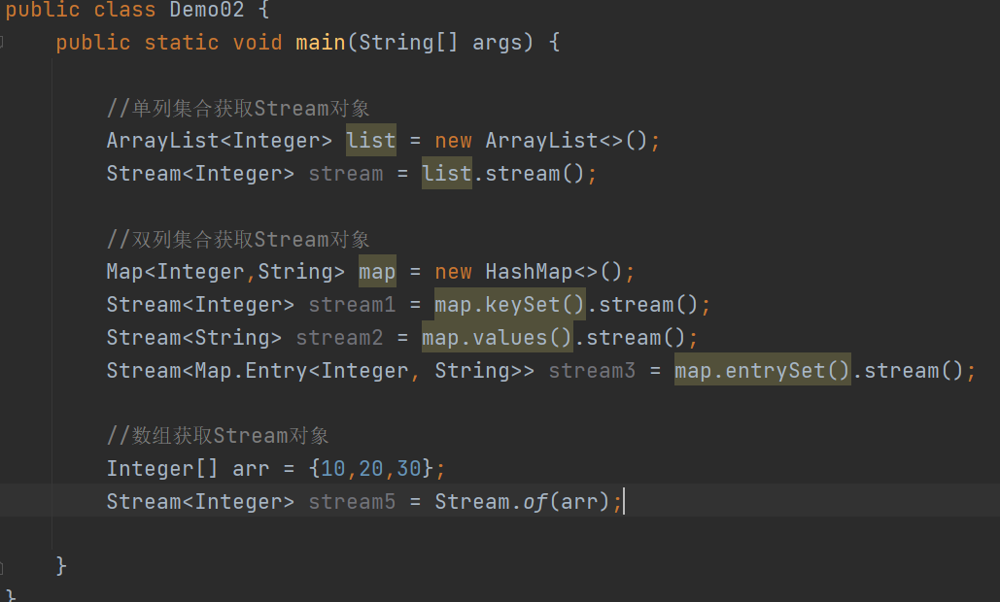

### Stream类的常用方法

1.  Stream类中包含了一些对数据过滤和筛选以及获取的方法，由此来代替循环和判断语句。

2.  分类：

延迟方法：使用完该类方法之后，返回值是一个Stream类的对象，可以继续调用类
中的方法。

终结方法：使用完该类方法之后，返回值不再是一个Stream类的对象，不能继续使用
类中的方法。

1.  方法罗列：

（1）forEach(Consumer\<? super T\> action) ：终结方法

该方法可以自动获取流中每一个数据，并对获取的数据操作

数据的操作方式根据消费型接口的实现类重写。

（2）count() ：返回此流中的元素数。终结方法

（3）filter(Predicate\<? super T\> predicate) ：延迟方法

该方法可以自动获取流中的每一个数据进行判断，如果数据判断结果为真，就
在流中存储，否则不存储该数据

（4）limit(long m) ：将流中的前m个元素保留，其余的删除 延迟方法

（5）skip(long n) ： 跳过前n个元素，保留后面的元素 延迟方法

（6）map(Function\<? super T,? extends R\> mapper) ：

该方法自动获取流中的每一个数据，并对数据处理，处理之后返回一个新
的数据。具体的处理方式根据实现类对象确定。

1.  concat(Stream\<? extends T\> a, Stream\<? extends T\> b)：

将两个流中的数据进行合并，合并为一个流对象

1.  distinct()：去除流中重复的元素

2.  toArray()：把stream流中的数据收集到数组中

3.  collect(Collector c)：把stream流中的数据收集到指定的集合中

Collector：参数的类型 是一个接口获取可以通过工具类Collectors的方法获取

常用：

获取List集合：Collectors.toList()

获取Set集合： Collectors.toSet()

代码

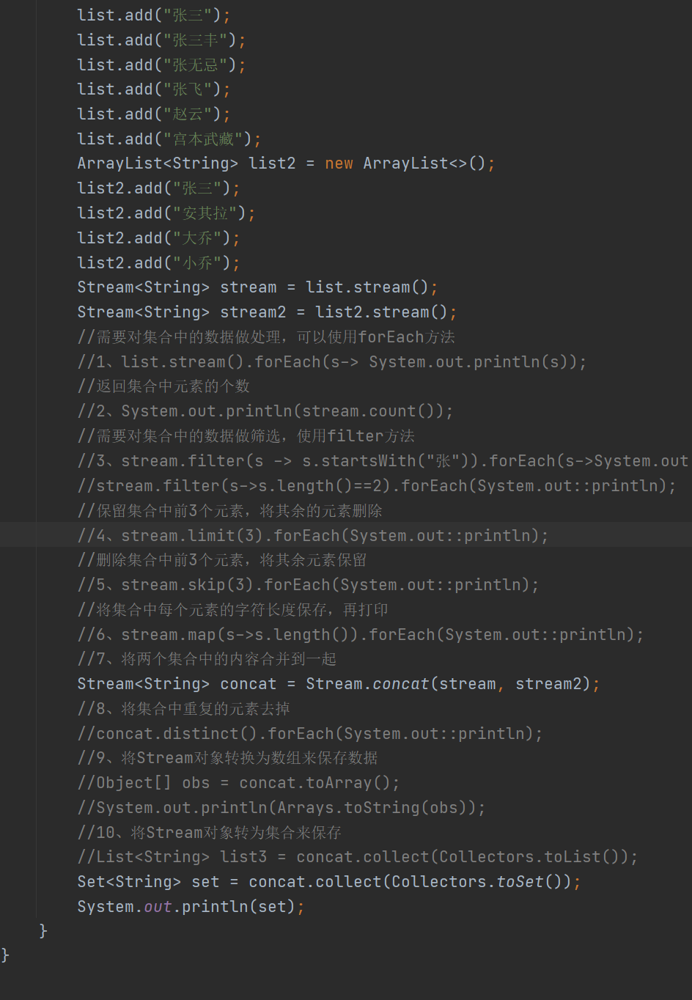

练习

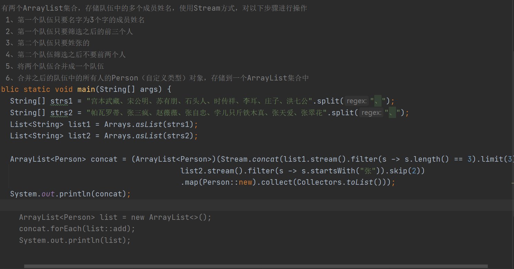
